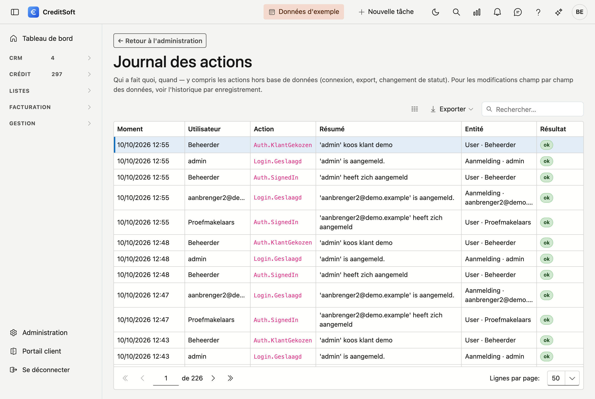

# Journal des actions

Le **Journal des actions** montre *qui a fait quoi et quand* dans CreditSoft. Il s'agit d'un journal continu
des actions importantes — connexion, export, changement de statut ou suppression, par exemple. Un
administrateur peut ainsi vérifier après coup ce qui s'est exactement passé.

## Ouvrir l'écran

Cliquez dans la barre latérale sur **Administration**, puis sur la tuile **Journal des actions** (sous
*Données*).

## Ce que vous voyez

Chaque ligne correspond à une action, avec notamment :

- **Quand** — le moment de l'action.
- **Qui** — l'utilisateur qui a effectué l'action.
- **Action** — ce qui s'est passé (p. ex. connexion, export, changement de statut).
- **Objet** — l'enregistrement ou l'élément concerné par l'action.

## Différence avec l'historique

Le Journal des actions répond à la question *« qui a fait quoi ? »* — y compris pour des actions qui ne
modifient pas un enregistrement précis (comme une connexion ou un export). L'**historique** (par fiche)
montre en plus les modifications champ par champ d'un enregistrement. Les deux se complètent.

## Bon à savoir

- Le Journal des actions n'affiche que les actions de **votre bureau** — vous ne voyez jamais les données
  d'un autre client.
- La consultation se règle par rôle dans **Administration → Rôles**.
- Le journal est un **ouvrage de référence** : les lignes sont conservées, jamais modifiées ni effacées.
