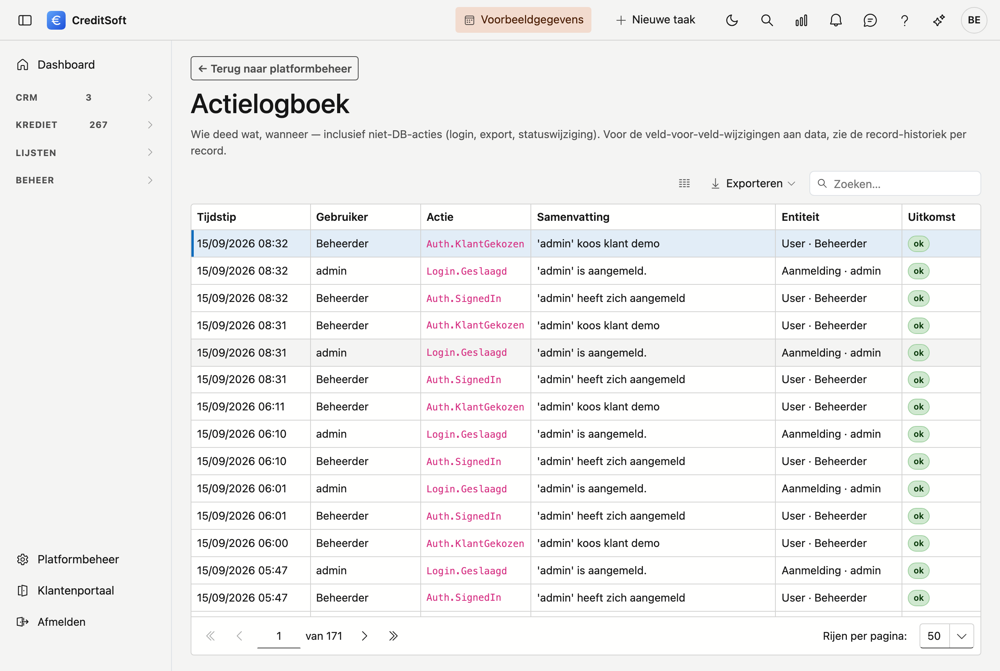

# Actielogboek

Het **Actielogboek** toont *wie wat wanneer deed* in CreditSoft. Het is een doorlopend logboek van
belangrijke handelingen — denk aan aanmelden, een export, een statuswijziging of een verwijdering. Zo kan een
beheerder achteraf nagaan wat er precies gebeurd is.

## Het scherm openen

Klik in de zijbalk op **Platformbeheer** en daarna op de tegel **Actielogboek** (onder *Gegevens*).

## Wat u ziet

Elke regel is één handeling, met onder meer:

- **Wanneer** — het tijdstip van de handeling.
- **Wie** — de gebruiker die de handeling deed.
- **Actie** — wat er gebeurde (bv. aanmelden, export, statuswijziging).
- **Onderwerp** — het record of onderdeel waarop de handeling sloeg.

## Verschil met de historiek

Het Actielogboek antwoordt op de vraag *"wie deed wat?"* — ook voor handelingen die niet één record wijzigen
(zoals aanmelden of een export). De **record-historiek** (per fiche) toont daarnaast de veld-per-veld
wijzigingen aan één record. De twee vullen elkaar aan.

## Goed om weten

- Het Actielogboek toont enkel de handelingen van **uw kantoor** — u ziet nooit de gegevens van een
  andere klant.
- Inkijken kunt u per rol regelen bij **Platformbeheer → Rollen**.
- Het logboek is een **naslagwerk**: regels worden bijgehouden, niet bewerkt of gewist.
