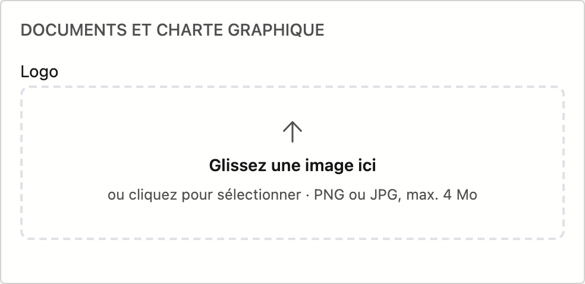

# Fiche d'entreprise

La fiche d'entreprise contient les données de votre propre bureau — utilisées sur les documents et lors de l'envoi d'e-mails. Vous les modifiez directement et cliquez sur **Enregistrer** en bas de l'écran.

!!! note "Le nom"
    Le **nom** de votre bureau est géré par ADM One et ne peut pas être modifié ici.

## Ouvrir l'écran

Dans la barre latérale, cliquez sur **Administration**, puis sur la tuile **Fiche d'entreprise** (sous *Entreprise*). En haut, le lien **← Retour à l'administration** vous ramène à l'aperçu.

## Les données

{ .volle-breedte }

Les champs sont regroupés en blocs :

- **Identité** — nom (en lecture seule), TVA / n° d'entreprise, numéro FSMA.
- **Adresse** — rue, numéro, boîte, code postal, commune, pays.
- **Contact** — téléphone, e-mail, site web.
- **Banque** — IBAN, BIC et numéro de compte (avec un second compte si nécessaire).
- **Documents et charte graphique** — votre logo.

## Récupérer les données depuis la BCE

Saisissez votre **numéro de TVA / d'entreprise** et cliquez sur **Récupérer**. Les données d'adresse sont alors complétées automatiquement depuis la Banque-Carrefour des Entreprises. Le nom reste inchangé (il provient d'ADM One).

## Logo

**Glissez** une image dans la zone du logo ou **cliquez** dessus pour choisir un fichier (PNG ou JPG, max. 4 Mo). Le bouton **Supprimer** retire le logo.

!!! tip "Code postal et commune"
    Tapez dans le champ **Code postal** : la liste affiche à la fois le code postal et la commune, vous pouvez
    donc chercher sur les deux. Lorsque vous choisissez un code postal, la **commune est complétée**. Si vous
    videz la commune — avec la croix ou avec **Retour arrière** — le code postal est vidé lui aussi.

## Enregistrer

Cliquez sur **Enregistrer** en bas — ce bouton reste visible pendant que vous faites défiler l'écran. Si vous saisissez une adresse e-mail, elle doit avoir une forme
valide. Le **numéro de téléphone est mis en forme** dans la notation officielle : si vous tapez `09/3724829`,
vous lirez `09 372 48 29` après l'enregistrement.
