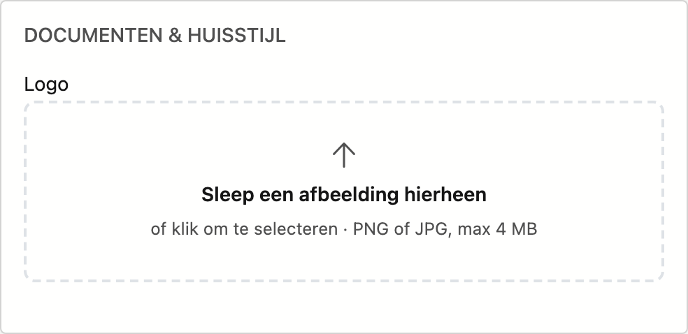

# Bedrijfsfiche

De bedrijfsfiche bevat de gegevens van uw eigen kantoor — die gebruikt worden op documenten en bij het versturen van mail. U bewerkt ze rechtstreeks en klikt onderaan op **Opslaan**.

!!! note "De naam"
    De **naam** van uw kantoor wordt door ADM One beheerd en kan hier niet gewijzigd worden.

## Het scherm openen

Klik in de zijbalk op **Platformbeheer** en daarna op de tegel **Bedrijfsfiche** (onder *Bedrijf*). Bovenaan brengt de link **← Terug naar platformbeheer** u terug naar het overzicht.

## De gegevens

{ .volle-breedte }

De velden staan gegroepeerd in blokken:

- **Identiteit** — naam (alleen-lezen), BTW / ondernemingsnr., FSMA-nummer.
- **Adres** — straat, nummer, bus, postcode, gemeente, land.
- **Contact** — telefoon, e-mail, website.
- **Bank** — IBAN, BIC en rekeningnummer (met een tweede rekening indien nodig).
- **Documenten & huisstijl** — uw logo.

## Gegevens ophalen uit de KBO

Vul uw **BTW / ondernemingsnummer** in en klik op **Ophalen**. De adresgegevens worden dan automatisch ingevuld vanuit de Kruispuntbank van Ondernemingen. De naam blijft ongewijzigd (die komt van ADM One).

## Logo

**Sleep** een afbeelding naar het logovak of **klik** erop om een bestand te kiezen (PNG of JPG, max 4 MB). Met **Verwijderen** haalt u het logo weer weg.

!!! tip "Postcode en gemeente"
    Typ in het veld **Postcode**: de keuzelijst toont zowel de postcode als de gemeente, dus u kunt op beide
    zoeken. Kiest u een postcode, dan wordt de **gemeente mee ingevuld**. Maakt u de gemeente leeg — met het
    kruisje of met **Backspace** — dan wordt de postcode mee leeggemaakt.

## Opslaan

Klik onderaan op **Opslaan** — die knop blijft in beeld terwijl u door het scherm scrolt. Vult u een e-mailadres in, dan moet dat een geldige vorm hebben. Het
**telefoonnummer wordt opgemaakt** in de officiële notatie: typt u `09/3724829`, dan staat er na het bewaren
`09 372 48 29`.
