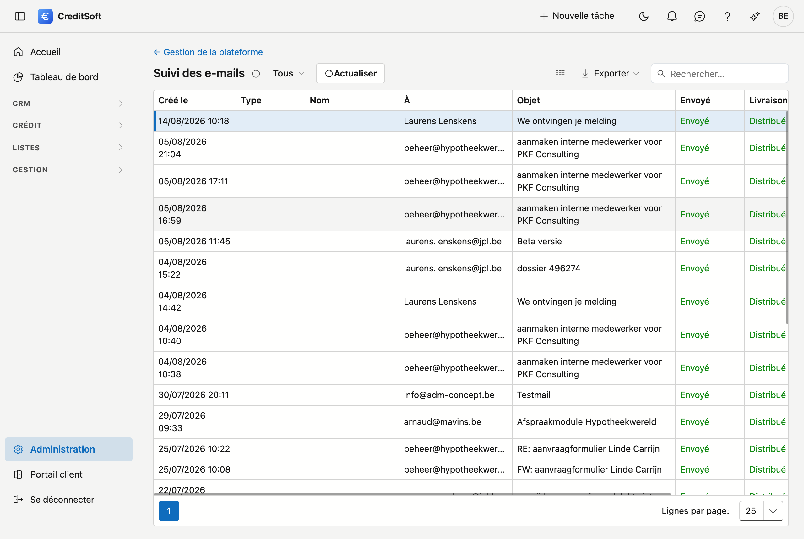

# Suivi des e-mails

L'écran **Suivi des e-mails** vous montre en un seul aperçu **tout le courrier envoyé** avec son **statut de livraison**. Un administrateur sait ainsi immédiatement ce qui a été livré et ce qui n'est pas arrivé, sans devoir consulter chaque établissement de crédit, assureur ou relation individuellement.

## Ouvrir l'écran

Dans la barre latérale, cliquez sur **Administration**, puis sur la tuile **Suivi des e-mails** (sous *Communication*). En haut, le lien **← Retour à l'administration** vous ramène à l'aperçu.

## Ce que vous voyez

Chaque ligne correspond à un e-mail envoyé. Les colonnes :

- **Créé le** — quand l'e-mail est parti.
- **Type** — le type d'entité à laquelle l'e-mail se rapporte (p. ex. *Établissement de crédit*, *Assureur*, *Relation*, *Apporteur*, *Dossier de crédit*).
- **Nom** — le nom de cette entité.
- **À** — le destinataire.
- **Objet** — l'objet de l'e-mail.
- **Envoyé** — si l'e-mail a été envoyé par la plateforme.
- **Livraison** — le **statut de livraison** : **Livré** (vert) si l'e-mail est arrivé, ou un problème en rouge (p. ex. **Rejeté (bounce)** ou **Échoué**).
- **Raison / erreur** — en cas de problème : la raison pour laquelle l'e-mail n'est pas arrivé.

## Filtrer et rechercher

- **Filtre de statut** (en haut à gauche) — affichez par exemple uniquement **Non livrés**, **Rejetés (bounce)** ou **Échoués** pour repérer rapidement les cas problématiques. Par défaut, il est sur **Tous**.
- **Actualiser** — récupère à nouveau le statut le plus récent.
- **Rechercher** (en haut à droite) — recherchez librement dans la liste, par exemple par destinataire ou objet.
- Le bouton **…** en haut à droite permet d'**exporter** la liste (Excel ou CSV).

## Bon à savoir

- Le statut de livraison provient directement de la plateforme d'envoi : **Livré**, **Rejeté (bounce)**, **Échoué**, … C'est la source fiable.
- Les colonnes **Type** et **Nom** se remplissent pour le courrier que vous envoyez **depuis une fiche** (p. ex. depuis un établissement de crédit). Le courrier envoyé auparavant reste vide dans ces deux colonnes.
