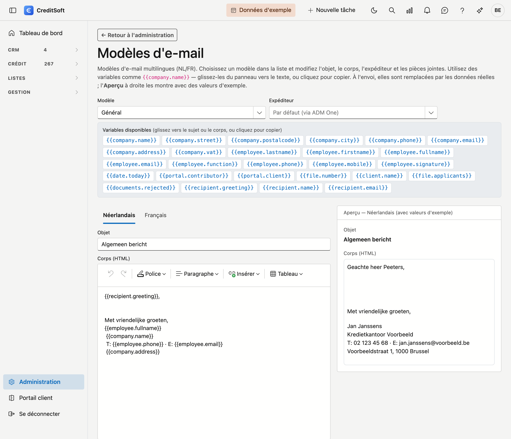

# Modèles d'e-mail

L'écran **Modèles d'e-mail** vous permet d'adapter le texte de vos e-mails sortants. Les modèles sont **fixes** — vous en choisissez un dans la liste et le modifiez ; vous n'en créez pas de nouveaux et n'en supprimez pas (ainsi chaque modèle reste lié à son rôle). Chaque modèle est **bilingue** (NL/FR).

{ .volle-breedte }

## Ouvrir l'écran

Dans la barre latérale, cliquez sur **Administration**, puis sur la tuile **Modèles d'e-mail** (sous *Communication*). En haut, le lien **← Retour à l'administration** vous ramène à l'aperçu.

## Choisir un modèle

En haut, sous **Modèle**, choisissez le modèle à modifier. *(Pour l'instant il y en a un : **Général** — l'e-mail libre utilisé pour écrire en dehors d'une action précise. D'autres suivront.)*

## Variables

Un modèle peut contenir des **variables** remplies automatiquement à l'envoi, par exemple `{{company.name}}` ou `{{employee.firstname}}`. Vous les trouvez dans le **panneau de variables** : **glissez** une variable vers l'objet ou le corps, ou **cliquez** dessus pour la copier. L'**Aperçu** à droite montre le modèle avec des valeurs d'exemple, pour voir immédiatement le rendu.

## Modifier

- **Expéditeur** — choisissez (facultatif) l'adresse d'envoi utilisée comme expéditeur. Vide = l'adresse par défaut.
- **Objet** et **Corps** — par langue (onglets **Néerlandais** / **Français**). Le corps est un texte HTML mis en forme.
- **Pièces jointes** — ajoutez par langue un ou plusieurs fichiers joints à l'e-mail. *(Les pièces jointes ne peuvent être ajoutées qu'après un premier enregistrement du modèle.)*

Cliquez sur **Enregistrer**.
