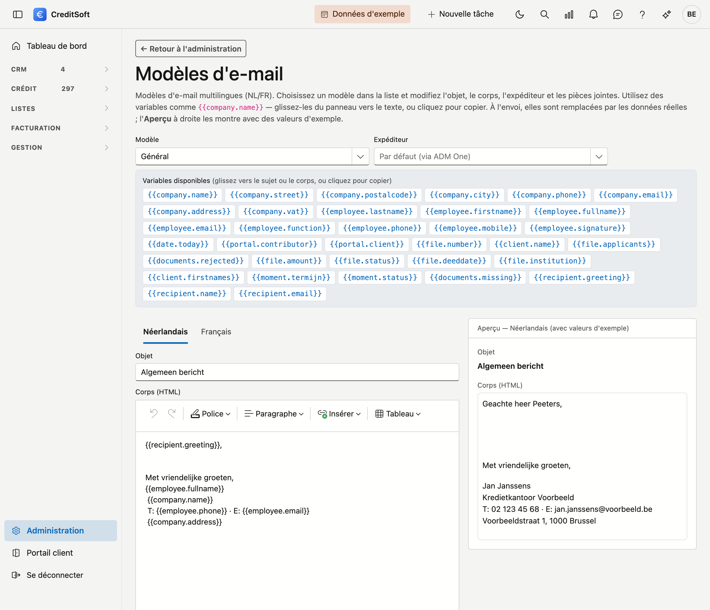

# Modèles d'e-mail

L'écran **Modèles d'e-mail** vous permet d'adapter le texte de vos e-mails sortants. Les modèles sont **fixes** — vous en choisissez un dans la liste et le modifiez ; vous n'en créez pas de nouveaux ici et n'en supprimez pas (ainsi chaque modèle reste lié à son rôle). Chaque modèle est **bilingue** (NL/FR).

Les textes de vos [e-mails par moment](../beheer/mail-momenten.md) figurent aussi dans la liste, sous la forme *Moment (statut) : titre*. Vous créez un nouveau texte de ce type sous *E-mails par moment*.

{ .volle-breedte }

## Ouvrir l'écran

Dans la barre latérale, cliquez sur **Administration**, puis sur la tuile **Modèles d'e-mail** (sous *Communication*). En haut, le lien **← Retour à l'administration** vous ramène à l'aperçu.

## Choisir un modèle

En haut, sous **Modèle**, choisissez le modèle à modifier. Chaque modèle correspond à un type d'e-mail :

| Modèle | Quand CreditSoft l'utilise |
|---|---|
| **Général** | Un e-mail que vous rédigez vous-même, en dehors d'une action précise |
| **Documents non valides (portail client)** | Vous refusez une pièce fournie par votre client |
| **Invitation portail client** | Vous invitez un client à fournir ses pièces |
| **Rappel pièces manquantes (portail client)** | Des pièces manquent encore, et le rappel part |
| **Confirmation de rendez-vous** | Vous confirmez un rendez-vous |
| **Bordereau de commission** | Vous envoyez un [bordereau](../credit-management/commission-statements.md) à l'apporteur |
| **Nouveau lead via le site web** | Un lead arrive par votre site web — cet e-mail part vers votre bureau |
| **Aperçu quotidien des leads** | L'aperçu des leads qui demandent votre attention — également vers votre bureau |
| **Facture ou note de crédit** | Vous envoyez une [facture ou une note de crédit](../facturatie/facturen.md#envoyer-par-e-mail) à votre client |

Le modèle *Facture ou note de crédit* a ses propres variables, comme `{{invoice.number}}`, `{{invoice.amount}}` et `{{invoice.payment}}` — la phrase de paiement avec l'échéance, votre numéro de compte et la communication. Pour une note de crédit, cette phrase reste vide, si bien qu'un seul texte convient aux deux.

## Variables

Un modèle peut contenir des **variables** remplies automatiquement à l'envoi, par exemple `{{company.name}}` ou `{{employee.firstname}}`. Vous les trouvez dans le **panneau de variables** : **glissez** une variable vers l'objet ou le corps, ou **cliquez** dessus pour la copier. L'**Aperçu** à droite montre le modèle avec des valeurs d'exemple, pour voir immédiatement le rendu.

## Modifier

- **Expéditeur** — choisissez (facultatif) l'adresse d'envoi utilisée comme expéditeur. Vide = l'adresse par défaut.
- **Objet** et **Corps** — par langue (onglets **Néerlandais** / **Français**). Le corps est un texte HTML mis en forme.
- **Pièces jointes** — ajoutez par langue un ou plusieurs fichiers joints à l'e-mail. *(Les pièces jointes ne peuvent être ajoutées qu'après un premier enregistrement du modèle.)*

Cliquez sur **Enregistrer**.
