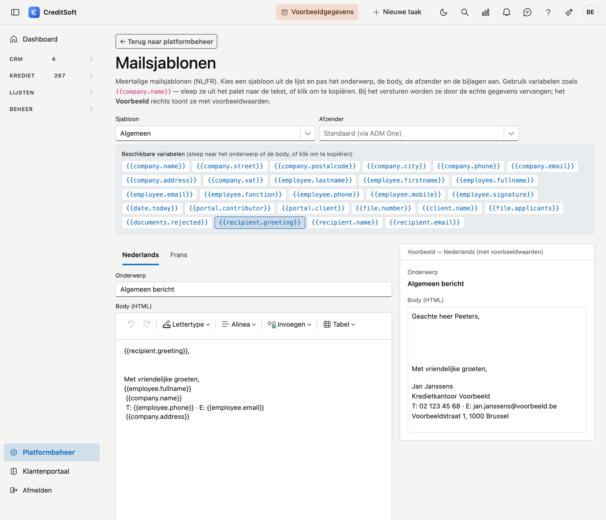

# Mailsjablonen

Op het scherm **Mailsjablonen** past u de tekst van uw uitgaande e-mails aan. De sjablonen zijn **vast** — u kiest er één uit de lijst en past hem aan; u maakt zelf geen nieuwe aan en verwijdert er geen (zo blijft elk sjabloon gekoppeld aan zijn rol). Elk sjabloon is **tweetalig** (NL/FR).

## Het scherm openen

Klik in de zijbalk op **Platformbeheer** en daarna op de tegel **Mailsjablonen** (onder *Communicatie*). Bovenaan brengt de link **← Terug naar platformbeheer** u terug naar het overzicht.

## Een sjabloon kiezen

Kies bovenaan bij **Sjabloon** welk sjabloon u wilt aanpassen. *(Voorlopig is er één: **Algemeen** — de vrije mail die u gebruikt om te mailen los van een specifieke actie. Later komen er meer.)*

## Variabelen

Een sjabloon kan **variabelen** bevatten die bij het versturen automatisch ingevuld worden, bijvoorbeeld `{{company.name}}` of `{{employee.firstname}}`. U vindt ze in het **variabelen-palet**: **sleep** een variabele naar het onderwerp of de body, of **klik** erop om ze te kopiëren. Het **Voorbeeld** rechts toont het sjabloon met voorbeeldwaarden, zodat u meteen ziet hoe het eruitziet.

## Aanpassen

- **Afzender** — kies (optioneel) welk verzendadres als afzender gebruikt wordt. Leeg = het standaardadres.
- **Onderwerp** en **Body** — per taal (tabbladen **Nederlands** / **Frans**). De body is een opgemaakte HTML-tekst.
- **Bijlagen** — voeg per taal één of meer bestanden toe die met de mail meegaan. *(Bijlagen kunt u pas toevoegen nadat u het sjabloon een eerste keer hebt opgeslagen.)*

Klik op **Opslaan**.
