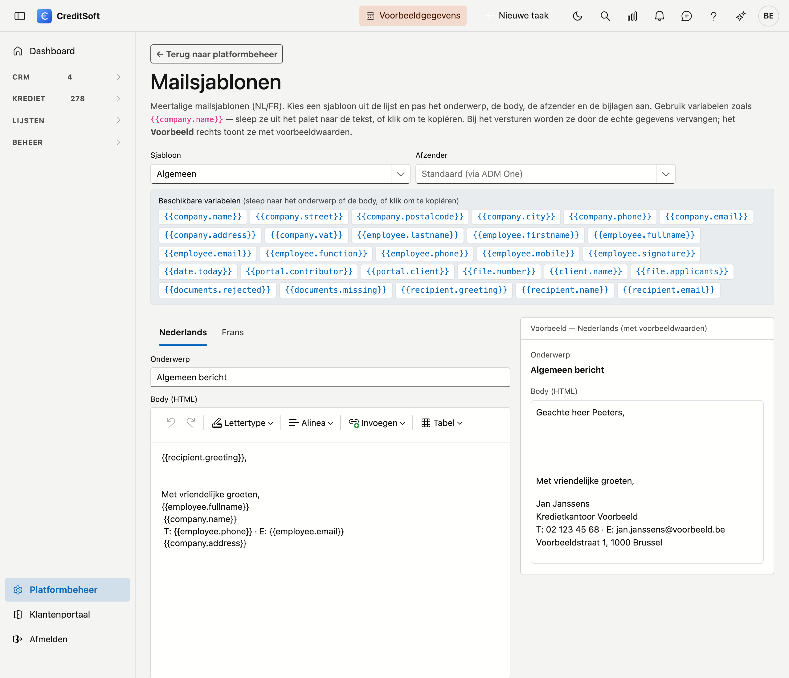

# Mailsjablonen

Op het scherm **Mailsjablonen** past u de tekst van uw uitgaande e-mails aan. De sjablonen zijn **vast** — u kiest er één uit de lijst en past hem aan; u maakt hier zelf geen nieuwe aan en verwijdert er geen (zo blijft elk sjabloon gekoppeld aan zijn rol). Elk sjabloon is **tweetalig** (NL/FR).

De teksten van uw [mails per moment](../beheer/mail-momenten.md) staan ook in de lijst, als *Bij een moment (status): titel*. Een nieuwe zulke tekst maakt u bij *Mails per moment*.

{ .volle-breedte }

## Het scherm openen

Klik in de zijbalk op **Platformbeheer** en daarna op de tegel **Mailsjablonen** (onder *Communicatie*). Bovenaan brengt de link **← Terug naar platformbeheer** u terug naar het overzicht.

## Een sjabloon kiezen

Kies bovenaan bij **Sjabloon** welk sjabloon u wilt aanpassen. Elk sjabloon hoort bij één soort mail:

| Sjabloon | Wanneer CreditSoft het gebruikt |
|---|---|
| **Algemeen** | Een mail die u zelf opstelt, los van een specifieke handeling |
| **Ongeldige documenten (klantenportaal)** | U keurt een stuk af dat uw klant aanleverde |
| **Uitnodiging klantenportaal** | U nodigt een klant uit om zijn stukken aan te leveren |
| **Herinnering ontbrekende stukken (klantenportaal)** | Er ontbreken nog stukken, en de herinnering vertrekt |
| **Bevestiging afspraak** | U bevestigt een afspraak |
| **Commissieborderel** | U mailt een [borderel](../credit-management/commission-statements.md) naar de aanbrenger |
| **Nieuwe lead via de website** | Er komt een lead binnen via uw website — deze mail gaat naar uw kantoor |
| **Dagelijks leadoverzicht** | Het overzicht van de leads die aandacht vragen — ook naar uw kantoor |
| **Factuur of creditnota** | U mailt een [factuur of creditnota](../facturatie/facturen.md#mailen) naar uw klant |

Het sjabloon *Factuur of creditnota* heeft eigen variabelen, zoals `{{invoice.number}}`, `{{invoice.amount}}` en `{{invoice.payment}}` — de betaalzin met de vervaldag, uw rekeningnummer en de mededeling. Bij een creditnota blijft die betaalzin leeg, zodat één tekst voor beide werkt.

## Variabelen

Een sjabloon kan **variabelen** bevatten die bij het versturen automatisch ingevuld worden, bijvoorbeeld `{{company.name}}` of `{{employee.firstname}}`. U vindt ze in het **variabelen-palet**: **sleep** een variabele naar het onderwerp of de body, of **klik** erop om ze te kopiëren. Het **Voorbeeld** rechts toont het sjabloon met voorbeeldwaarden, zodat u meteen ziet hoe het eruitziet.

## Aanpassen

- **Afzender** — kies (optioneel) welk verzendadres als afzender gebruikt wordt. Leeg = het standaardadres.
- **Onderwerp** en **Body** — per taal (tabbladen **Nederlands** / **Frans**). De body is een opgemaakte HTML-tekst.
- **Bijlagen** — voeg per taal één of meer bestanden toe die met de mail meegaan. *(Bijlagen kunt u pas toevoegen nadat u het sjabloon een eerste keer hebt opgeslagen.)*

Klik op **Bewaren**.
