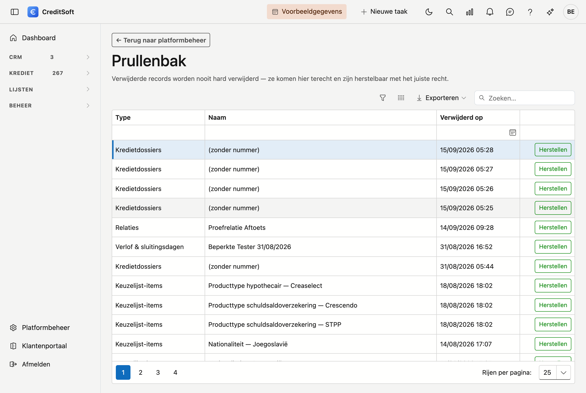

# Prullenbak

In de **Prullenbak** vindt u de records die verwijderd zijn. Bij CreditSoft wordt niets meteen definitief gewist: een verwijderd record verhuist naar de Prullenbak en blijft **herstelbaar**. Zo kan een beheerder een per ongeluk verwijderde relatie, aanbrenger of dossier zonder gegevensverlies terugzetten.

## Het scherm openen

Klik in de zijbalk op **Platformbeheer** en daarna op de tegel **Prullenbak** (onder *Gegevens*).

## Wat u ziet

De verwijderde records staan **gegroepeerd per soort** — bijvoorbeeld *Relaties*, *Kredietinstellingen*, *Verzekeraars*, *Aanbrengers*, *Kredietdossiers*, *Afspraken* en de journaal-items (*Taken*, *Notities*, *Bijlagen*, *Mailverkeer*). Per record ziet u:

- **Naam** — de naam of titel van het verwijderde record.
- **Verwijderd op** — wanneer het naar de Prullenbak ging.
- **Herstellen** — de knop om het record terug te zetten.

## Een record herstellen

Klik naast het record op **Herstellen**. Het record verdwijnt uit de Prullenbak en is meteen weer beschikbaar op zijn gewone plaats, precies zoals voordien.

## Goed om weten

- De Prullenbak toont enkel de records van **uw kantoor** — u ziet nooit de verwijderde gegevens van een andere klant.
- **Herstellen** vereist een bijkomend recht: alleen wie dat recht heeft, ziet de knop. Bekijken en herstellen kunt u per rol regelen bij **Platformbeheer → Rollen**.
- Elke verwijdering en elk herstel wordt netjes bijgehouden in de historiek.
