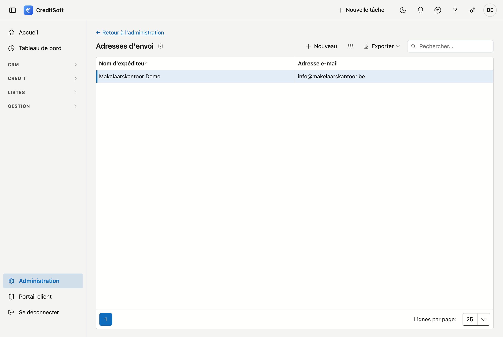

# Adresses d'envoi

Les adresses d'envoi sont les **adresses e-mail utilisables comme expéditeur** lorsque CreditSoft envoie des e-mails. Vous constituez ici une courte liste ; lors de la rédaction d'un modèle d'e-mail, vous choisissez ensuite l'adresse d'envoi à utiliser. L'envoi lui-même passe par la connexion e-mail sécurisée avec ADM One.

## Ouvrir l'écran

Dans la barre latérale, cliquez sur **Administration**, puis sur la tuile **Adresses d'envoi** (sous *Communication*). En haut de l'écran, le lien **← Retour à l'administration** vous ramène à l'aperçu.

## La liste

Le tableau affiche, pour chaque adresse d'envoi, le **nom d'expéditeur** et l'**adresse e-mail**.

- **Rechercher** — utilisez le champ de recherche.
- **Exporter** — exportez la liste via Excel ou CSV.
- **Nouveau / modifier** — cliquez sur **Nouveau**, ou **double-cliquez** une ligne pour la modifier.
- **Supprimer** — une adresse d'envoi est **archivée** (suppression douce), pas définitivement effacée.

## Ajouter ou modifier une adresse d'envoi

Une adresse d'envoi comporte deux champs, tous deux **obligatoires** (indiqués par un astérisque rouge) :

- **Adresse e-mail** — l'adresse qui apparaît comme expéditeur, par exemple `info@votrebureau.be`. L'adresse doit avoir une forme valide.
- **Nom d'expéditeur** — le nom que le destinataire voit comme expéditeur, par exemple *Bureau de courtage Exemple*.

Saisissez les champs et cliquez sur **Enregistrer**. La suppression se fait dans le même écran d'édition.

!!! tip "Où est-ce utilisé ?"
    Une adresse de cette liste se choisit ensuite comme expéditeur sur un **modèle d'e-mail**. Vous ne saisissez donc l'adresse qu'une seule fois et l'utilisez partout de façon cohérente.
