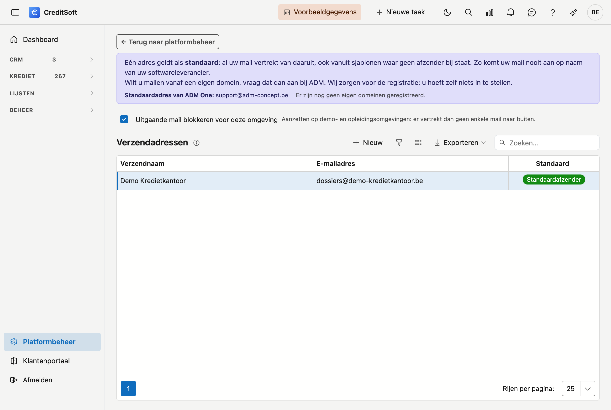

# Verzendadressen

Verzendadressen zijn de **e-mailadressen die als afzender** gebruikt worden wanneer CreditSoft e-mails verstuurt. U legt hier een korte lijst aan en duidt er één aan als **standaard**. Het versturen zelf verloopt via de beveiligde mailkoppeling met ADM One.

## Het scherm openen

Klik in de zijbalk op **Platformbeheer** en daarna op de tegel **Verzendadressen** (onder *Communicatie*). Bovenaan het scherm brengt de link **← Terug naar platformbeheer** u terug naar het overzicht.

{ .volle-breedte }

## Waarom dit belangrijk is

Zolang u geen verzendadres aanduidt, kan CreditSoft geen mail versturen. Dat is met opzet: zonder uw eigen adres zou uw mail vertrekken van het adres van uw softwareleverancier, en dan komt een dossieroverzicht bij een notaris aan op naam van iemand anders dan uw kantoor.

Duid daarom **één adres aan als standaard**. Alle mail vertrekt dan van dat adres — ook vanuit sjablonen waar geen afzender bij ingevuld staat.

## De lijst

De tabel toont per verzendadres de **verzendnaam**, het **e-mailadres** en of het de **standaard** is.

- **Als standaard instellen** — klik op die knop in de kolom *Standaard*. Er is altijd hoogstens één standaardadres; het vorige verliest de aanduiding vanzelf.
- **Zoeken** — gebruik het zoekveld om te zoeken.
- **Exporteren** — exporteer de lijst naar Excel of CSV.
- **Nieuw / bewerken** — klik op **Nieuw**, of **dubbelklik** een rij om ze te bewerken.
- **Verwijderen** — een verzendadres wordt **gearchiveerd**, niet definitief gewist.

## Een verzendadres toevoegen of bewerken

Een verzendadres heeft twee velden, allebei **verplicht** (aangeduid met een rood sterretje):

- **E-mailadres** — het adres dat als afzender verschijnt, bijvoorbeeld `info@uwkantoor.be`.
- **Verzendnaam** — de naam die de ontvanger als afzender te zien krijgt, bijvoorbeeld *Makelaarskantoor Voorbeeld*.

Vul de velden in en klik op **Opslaan**. Verwijderen doet u in hetzelfde bewerkscherm.

## Uw eigen domein gebruiken

Bovenaan het scherm ziet u twee dingen: het **standaardadres van ADM One**, en welke **domeinen toegelaten zijn** voor uw platform.

Terwijl u een adres intikt, controleert CreditSoft het domein tegen die lijst:

- **Groen** — het domein is geregistreerd. Mail van dit adres vertrekt op naam van uw kantoor.
- **Oranje** — het domein is nog niet geregistreerd. U kan het adres wél bewaren en gebruiken, maar de aflevering kan later stilvallen.

Wilt u mailen vanaf een eigen domein, **vraag dat dan aan bij uw contactpersoon bij ADM**. Wij zorgen voor de registratie; u hoeft zelf niets in te stellen. Zodra het domein geregistreerd is, verschijnt het hier bij de toegelaten domeinen en kleurt de controle groen.

## Uitgaande mail blokkeren

Met de schakelaar **Uitgaande mail blokkeren voor deze omgeving** houdt u alle uitgaande mail tegen. Gebruik dat op **demonstratie- en opleidingsomgevingen**: er kan dan niets per ongeluk naar een echte ontvanger vertrekken. Wie toch probeert te versturen, krijgt een nette melding en de mail blijft achterwege.

Op uw eigen werkomgeving laat u die schakelaar uit staan.

## Veelgemaakte fouten

!!! warning
    **Een adres invullen is niet hetzelfde als het aanduiden als standaard.** Staat er een adres in de lijst maar is er geen standaard aangeduid, en verwijst uw mailsjabloon ook niet naar een afzender, dan kan er nog steeds niet verstuurd worden. Kijk in de kolom *Standaard* of er één groen aangeduid staat.

    **Een oranje waarschuwing is geen blokkade, maar negeer ze niet.** Uw mail vertrekt vandaag nog, maar zolang het domein niet geregistreerd is, kan de aflevering later stilvallen. Vraag de registratie aan zodra u het adres in gebruik neemt.

## Zie ook

- [Mailsjablonen](mail-templates.md) — daar kiest u per sjabloon een afzender; die krijgt voorrang op de standaard.
- [Mailmonitoring](mail-monitoring.md) — daar volgt u op of uw mails effectief afgeleverd zijn.
