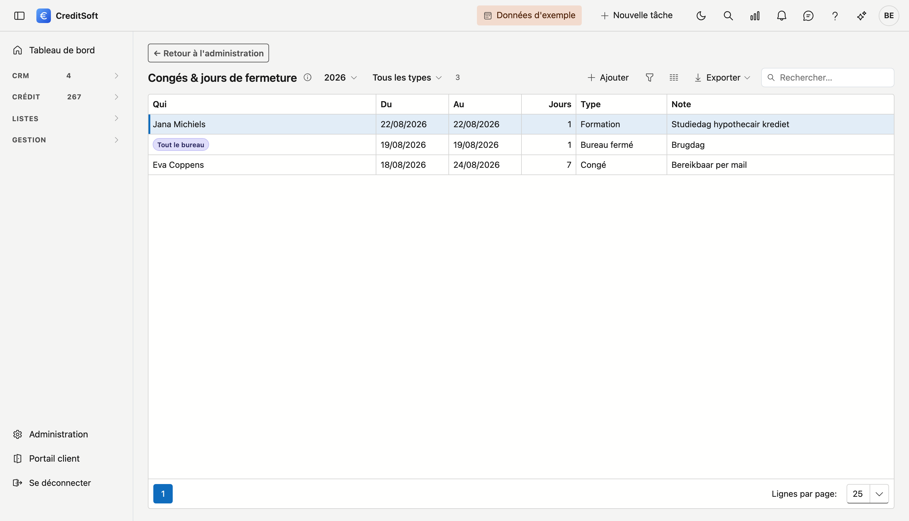
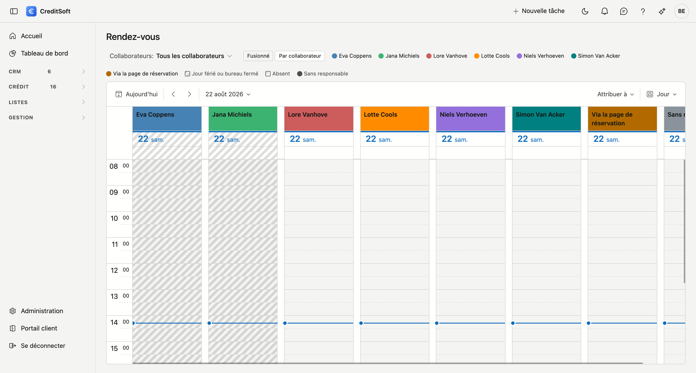

# Congés & jours de fermeture

Vous consignez ici qui est absent et quand, et les jours où votre bureau est fermé. L'[agenda](../crm/meetings.md)
**hachure** ces jours, pour que vous les voyiez avant de planifier quoi que ce soit.

## Encoder une période

Cliquez sur **Ajouter**. Le **type** détermine le reste de la fenêtre :

| Type | Pour quoi | Qui |
|---|---|---|
| **Congé** | Vacances | une personne |
| **Maladie** | Maladie ou accident | une personne |
| **Formation** | Séminaire, journée d'étude | une personne |
| **Bureau fermé** | Pont, fermeture collective, congé du bâtiment | tout le monde |

Pour *Bureau fermé*, le champ **Qui** disparaît : un tel jour vaut pour l'ensemble du bureau. Si vous choisissez
l'un des trois autres, vous désignez un **collaborateur ou un apporteur** — la même liste que pour les tâches et
les appels.

La période va **du … au … inclus**. Un seul jour d'absence ? Indiquez deux fois la même date. Si vous avez
inversé les dates, CreditSoft les remet dans l'ordre au lieu de se plaindre.

La **note** est libre et facultative — pratique pour « joignable par e-mail » ou « remplacé par Ann ».

## Ce que vous voyez dans l'agenda

- Dans la **vue par colonnes** (une colonne par collaborateur), le congé de chaque personne apparaît dans sa
  propre colonne.
- Dans la **vue normale**, il n'y a pas de colonne par personne. Seuls les jours de fermeture du **bureau** y
  sont hachurés — un congé personnel semblerait sinon valoir pour tout le monde.
- Un **jour de fermeture** reçoit une hachure plus dense qu'un congé personnel, afin que vous distinguiez les
  deux lorsqu'ils tombent le même jour.

!!! warning "Une absence ne bloque rien"
    Vous pouvez toujours placer un rendez-vous sur un jour hachuré — c'est parfois nécessaire. Et un client qui
    réserve **en ligne** ne voit pas vos congés : cette page de réservation ne connaît pas encore vos absences.
    Si vous fermez le bureau une semaine, fermez également vos heures d'ouverture en ligne pour cette semaine.

## Vous ne devez pas encoder les jours fériés légaux

Le Nouvel An, Pâques, le 21 juillet et les autres sont identiques pour chaque bureau. **Ils y figurent déjà** —
l'agenda les hachure comme un jour de fermeture, et ils se décalent d'eux-mêmes chaque année. Trois d'entre eux
dépendent de Pâques et changent donc de date chaque année ; cela aussi se fait sans intervention. Vous ne pouvez
pas les modifier ici, et ce n'est pas nécessaire.

Ce que vous encodez ici est propre à **votre** bureau : un pont après l'Ascension, la semaine entre Noël et
Nouvel An, le congé du bâtiment.

## Supprimer

Ouvrez la période et cliquez sur **Supprimer**. Elle disparaît de l'agenda et se retrouve dans la
[Corbeille](../administration/recycle-bin.md), d'où vous pouvez la récupérer.
