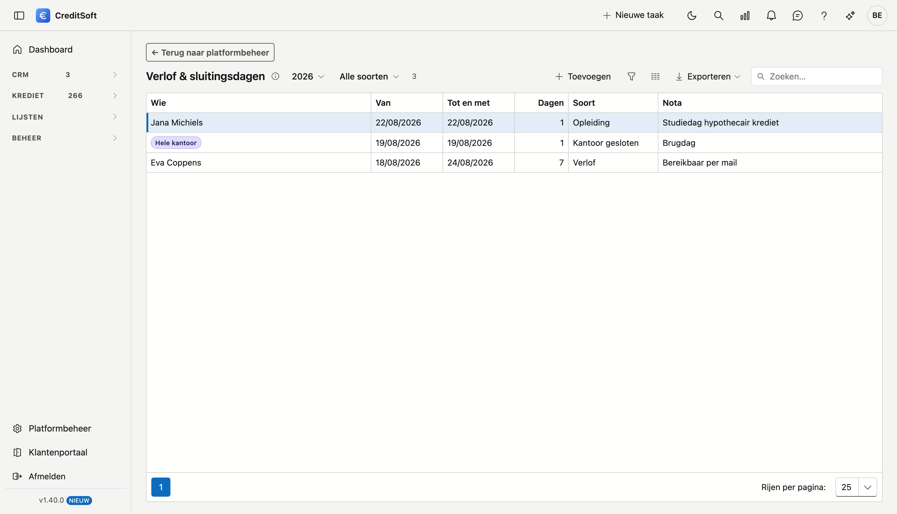
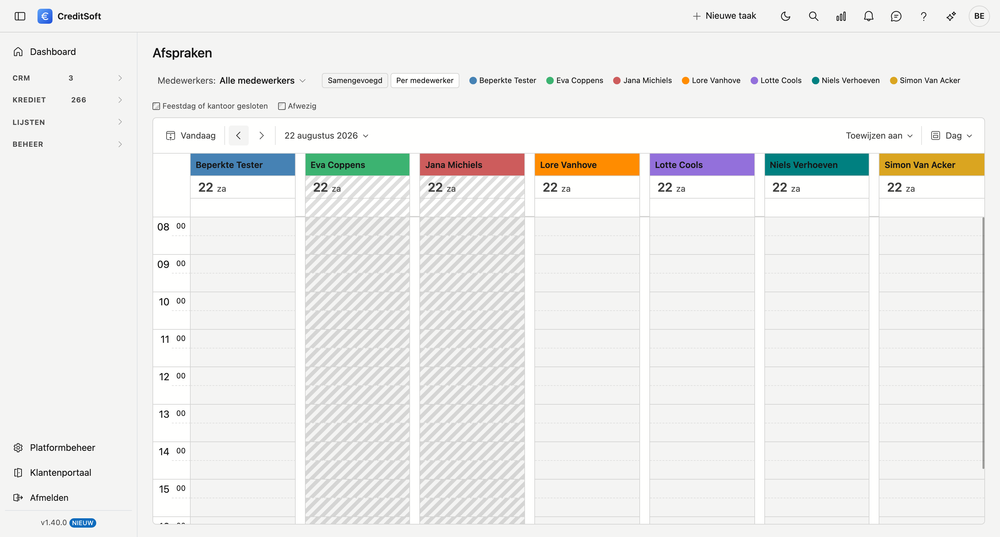

# Verlof & sluitingsdagen

Hier legt u vast wie er wanneer niet is, en op welke dagen uw kantoor dicht is. De [agenda](../crm/meetings.md)
**arceert** die dagen, zodat u ze ziet vóór u iets inplant.

## Een periode invoeren

Klik **Toevoegen**. Het **soort** bepaalt de rest van het venster:

| Soort | Waarvoor | Wie |
|---|---|---|
| **Verlof** | Vakantie | één persoon |
| **Ziekte** | Ziekte of ongeval | één persoon |
| **Opleiding** | Seminarie, studiedag | één persoon |
| **Kantoor gesloten** | Brugdag, collectieve sluiting, bouwverlof | iedereen |

Bij *Kantoor gesloten* verdwijnt het veld **Wie**: zo'n dag geldt voor het hele kantoor. Kiest u een van de
andere drie, dan kiest u een **medewerker of aanbrenger** — dezelfde lijst als bij taken en gesprekken.

De periode loopt **van tot en met**. Eén dag afwezig? Zet dezelfde datum twee keer. Hebt u de datums omgekeerd
ingevuld, dan zet CreditSoft ze recht in plaats van te klagen.

De **nota** is vrij en optioneel — handig voor "bereikbaar per mail" of "vervangen door Ann".

## Wat u in de agenda ziet

- In de **kolomweergave** (één kolom per medewerker) ziet u het verlof van elke persoon in zijn eigen kolom.
- In de **gewone weergave** is er geen kolom per persoon. Daar arceren enkel de dagen waarop het **kantoor**
  dicht is — persoonlijk verlof zou er anders lijken te gelden voor iedereen.
- Een **sluitingsdag** krijgt een dichtere arcering dan persoonlijk verlof, zodat u de twee uit elkaar houdt
  wanneer ze op dezelfde dag vallen.

!!! warning "Afwezigheid blokkeert niets"
    U kunt op een gearceerde dag nog altijd een afspraak zetten — soms moet dat. En een klant die **online**
    een afspraak boekt, ziet uw verlof niet: die boekingspagina kent uw afwezigheden nog niet. Sluit u het
    kantoor een week, sluit dan ook uw online openingsuren voor die week.

## Wettelijke feestdagen hoeft u niet in te voeren

Nieuwjaar, Pasen, 21 juli en de andere zijn voor elk kantoor gelijk. **Ze staan er al** — de agenda arceert ze
net als een sluitingsdag, en ze schuiven elk jaar vanzelf mee. Drie ervan hangen aan Pasen en verspringen dus
per jaar; ook dat gebeurt zonder dat u er iets voor doet. U kunt ze hier niet aanpassen, en dat hoeft ook niet.

Wat u hier wél zet, is wat **uw** kantoor eigen is: een brugdag na Hemelvaart, de week tussen Kerst en
Nieuwjaar, bouwverlof.

## Verwijderen

Open de periode en klik **Verwijderen**. Ze verdwijnt uit de agenda en belandt in de
[Prullenbak](../administration/recycle-bin.md), waar u ze kunt terughalen.
