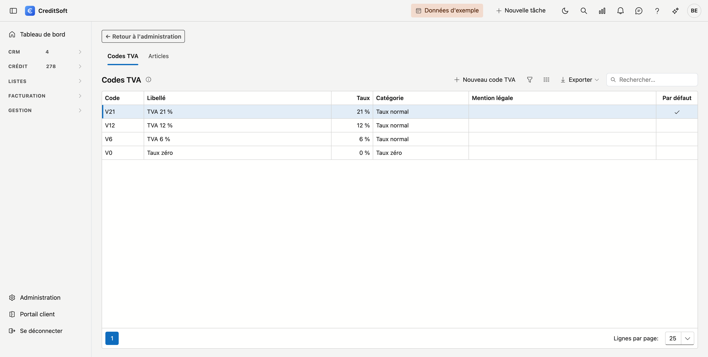

# Codes TVA et articles

Vous gérez ici les **codes TVA** et les **articles** que vous choisissez sur une facture. Un article est une ligne que vous facturez souvent, avec son libellé, son prix et son code TVA déjà remplis.

## Ouvrir l'écran

Dans le menu de gauche, cliquez sur **Administration** et choisissez la tuile **Codes TVA et articles**, sous *Facturation*. Il vous faut le droit *Gérer les codes TVA, articles et paramètres de facturation*.

L'écran a deux onglets : **Codes TVA** et **Articles**.

## Codes TVA

{ .volle-breedte }

Chaque bureau démarre avec quatre codes : **21 %**, **12 %**, **6 %** et le **taux zéro**. Le code **V21** est le **code par défaut** : il est proposé sur chaque nouvelle ligne.

Cliquez sur **Nouveau code TVA**, ou double-cliquez un code pour l'ouvrir. Un code TVA comprend :

- un **code** et un **libellé** en néerlandais et en français ;
- une **catégorie** : *Taux normal*, *Taux zéro*, *Exonéré*, *Autoliquidation (cocontractant)*, *Intracommunautaire*, *Exportation* ou *Hors champ d'application*. Seul le taux normal porte un **taux** en pourcentage ;
- **Code par défaut sur une nouvelle ligne** — à cocher pour un seul code ;
- une **mention légale**, en néerlandais et en français. Pour un code exonéré ou en autoliquidation, elle est obligatoire : elle figure sur chaque facture qui utilise ce code, dans la langue du client ;
- un **code VATEX (Peppol)**.

!!! warning "La mention légale"
    Un code exonéré ou en autoliquidation doit porter le texte légal exact. CreditSoft n'en propose volontairement aucun : faites confirmer ce texte par votre comptable. Sans mention, une facture qui utilise ce code ne devient pas définitive.

## Articles

Dans l'onglet **Articles**, vous créez les lignes que vous facturez souvent, par exemple vos honoraires pour un dossier de crédit. Un article a un **code**, un **libellé** en néerlandais et en français, un **prix hors TVA** et un **code TVA**. Quand vous choisissez l'article sur une facture, CreditSoft remplit ces données pour vous.

## Archiver

**Archiver** retire un code TVA ou un article des listes de choix. Les factures qui les utilisent déjà les conservent.

## Voir aussi

- [Factures](../facturatie/facturen.md)
- [Paramètres de facturation](factuurinstellingen.md)
