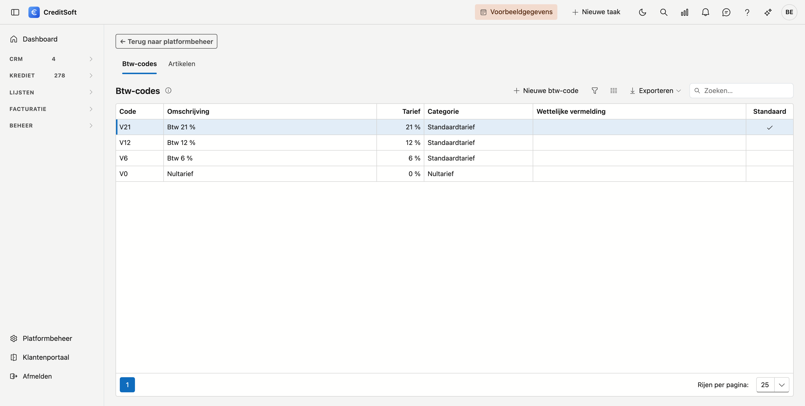

# Btw-codes en artikelen

Hier beheert u de **btw-codes** en de **artikelen** die u op een factuur kiest. Een artikel is een lijn die u vaak factureert, met haar omschrijving, prijs en btw-code al ingevuld.

## Het scherm openen

Klik in het menu links op **Platformbeheer** en kies de tegel **Btw-codes en artikelen**, onder *Facturatie*. U hebt daarvoor het recht *Btw-codes, artikelen en factuurinstellingen beheren* nodig.

Het scherm heeft twee tabbladen: **Btw-codes** en **Artikelen**.

## Btw-codes

{ .volle-breedte }

Elk kantoor start met vier codes: **21 %**, **12 %**, **6 %** en het **nultarief**. De code **V21** is de **standaardcode**: die staat voorgesteld op elke nieuwe lijn.

Klik op **Nieuwe btw-code**, of dubbelklik een code om ze te openen. Een btw-code heeft:

- een **code** en een **omschrijving** in het Nederlands en het Frans;
- een **categorie**: *Standaardtarief*, *Nultarief*, *Vrijgesteld*, *Verlegd (medecontractant)*, *Intracommunautair*, *Uitvoer* of *Buiten het toepassingsgebied*. Enkel het standaardtarief draagt een **tarief** in procent;
- **Standaardcode op een nieuwe lijn** — aan te vinken bij één code;
- een **wettelijke vermelding**, in het Nederlands en het Frans. Bij een vrijgestelde of verlegde code is die verplicht: ze komt op elke factuur met die code, in de taal van de klant;
- een **VATEX-code (Peppol)**.

!!! warning "De wettelijke vermelding"
    Een vrijgestelde of verlegde code moet de juiste wettelijke tekst dragen. CreditSoft stelt er bewust geen voor: laat die tekst bevestigen door uw boekhouder. Zonder vermelding wordt een factuur met die code niet definitief.

## Artikelen

Op het tabblad **Artikelen** maakt u de lijnen aan die u vaak factureert, bijvoorbeeld uw erelonen voor een kredietdossier. Een artikel heeft een **code**, een **omschrijving** in het Nederlands en het Frans, een **prijs excl. btw** en een **btw-code**. Kiest u het artikel op een factuur, dan vult CreditSoft die gegevens voor u in.

## Archiveren

**Archiveren** haalt een btw-code of een artikel uit de keuzelijsten. Facturen die ze al gebruiken, houden ze.

## Zie ook

- [Facturen](../facturatie/facturen.md)
- [Factuurinstellingen](factuurinstellingen.md)
