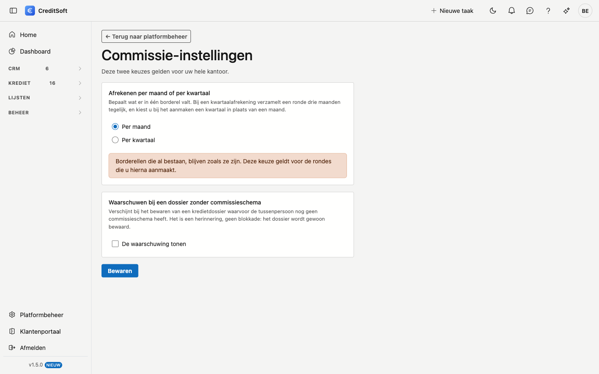

# Commissie-instellingen

Twee keuzes die bepalen hoe CreditSoft met commissie omgaat. Ze gelden voor uw hele kantoor, niet per dossier of per medewerker.

## Het scherm openen

Ga naar **Platformbeheer** onderaan het menu, en klik onder *Krediet* op de tegel **Commissie-instellingen**.

{ .volle-breedte }

## Afrekenen per maand of per kwartaal

Dit bepaalt wat er in één borderel valt.

- **Per maand** — een ronde verzamelt één maand, en u kiest bij het aanmaken een maand.
- **Per kwartaal** — een ronde verzamelt drie maanden tegelijk, en u kiest een kwartaal.

!!! warning "Borderellen die al bestaan, veranderen niet"
    Zet u dit om nadat u al rondes hebt aangemaakt, dan blijven die staan zoals ze waren. De keuze geldt voor de rondes die u hierna maakt.

## Waarschuwen bij een dossier zonder commissieschema

Staat dit aan, dan krijgt u een herinnering wanneer u een kredietdossier bewaart waarvoor de tussenpersoon nog geen commissieschema heeft.

Het is een **herinnering, geen blokkade**: het dossier wordt gewoon bewaard. Zet het uit als uw kantoor niet met commissieschema's werkt — anders verschijnt de melding bij elke bewaaractie van elk dossier.

## Wat hier níét staat

De **beginstatus van een nieuw dossier** is ook een instelling voor het hele kantoor, maar staat bij [Dashboard-fases](dashboard-fases.md). Daar gebruikt ze dezelfde statuslijst als de fase-indeling, en dat hoort bij elkaar.
