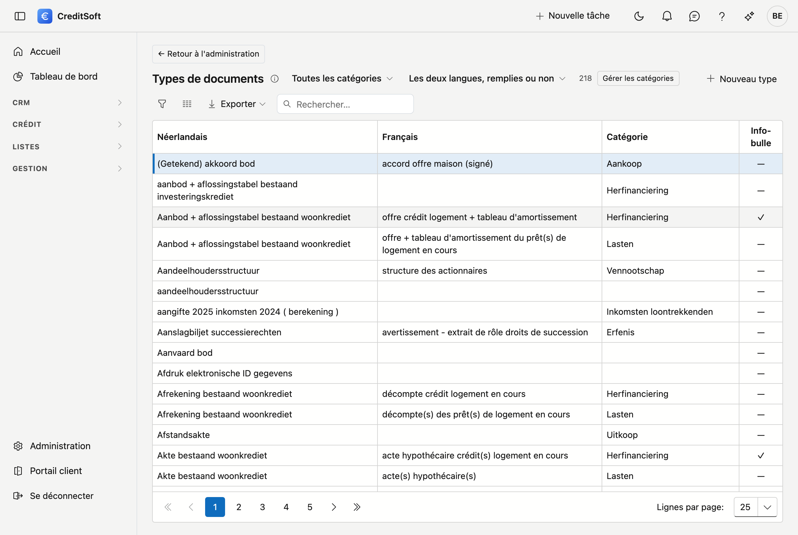
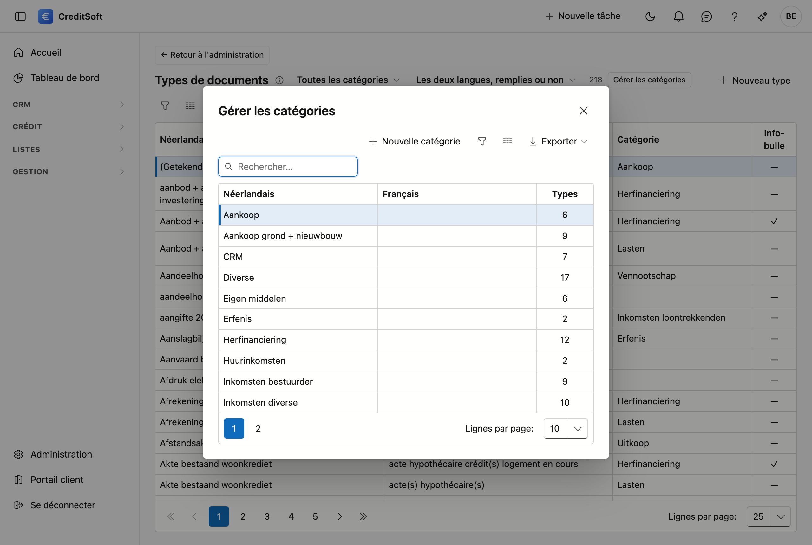

# Types de documents

Vous gérez ici le **modèle maître** des documents attendus. C'est la liste à partir de laquelle vous composez la check-list documentaire sur un dossier de crédit : fiche de paie, avertissement-extrait de rôle, compromis, et ainsi de suite.

## Ouvrir l'écran

En bas à gauche, cliquez sur **Administration**, puis sur la tuile **Types de documents**, dans le groupe *Données*.

## Ce que vous renseignez par type

| Champ | À quoi il sert |
|---|---|
| **Description (NL/FR)** | Telle qu'elle apparaît sur la check-list d'un dossier |
| **Indication** | Une brève précision pour votre collaborateur ou le client — par exemple « les trois derniers mois » |
| **Catégorie** | Regroupe les types sur la check-list, pour qu'une longue liste reste lisible |

L'**indication** en vaut la peine : elle figure là où quelqu'un hésite, et évite un appel téléphonique.

## Parcourir la liste

Avec **218 types**, la recherche devient plus importante que le défilement. Deux filtres figurent donc en haut de la liste :

- **Catégorie** — n'affiche que les types d'une seule catégorie.
- **Sans description française** — montre ce qu'il reste à traduire. Un type sans texte français n'est pas cassé : il affiche simplement le néerlandais. Mais si vous travaillez dans les deux langues, vous voudrez vider cette liste, et ce filtre vous montre aussitôt lesquels.

Le compteur à côté indique combien sont affichés sur le total.

**Double-cliquez** une ligne pour la modifier. La **suppression** se fait dans cette même fenêtre ; le type est archivé, pas effacé — les dossiers qui le portent déjà continuent à l'afficher.

## Gérer les catégories

Le bouton **Gérer les catégories** ouvre la liste des catégories. Une catégorie porte elle aussi un nom néerlandais et un nom français ; si vous laissez le français vide, l'application affiche le néerlandais.

{ .volle-breedte }

La colonne **Types** indique combien de types de documents relèvent de chaque catégorie. Ce chiffre a sa raison d'être : supprimer une catégorie qui porte encore des types est impossible. L'écran vous dit alors combien font obstacle, afin que vous puissiez d'abord les déplacer.

## Comment cela se répercute sur un dossier

Sur le dossier de crédit, vous choisissez dans cette liste les pièces que vous attendez. Pour chacune, vous suivez ensuite si elle a été reçue, vérifiée ou refusée.

!!! note "Les types de documents ne sont pas des pièces jointes"
    Un **type de document** est une pièce que vous **attendez** — elle figure sur la check-list, même si elle n'est pas encore arrivée. Une **pièce jointe** est un fichier effectivement rattaché au dossier. Le premier est un engagement, le second est un fichier.
