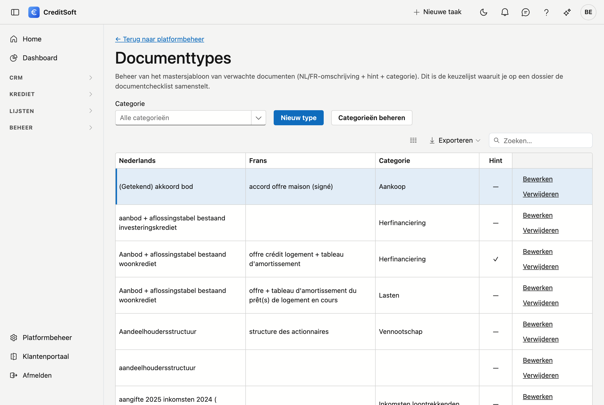

# Documenttypes

Hier beheert u het **mastersjabloon** van verwachte documenten. Dat is de lijst waaruit u op een kredietdossier de documentchecklist samenstelt: loonfiche, aanslagbiljet, compromis, en zo verder.

## Het scherm openen

Klik in de zijbalk op **Beheer** en dan op **Documenttypes**.

## Wat u per type invult

| Veld | Waarvoor |
|---|---|
| **Omschrijving (NL/FR)** | Zoals het op de checklist van een dossier verschijnt |
| **Hint** | Een korte toelichting voor uw medewerker of de klant — bijvoorbeeld "de laatste drie maanden" |
| **Categorie** | Groepeert de types op de checklist, zodat een lange lijst overzichtelijk blijft |

De **hint** is de moeite waard: die staat op de plaats waar iemand twijfelt, en scheelt een telefoontje.

## Hoe dit doorwerkt op een dossier

Op het kredietdossier kiest u uit deze lijst welke stukken u verwacht. Per stuk houdt u dan bij of het ontvangen, gecontroleerd of geweigerd is.

!!! note "Documenttypes zijn niet hetzelfde als bijlagen"
    Een **documenttype** is een stuk dat u vérwacht — het staat op de checklist, ook als het er nog niet is. Een **bijlage** is een bestand dat effectief aan het dossier hangt. Het eerste is een afspraak, het tweede is een bestand.
