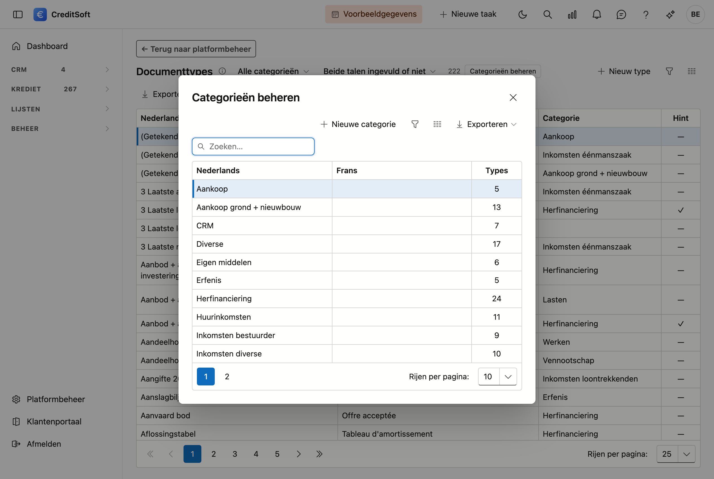

# Documenttypes

Hier beheert u het **mastersjabloon** van verwachte documenten. Dat is de lijst waaruit u op een kredietdossier de documentchecklist samenstelt: loonfiche, aanslagbiljet, compromis, en zo verder.

## Het scherm openen

Klik links onderaan op **Platformbeheer** en dan op de tegel **Documenttypes**, in de groep *Gegevens*.

## Wat u per type invult

| Veld | Waarvoor |
|---|---|
| **Omschrijving (NL/FR)** | Zoals het op de checklist van een dossier verschijnt |
| **Hint (NL)** en **Hint (FR)** | Een korte toelichting voor uw medewerker of de klant — bijvoorbeeld "de laatste drie maanden". In beide talen, want uw klant leest ze in de zijne |
| **Hint tonen** | Staat dit vinkje uit, dan blijft de hint bewaard maar wordt hij nergens getoond — ook niet aan de klant in het portaal. In de lijst ziet u aan het vinkje of de hint zichtbaar is |
| **Categorie** | Groepeert de types op de checklist, zodat een lange lijst overzichtelijk blijft |

De **hint** is de moeite waard: die staat op de plaats waar iemand twijfelt, en scheelt een telefoontje.

De app zet de **eerste letter** van een omschrijving in hoofdletter, zodat de lijst gelijk oogt. De rest van uw tekst blijft onaangeroerd: afkortingen als *BTW*, *EPC* of *IPT* houden hun hoofdletters, en een omschrijving die met een cijfer of een haakje begint — *3 laatste loonfiches*, *(Getekend) akkoord bod* — wordt niet verbouwd. Hetzelfde geldt voor de naam van een categorie.

## De lijst doorzoeken

Bij enkele honderden types wordt zoeken belangrijker dan bladeren. Bovenaan de lijst staan daarom twee filters:

- **Categorie** — toont enkel de types van één categorie.
- **Zonder Franse omschrijving** — toont wat er nog te vertalen valt. Een type zonder Franse tekst is niet stuk: het toont dan gewoon de Nederlandse. Maar werkt u tweetalig, dan wilt u die lijst leeg krijgen, en met dit filter ziet u meteen welke.

De teller ernaast zegt hoeveel er getoond worden van het totaal.

**Dubbelklik** een rij om ze te bewerken. **Verwijderen** doet u in datzelfde venster; het type wordt gearchiveerd, niet gewist — dossiers waar het al op staat, blijven het gewoon tonen.

## Categorieën beheren

Achter de knop **Categorieën beheren** staat de lijst van categorieën. Ook een categorie heeft een Nederlandse en een Franse naam; laat u de Franse leeg, dan toont de app de Nederlandse.

{ .volle-breedte }

De kolom **Types** zegt hoeveel documenttypes er onder elke categorie hangen. Dat cijfer is er met een reden: een categorie verwijderen die nog types draagt, kan niet. U krijgt dan te zien hoeveel er in de weg staan, zodat u ze eerst kunt verplaatsen.

## Hoe dit doorwerkt op een dossier

Op het kredietdossier kiest u uit deze lijst welke stukken u verwacht. Per stuk houdt u dan bij of het ontvangen, gecontroleerd of geweigerd is.

!!! note "Documenttypes zijn niet hetzelfde als bijlagen"
    Een **documenttype** is een stuk dat u vérwacht — het staat op de checklist, ook als het er nog niet is. Een **bijlage** is een bestand dat effectief aan het dossier hangt. Het eerste is een afspraak, het tweede is een bestand.
