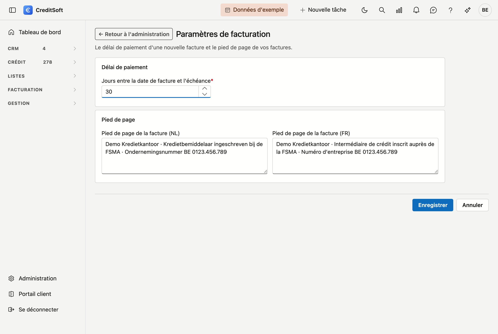

# Paramètres de facturation

Les paramètres qui s'appliquent à **chaque nouvelle facture** de votre bureau.

## Ouvrir l'écran

Dans le menu de gauche, cliquez sur **Administration** et choisissez la tuile **Paramètres de facturation**, sous *Facturation*. Il vous faut le droit *Gérer les codes TVA, articles et paramètres de facturation*.

{ .volle-breedte }

## Délai de paiement

Le nombre de **jours entre la date de facture et l'échéance**. Sur une nouvelle facture, CreditSoft calcule l'échéance avec ce délai. Vous pouvez encore l'adapter sur la facture elle-même.

## Pied de page

Le texte **en bas de vos factures**, en néerlandais et en français. Un client reçoit le pied de page dans sa propre langue. Vous y indiquez par exemple votre numéro d'entreprise et votre inscription à la FSMA.

Votre adresse, votre logo et votre numéro de compte ne viennent pas d'ici, mais de votre [Fiche d'entreprise](../administration/company-profile.md).

## Voir aussi

- [Factures](../facturatie/facturen.md)
- [Codes TVA et articles](btw-codes-en-artikelen.md)
