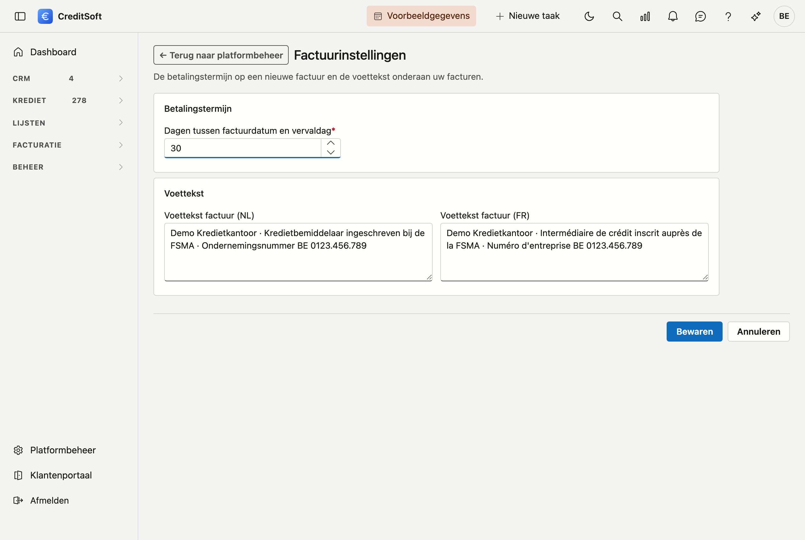

# Factuurinstellingen

De instellingen die gelden voor **elke nieuwe factuur** van uw kantoor.

## Het scherm openen

Klik in het menu links op **Platformbeheer** en kies de tegel **Factuurinstellingen**, onder *Facturatie*. U hebt daarvoor het recht *Btw-codes, artikelen en factuurinstellingen beheren* nodig.

{ .volle-breedte }

## Betalingstermijn

Het aantal **dagen tussen de factuurdatum en de vervaldag**. Op een nieuwe factuur rekent CreditSoft de vervaldag daarmee uit. Op de factuur zelf kan u ze nog aanpassen.

## Voettekst

De tekst **onderaan uw facturen**, in het Nederlands en in het Frans. Een klant krijgt de voettekst in zijn eigen taal. Hier zet u bijvoorbeeld uw ondernemingsnummer en uw FSMA-inschrijving.

Uw adres, logo en rekeningnummer komen niet hiervandaan, maar uit uw [Bedrijfsfiche](../administration/company-profile.md).

## Zie ook

- [Facturen](../facturatie/facturen.md)
- [Btw-codes en artikelen](btw-codes-en-artikelen.md)
