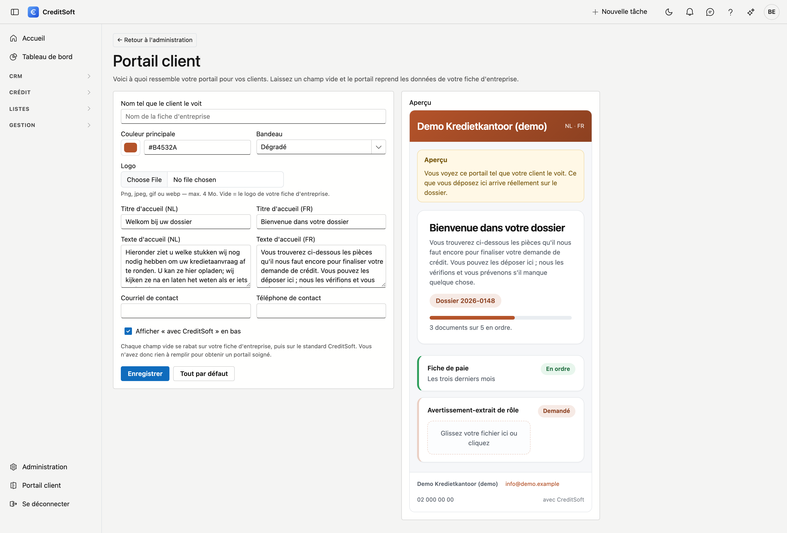
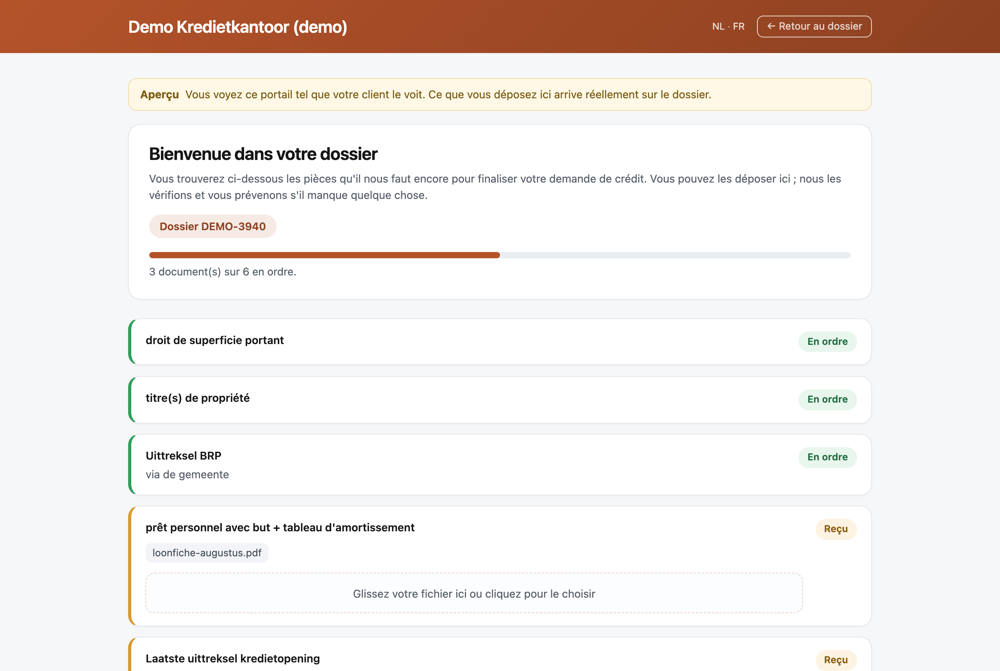

# Portail client

Vos clients déposent leurs documents via un portail qui leur est propre. Cet écran détermine l'aspect de ce portail — c'est ce qu'ils voient de vous : autant qu'il porte votre nom et vos couleurs.

## Ouvrir l'écran

En bas à gauche, cliquez sur **Administration**, puis sur la tuile **Portail client**, dans le groupe *Données*.

{ .volle-breedte }

## Vous n'avez rien à remplir

C'est le principe. Chaque champ laissé vide est repris de votre **fiche d'entreprise** : votre nom, votre logo, votre courriel et votre numéro de téléphone. Ce qui n'y figure pas non plus se rabat sur le standard CreditSoft. Votre portail est donc soigné sans le moindre réglage — et tout ce que vous remplissez prend le dessus.

## Ce que vous pouvez adapter

| Champ | À quoi cela sert |
|---|---|
| **Nom tel que le client le voit** | Le nom dans le bandeau et en bas de page. Vide = le nom de votre fiche d'entreprise |
| **Couleur principale** | Une seule couleur suffit : les tons plus clairs et plus foncés en sont déduits |
| **Bandeau** | Dégradé, uni, ou clair avec un liseré |
| **Logo** | Un logo propre au portail. Vide = le logo de votre fiche d'entreprise |
| **Titre et texte d'accueil** | Les premières phrases que lit votre client, en néerlandais et en français |
| **Contact** | À qui le client peut s'adresser. Vide = les données de votre fiche d'entreprise |

À droite, un **aperçu** suit aussitôt vos choix. Vous ne devez donc pas enregistrer pour voir le résultat.

!!! tip "Une couleur, pas une palette"
    Vous ne choisissez que la couleur principale. Les fonds, bordures et boutons en sont calculés, afin qu'ils s'accordent et restent lisibles.

Le bouton **Tout par défaut** efface vos choix et rétablit votre fiche d'entreprise.

## Ce que voit votre client

Une seule page, avec les documents que vous lui demandez. Pour chaque pièce, il voit si elle est encore **demandée**, **reçue**, **en ordre**, ou **à renvoyer** — dans ce dernier cas avec votre motif. Il glisse son fichier dans la zone en dessous ; vous le retrouvez aussitôt sur le document concerné dans le dossier de crédit.

{ .volle-breedte }

Cette image provient de **Voir comme le client**, d'où le bandeau jaune en haut et le bouton *Retour au dossier*. Votre client ne voit ni l'un ni l'autre — il obtient la même page avec un bouton de déconnexion.

!!! info "Votre client n'a pas besoin de mot de passe"
    Il entre par un lien personnel que vous lui transmettez. Ce lien vaut pour **un seul dossier** et expire après trente jours.
