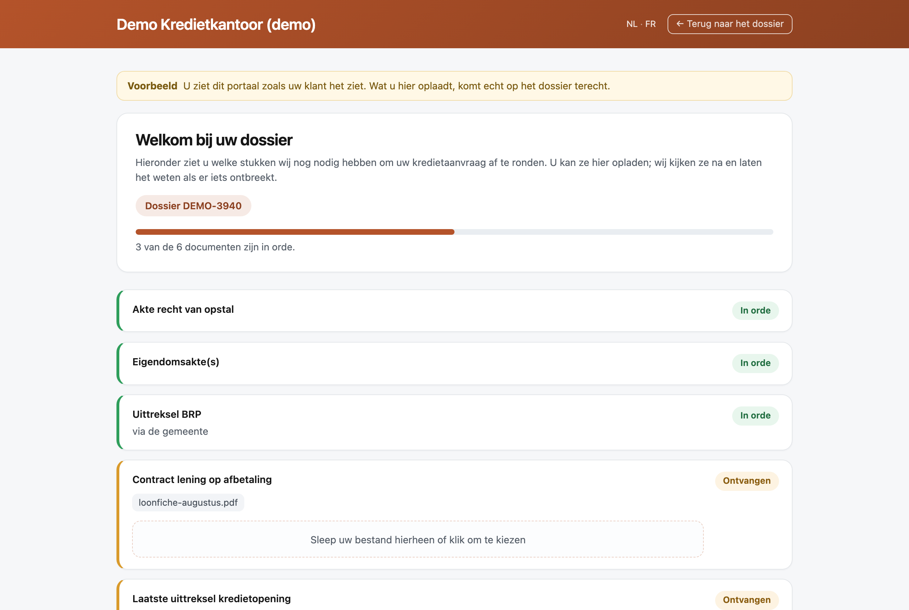

# Klantenportaal

Uw klanten leveren hun documenten aan via een eigen portaal. Dit scherm bepaalt hoe dat portaal er voor hen uitziet — het is wat zij van u te zien krijgen, dus het draagt best uw naam en uw kleuren.

## Het scherm openen

Klik links onderaan op **Platformbeheer** en dan op de tegel **Klantenportaal**, in de groep *Gegevens*.

{ .volle-breedte }

## U hoeft niets in te vullen

Dat is het uitgangspunt. Elk veld dat u leeg laat, wordt overgenomen van uw **bedrijfsfiche**: uw naam, uw logo, uw e-mailadres en uw telefoonnummer. Wat daar ook niet staat, valt terug op de standaard van CreditSoft. Uw portaal ziet er dus verzorgd uit zonder dat u iets instelt — en alles wat u wél invult, gaat vóór.

## Wat u kan aanpassen

| Veld | Waarvoor |
|---|---|
| **Naam zoals de klant hem ziet** | De naam in de kopbalk en onderaan. Leeg = de naam van uw bedrijfsfiche |
| **Hoofdkleur** | Eén kleur volstaat: de lichtere en donkerdere tinten worden er automatisch uit afgeleid |
| **Kopbalk** | Verloop, effen of licht met een accentlijn |
| **Logo** | Een eigen portaallogo. Leeg = het logo van uw bedrijfsfiche |
| **Welkomsttitel en -tekst** | De eerste zinnen die uw klant leest, in het Nederlands en het Frans |
| **Contact** | Bij wie de klant terechtkan. Leeg = de gegevens van uw bedrijfsfiche |

Rechts staat een **voorbeeld** dat meteen meebeweegt met wat u kiest. U hoeft dus niet te bewaren om te zien hoe het wordt.

!!! tip "Eén kleur, geen palet"
    U kiest alleen de hoofdkleur. De achtergronden, randen en knoppen worden daaruit berekend, zodat ze bij elkaar passen en leesbaar blijven.

De knop **Alles op standaard** wist uw keuzes en zet alles terug op uw bedrijfsfiche.

## Wat uw klant ziet

Eén pagina met de documenten die u van hem vraagt. Per stuk staat er of het nog **gevraagd** is, **ontvangen**, **in orde**, of **opnieuw te sturen** — bij dat laatste met uw reden erbij. Hij sleept zijn bestand in de zone eronder; u ziet het meteen bij dat document op het kredietdossier staan.

{ .volle-breedte }

Dit beeld komt uit **Bekijk als klant**, vandaar de gele balk bovenaan en de knop *Terug naar het dossier*. Uw klant ziet die twee niet — hij krijgt dezelfde pagina met een afmeldknop.

!!! info "Uw klant heeft geen wachtwoord nodig"
    Hij komt binnen via een persoonlijke link die u hem bezorgt. Die link geldt voor **één dossier** en vervalt na dertig dagen.
