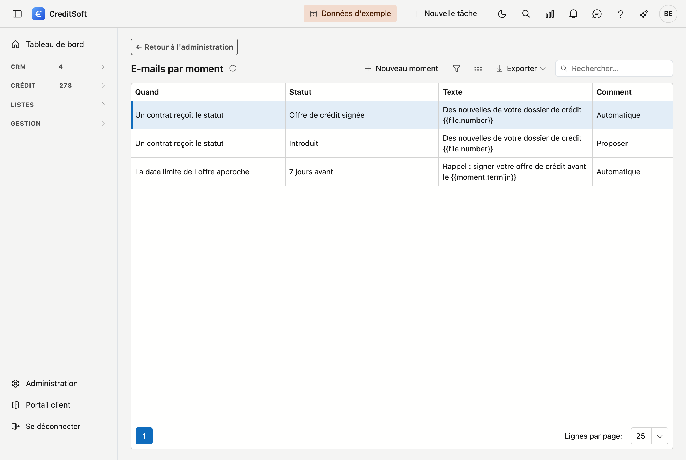
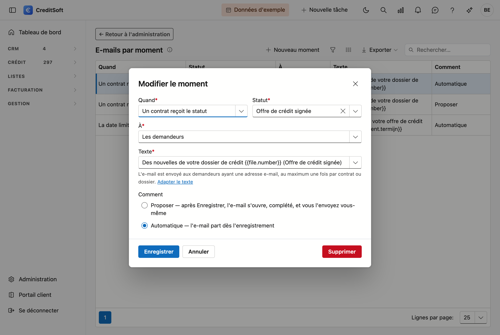
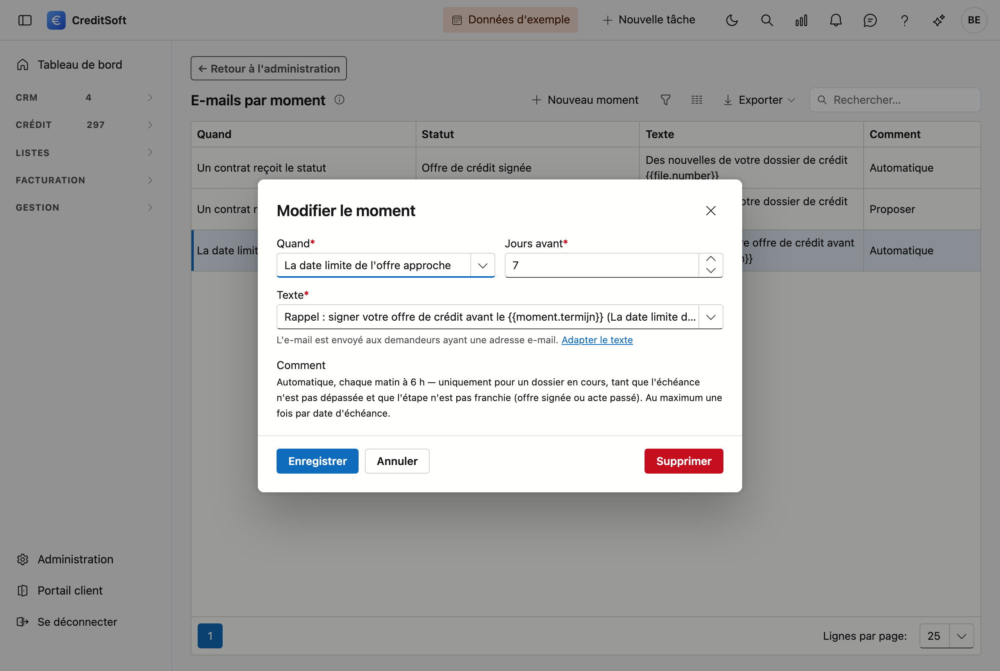

# E-mails par moment

Sur cet écran, vous déterminez quel e-mail votre client ou l'**apporteur** reçoit lorsqu'un **contrat** ou le **dossier** reçoit un certain statut — par exemple un message indiquant que la demande a été introduite, ou que l'offre est disponible —, lorsque la **date de l'acte** est complétée, ou lorsqu'une **date limite** approche.

## Ouvrir l'écran

Dans la barre latérale, cliquez sur **Administration**, puis sur la tuile **E-mails par moment** (sous *Communication*).

## Configurer un moment

Avec **Nouveau moment** — ou un double-clic sur un moment existant — la fenêtre s'ouvre.

| Champ | Utilité |
|---|---|
| **Quand** | *Un contrat reçoit le statut* ou *Le dossier reçoit le statut* — si votre bureau travaille avec des statuts de contrat, choisissez le premier. Ou *La date de l'acte est complétée* : voir [La date de l'acte](#la-date-de-lacte). Ou *La date limite de l'offre approche* ou *… de l'acte approche* : voir [Lors d'une date limite](#lors-dune-date-limite). |
| **Statut** | Le statut auquel l'e-mail part. |
| **À** | *Les demandeurs* ou *L'apporteur* du dossier : voir [À l'apporteur](#a-lapporteur). |
| **Texte** | L'e-mail lui-même. Avec *Nouveau texte*, vous recevez un texte standard ; avec **Adapter le texte**, vous l'adaptez sous [Modèles d'e-mail](../administration/mail-templates.md). |
| **Comment** | **Proposer** : après *Enregistrer*, l'e-mail s'ouvre, complété, et vous l'envoyez vous-même. **Automatique** : l'e-mail part tout de suite. |

**Proposer** est le choix prudent : vous voyez d'abord l'e-mail. En mode **Automatique**, il part dès l'enregistrement, même si vous avez cliqué le statut par erreur.

## Ce qui se passe à l'enregistrement

Si vous enregistrez un contrat ou un dossier et qu'il reçoit un statut pour lequel un moment existe :

- l'e-mail est envoyé à qui figure sous **À** : **les demandeurs ayant une adresse e-mail**, ou **l'apporteur** ;
- il part **au maximum une fois** par contrat ou dossier — si vous remettez le statut puis le rétablissez, aucun deuxième ne suit ;
- il figure ensuite dans le **courrier** du dossier.

Enregistrer un dossier sans modifier son statut n'envoie rien. En mode *Proposer*, l'e-mail ne compte comme envoyé que lorsque vous l'envoyez réellement : si vous fermez la fenêtre, un changement suivant le proposera à nouveau.

## À l'apporteur

Choisissez sous **À** *L'apporteur* pour tenir l'apporteur du dossier informé : par exemple lorsque le dossier est introduit,
ou lorsque la date de l'acte est connue.

- L'apporteur ne reçoit l'e-mail **que si *E-mails par moment* est coché sur sa fiche** (bloc *Agrément et statut*, voir
  [Apporteurs](../crm/contributors.fr.md#agrement-et-statut)). Vous choisissez ainsi, apporteur par apporteur, qui reçoit ces
  messages. Si la case n'est pas cochée, rien ne part et aucun message n'apparaît.
- Si la case est cochée mais que l'apporteur n'a pas d'adresse e-mail, l'écran signale après *Enregistrer* que l'e-mail n'a pas pu partir.
- L'e-mail est rédigé dans la **langue des documents** de l'apporteur. Si elle n'est pas remplie, dans la langue de votre bureau.
- Avec *Nouveau texte*, vous recevez un texte standard pour l'apporteur : il mentionne le dossier et le client qu'il a apporté.

Pour envoyer, à un même moment, un e-mail au client et à l'apporteur, créez **deux moments** : l'un aux demandeurs, l'autre à
l'apporteur, chacun avec son propre texte.

## La date de l'acte

Si vous choisissez sous **Quand** *La date de l'acte est complétée*, l'e-mail part lorsque quelqu'un complète le champ *Date de
l'acte* sur le dossier, avec une date d'aujourd'hui ou plus tard. Il n'y a pas de statut à choisir.

- Une date **déplacée** n'envoie pas de nouvel e-mail : le message indiquant que la date est connue est déjà parti.
- Une date **dans le passé** n'envoie rien : c'est un acte déjà passé, pas une nouvelle.

## Lors d'une date limite

Si vous choisissez sous **Quand** *La date limite de l'offre approche* ou *La date limite de l'acte approche*, vous indiquez combien de **jours avant** l'e-mail part (7 par défaut). Il s'agit des champs *Date limite offre* et *Date limite acte* du dossier.

Un tel e-mail part toujours **automatiquement**, chaque matin à 6 h :

- uniquement pour un dossier **en cours**, et tant que la date n'est pas dépassée ;
- plus du tout si l'étape est franchie : pour l'offre si elle est signée (date de signature, *Offre signée envoyée*, ou l'acte est passé), pour l'acte s'il est passé ;
- **une fois par date** : si la date limite est prolongée, un nouvel e-mail suit pour la nouvelle date.

!!! tip "Variables pour ces textes"
    Dans le texte, vous pouvez notamment utiliser `{{client.firstnames}}` (les prénoms des clients), `{{file.applicants}}` (les noms des demandeurs), `{{file.institution}}` (l'institution de crédit — pour un moment de contrat, celle du contrat), `{{file.amount}}`, `{{file.number}}`, `{{file.deeddate}}` (la date de l'acte), `{{moment.status}}` (le statut qui a déclenché l'e-mail) et `{{moment.termijn}}` (la date limite, pour une échéance). Dans un e-mail à l'apporteur, `{{recipient.name}}` désigne son nom.
