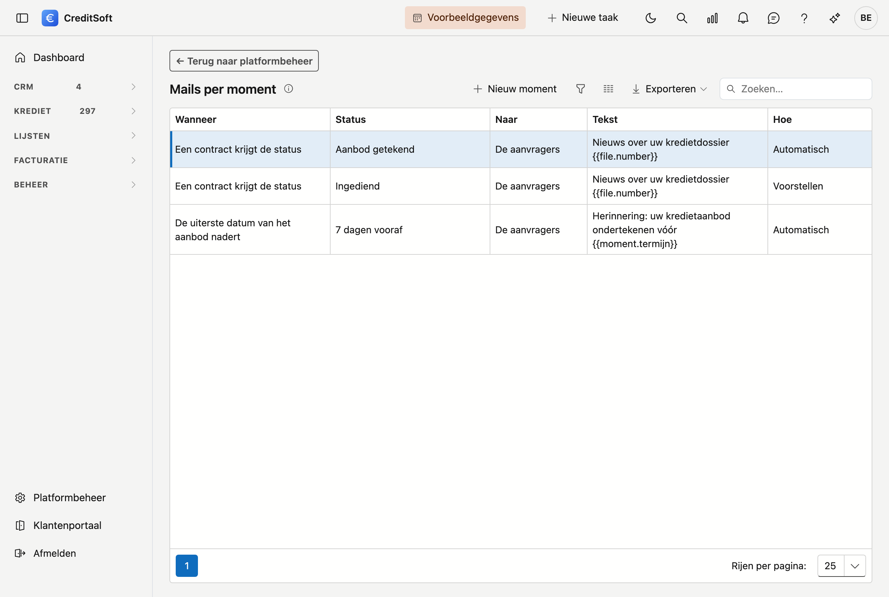
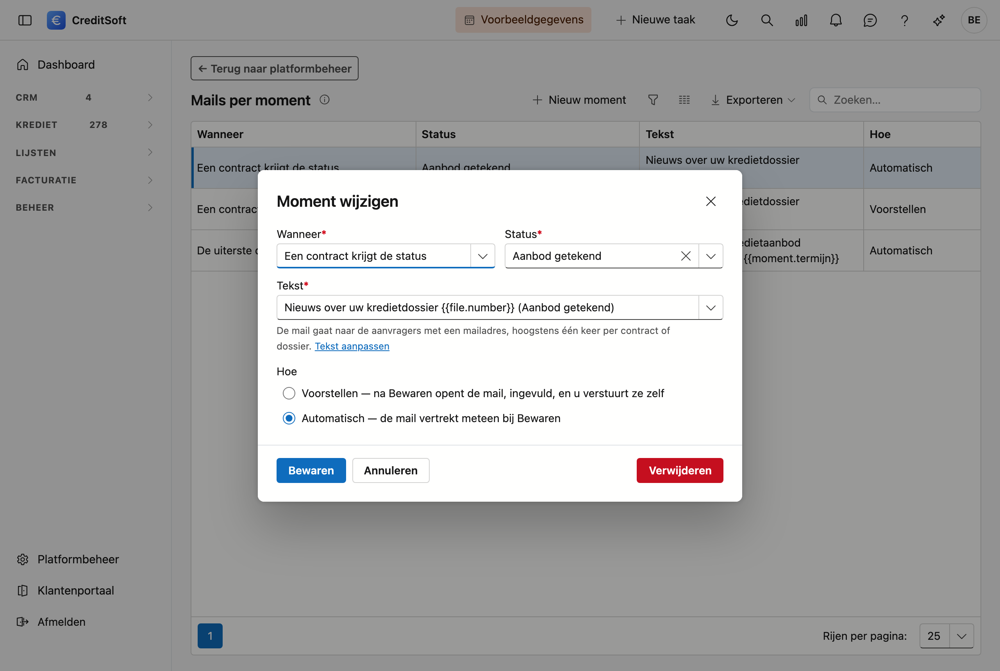
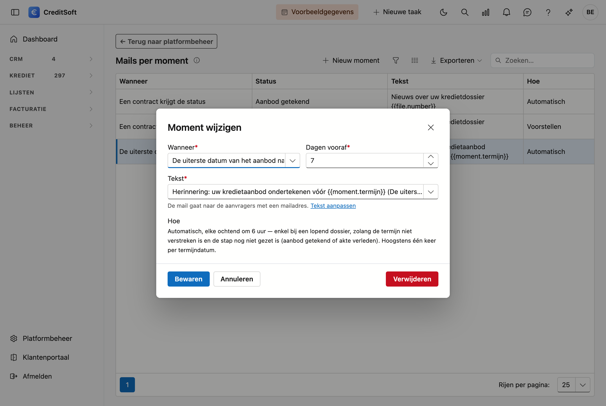

# Mails per moment

Op dit scherm bepaalt u welke mail uw klant of de **aanbrenger** krijgt wanneer een **contract** of het **dossier** een bepaalde status krijgt — bijvoorbeeld een bericht dat de aanvraag ingediend is, of dat het aanbod beschikbaar is —, wanneer de **datum akte** ingevuld wordt, of wanneer een **uiterste datum** nadert.

## Het scherm openen

Klik in de zijbalk op **Platformbeheer** en daarna op de tegel **Mails per moment** (onder *Communicatie*).

## Een moment instellen

Met **Nieuw moment** — of een dubbelklik op een bestaand moment — opent het venster.

| Veld | Waarvoor |
|---|---|
| **Wanneer** | *Een contract krijgt de status* of *Het dossier krijgt de status* — werkt uw kantoor met contractstatussen, dan kiest u de eerste. Of *De datum akte wordt ingevuld*: zie [De datum akte](#de-datum-akte). Of *De uiterste datum van het aanbod nadert* of *… van de akte nadert*: zie [Bij een uiterste datum](#bij-een-uiterste-datum). |
| **Status** | De status waarbij de mail vertrekt. |
| **Naar** | *De aanvragers* of *De aanbrenger* van het dossier: zie [Naar de aanbrenger](#naar-de-aanbrenger). |
| **Tekst** | De mail zelf. Met *Nieuwe tekst* krijgt u een standaardtekst; met **Tekst aanpassen** past u die aan bij [Mailsjablonen](../administration/mail-templates.md). |
| **Hoe** | **Voorstellen**: na *Bewaren* opent de mail, ingevuld, en u verstuurt ze zelf. **Automatisch**: de mail vertrekt meteen. |

**Voorstellen** is de veilige keuze: u ziet de mail eerst. Bij **Automatisch** vertrekt ze bij het bewaren, ook als u de status per vergissing aanklikte.

## Wat er gebeurt bij het bewaren

Bewaart u een contract of dossier en krijgt het daarbij een status waarvoor een moment bestaat, dan:

- gaat de mail naar wie bij **Naar** staat: **de aanvragers met een mailadres**, of **de aanbrenger**;
- vertrekt ze **hoogstens één keer** per contract of dossier — zet u de status terug en daarna opnieuw, dan volgt er geen tweede;
- staat ze daarna bij het **mailverkeer** van het dossier.

Een dossier bewaren zonder zijn status te wijzigen, stuurt niets. Bij *Voorstellen* telt de mail pas als verstuurd wanneer u ze ook verstuurt: sluit u het venster, dan stelt een volgende wissel ze opnieuw voor.

## Naar de aanbrenger

Kies bij **Naar** *De aanbrenger* om de aanbrenger van het dossier op de hoogte te houden: bijvoorbeeld wanneer het dossier
ingediend is, of wanneer de datum akte gekend is.

- De aanbrenger krijgt de mail **enkel als op zijn fiche *Mails bij momenten* aangevinkt staat** (blok *Erkenning en status*,
  zie [Aanbrengers](../crm/contributors.md#erkenning-en-status)). Zo kiest u per aanbrenger wie deze berichten krijgt. Staat
  het vinkje uit, dan vertrekt er niets en verschijnt er ook geen melding.
- Staat het vinkje aan maar heeft de aanbrenger geen mailadres, dan meldt het scherm na *Bewaren* dat de mail niet kon vertrekken.
- De mail komt in de **documenttaal** van de aanbrenger. Is die niet ingevuld, dan in de taal van uw kantoor.
- Met *Nieuwe tekst* krijgt u een standaardtekst voor de aanbrenger: die noemt het dossier en de klant die hij aanbracht.

Wil u bij hetzelfde moment de klant én de aanbrenger een mail sturen, maak dan **twee momenten**: één naar de aanvragers en
één naar de aanbrenger, elk met een eigen tekst.

## De datum akte

Kiest u bij **Wanneer** *De datum akte wordt ingevuld*, dan vertrekt de mail wanneer iemand op het dossier het veld *Datum
akte* invult, met een datum van vandaag of later. Er is geen status te kiezen.

- Een datum die **verzet** wordt, stuurt geen nieuwe mail: het bericht dat de datum gekend is, ging al weg.
- Een datum **in het verleden** stuurt niets: dat is een akte die al verleden werd, geen nieuws.

## Bij een uiterste datum

Kiest u bij **Wanneer** *De uiterste datum van het aanbod nadert* of *De uiterste datum van de akte nadert*, dan vult u in hoeveel **dagen vooraf** de mail vertrekt (standaard 7). Het gaat om de velden *Uiterste datum aanbod* en *Uiterste datum akte* van het dossier.

Zo'n mail vertrekt altijd **automatisch**, elke ochtend om 6 uur:

- enkel bij een **lopend** dossier, en zolang de datum niet verstreken is;
- niet meer als de stap al gezet is: bij het aanbod als het getekend is (ondertekeningsdatum, *Getekend aanbod verzonden*, of de akte is verleden), bij de akte als die verleden is;
- **één keer per datum**: wordt de uiterste datum verlengd, dan volgt er voor de nieuwe datum één nieuwe mail.

!!! tip "Variabelen voor deze teksten"
    In de tekst kan u onder meer `{{client.firstnames}}` (de voornamen van de klanten), `{{file.applicants}}` (de namen van de aanvragers), `{{file.institution}}` (de kredietinstelling — bij een contractmoment die van het contract), `{{file.amount}}`, `{{file.number}}`, `{{file.deeddate}}` (de datum akte), `{{moment.status}}` (de status die de mail deed vertrekken) en `{{moment.termijn}}` (de uiterste datum, bij een termijn) gebruiken. In een mail aan de aanbrenger staat `{{recipient.name}}` voor zijn naam.
