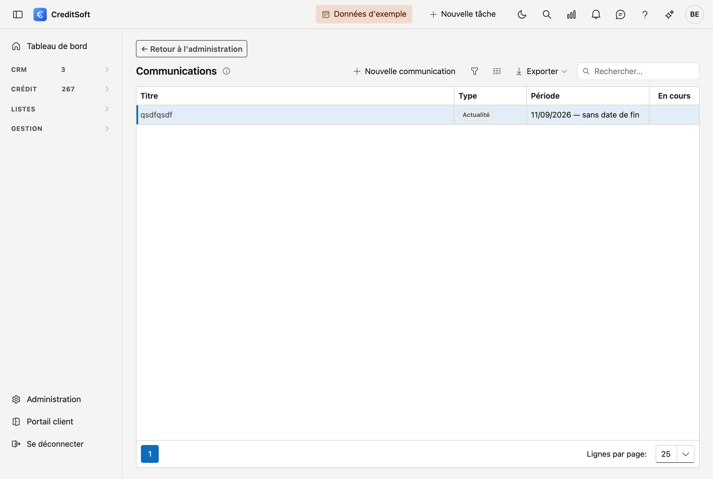

# Communications

Les communications vous permettent de préparer des messages que vos courtiers voient dès qu'ils ouvrent le portail. Ils figurent en haut de leur aperçu, au-dessus des chiffres : ce qu'il faut savoir doit se voir avant de se mettre au travail.

## Ouvrir l'écran

Cliquez en bas à gauche sur **Gestion de la plateforme**, puis sur la tuile **Communications**, dans le groupe *Communication*.

La liste affiche tous vos messages. La colonne **En cours** indique si un message est visible pour vos courtiers à ce moment.

## Rédiger une communication

Cliquez sur **Nouvelle communication**.

| Champ | À quoi il sert |
|---|---|
| **Titre (NL)** et **Titre (FR)** | L'en-tête tel que le courtier le voit |
| **Texte (NL)** et **Texte (FR)** | Le message lui-même |
| **À partir du** | Le jour où le message apparaît |
| **Jusqu'au** | Le dernier jour où il est visible — laissez vide pour le maintenir |
| **Type** | *Actualité* ou *Avertissement* |
| **Épingler en haut** | Maintient le message au-dessus des autres, quelle que soit la date |

**Le néerlandais est obligatoire, le français non.** Si vous ne remplissez pas le français, le portail revient au néerlandais. Un courtier a donc toujours quelque chose à lire, mais pas toujours dans sa langue. Pour un message qui compte vraiment, remplissez les deux.

### Travailler à l'avance

Indiquez une date **À partir du** dans le futur et le message reste invisible jusque-là. Vous rédigez ainsi le vendredi la communication qui doit paraître le lundi.

### Actualité ou avertissement

La différence est une **couleur**, rien de plus. *Actualité* est neutre, *Avertissement* attire l'œil. Il n'y a pas d'autre traitement : un avertissement n'est pas signalé séparément et ne reste pas plus longtemps.

## Erreurs fréquentes

!!! warning "Oublier une date de fin"
    **Jusqu'au** peut rester vide, et c'est justement le piège. Un message qui traîne pendant des mois n'est plus lu — et ensuite, *plus rien* à cet endroit n'est lu. Si vous savez quand le message n'aura plus lieu d'être, indiquez cette date tout de suite.

!!! warning "Tout épingler"
    **Épingler en haut** ne fonctionne que tant que cela reste l'exception. Si trois messages sont épinglés, plus rien ne l'est.

!!! info "Il n'y a pas d'accusé de lecture"
    Vous ne voyez pas qui a lu le message, et le courtier ne peut pas le masquer. Ce qui doit disparaître, vous le supprimez ici ou vous le laissez expirer — c'est le seul bouton.

## Voir aussi

- [Mise en page du portail](../beheer/klantportaal.fr.md)
- [Le portail de vos courtiers](../portaal/overzicht.fr.md)
