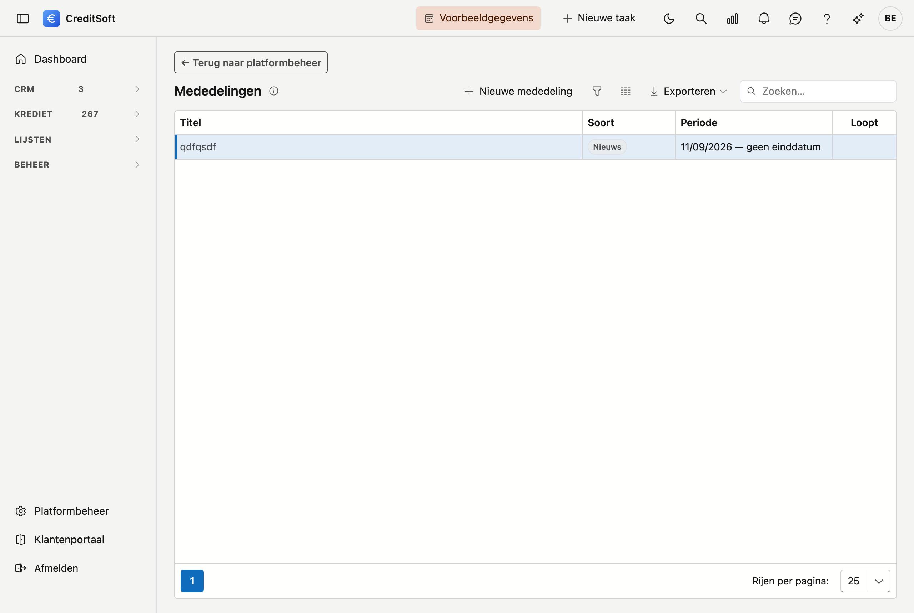

# Mededelingen

Met de mededelingen zet u berichten klaar die uw makelaars te zien krijgen zodra ze het portaal openen. Ze staan bovenaan hun overzicht, boven de cijfers: wie iets moet weten, moet het zien vóór hij aan het werk gaat.

## Het scherm openen

Klik links onderaan op **Platformbeheer** en dan op de tegel **Mededelingen**, in de groep *Communicatie*.

De lijst toont al uw berichten. De kolom **Loopt** zegt of een bericht op dit moment zichtbaar is voor uw makelaars.

## Een mededeling schrijven

Klik op **Nieuwe mededeling**.

| Veld | Waarvoor |
|---|---|
| **Titel (NL)** en **Titel (FR)** | De kop zoals de makelaar hem ziet |
| **Tekst (NL)** en **Tekst (FR)** | Het bericht zelf |
| **Vanaf** | De dag waarop het bericht verschijnt |
| **Tot en met** | De laatste dag waarop het te zien is — laat leeg om het te laten staan |
| **Soort** | *Nieuws* of *Waarschuwing* |
| **Bovenaan vastzetten** | Houdt het bericht boven de andere, ongeacht de datum |

**Nederlands is verplicht, Frans niet.** Vult u het Frans niet in, dan valt het portaal terug op het Nederlands. Een makelaar krijgt dus altijd iets te lezen, maar niet altijd in zijn taal. Voor een bericht dat er echt toe doet, vult u beide in.

### Vooruit werken

Zet **Vanaf** in de toekomst en het bericht blijft tot die dag onzichtbaar. Zo schrijft u vrijdag de mededeling die maandag moet verschijnen.

### Nieuws of waarschuwing

Het verschil is een **kleur**, meer niet. *Nieuws* is neutraal, *Waarschuwing* valt op. Er is geen andere behandeling: een waarschuwing wordt niet apart gemeld en blijft niet langer staan.

## Veelgemaakte fouten

!!! warning "Een einddatum vergeten"
    **Tot en met** mag leeg blijven, en dat is meteen de valkuil. Een bericht dat maanden blijft hangen wordt niet meer gelezen — en daarna wordt *niets* op die plek nog gelezen. Weet u wanneer het bericht niet meer hoeft, vul die datum dan meteen in.

!!! warning "Alles vastzetten"
    **Bovenaan vastzetten** werkt zolang het uitzondering blijft. Staan er drie berichten vast, dan staat er niets meer vast.

!!! info "Er is geen leesbevestiging"
    U ziet niet wie het bericht gelezen heeft, en de makelaar kan het niet wegklikken. Wat weg moet, haalt u hier weg of laat u aflopen — dat is de enige knop.

## Zie ook

- [Portaalvormgeving](../beheer/klantportaal.md)
- [Het portaal voor uw makelaars](../portaal/overzicht.md)
