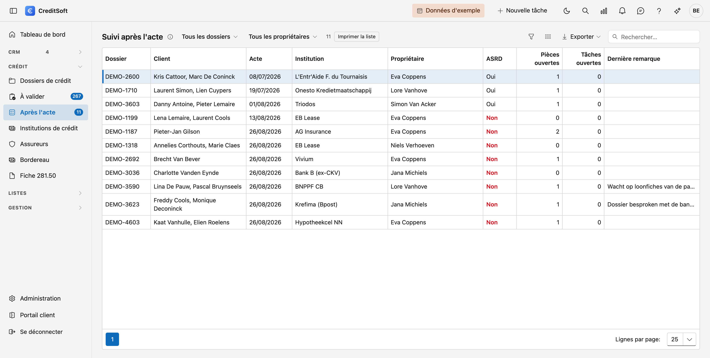

# Suivi après l'acte

Après l'acte, un dossier est rarement tout à fait terminé : l'**assurance solde restant dû** doit encore être ajoutée, une pièce manque, une tâche reste ouverte. Cette liste affiche les dossiers qui se trouvent dans cette phase, avec ce qui reste ouvert.

## Ouvrir l'écran

Cliquez dans le menu de gauche sur **Après l'acte**, sous *Crédit*. Le chiffre à côté indique combien de dossiers ont encore quelque chose d'ouvert ; s'il n'y a pas de chiffre, il n'y a rien à faire.

{ .volle-breedte }

## Quels dossiers y figurent

Tous les dossiers dans les statuts que votre bureau a désignés sous [Phases du tableau de bord](../beheer/dashboard-fases.md#suivi-apres-lacte) — par exemple *Suivi après l'acte*. Si vous n'y avez encore rien choisi, la liste reste vide et l'écran indique où le régler.

Un dossier quitte la liste dès que vous changez son **statut**, par exemple vers *Terminé*. Il n'y a pas de case *terminé* séparée : le statut le dit déjà.

## Ce qui reste ouvert

| Colonne | Ce qu'elle signifie |
|---|---|
| **Dossier** · **Client** · **Acte** | Le dossier, le ou les demandeurs et la date de l'acte. L'acte le plus ancien figure en haut |
| **Institution** · **Propriétaire** | L'institution de crédit et la personne qui suit le dossier |
| **ASRD** | *Oui* si le dossier porte un contrat d'un produit qui est une assurance solde restant dû, sinon *Non* en rouge |
| **Pièces ouvertes** | Les pièces demandées qui ne sont pas encore en ordre — y compris une pièce reçue mais encore à évaluer |
| **Tâches ouvertes** | Les tâches du dossier encore ouvertes ou en cours |
| **Dernière remarque** | La remarque la plus récente du dossier, abrégée ; survolez-la pour le texte complet |

En haut, choisissez **Encore quelque chose d'ouvert** pour ne garder que les dossiers où il reste du travail — pas d'ASRD, une pièce pas en ordre, ou une tâche ouverte. Ce sont aussi les dossiers que compte le chiffre à côté du menu. Filtrez en plus par **propriétaire** pour voir vos propres dossiers.

**Double-cliquez** une ligne pour ouvrir le dossier.

!!! note "Une remarque ne compte pas comme ouvert"
    Une remarque est du texte, sans case *traitée*. Elle figure dans la liste pour que vous voyiez ce qui a été dit en dernier, mais elle ne maintient pas un dossier sur *encore quelque chose d'ouvert*.
