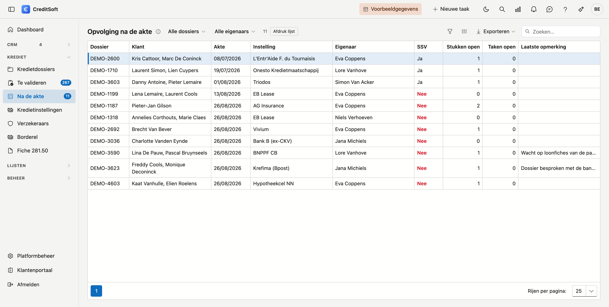

# Opvolging na de akte

Na de akte is een dossier zelden echt af: de **schuldsaldoverzekering** moet er nog bij, een stuk ontbreekt, er staat nog een taak open. Deze lijst toont de dossiers die in die fase zitten, met wat er nog open staat.

## Het scherm openen

Klik in het menu links op **Na de akte**, onder *Krediet*. Het getal ernaast zegt hoeveel dossiers nog iets open hebben; staat er geen getal, dan is er niets te doen.

{ .volle-breedte }

## Welke dossiers erin staan

Alle dossiers in de statussen die uw kantoor daarvoor aanduidde bij [Dashboard-fases](../beheer/dashboard-fases.md#opvolging-na-de-akte) — bijvoorbeeld *Opvolging na akte*. Hebt u daar nog niets gekozen, dan blijft de lijst leeg en zegt het scherm waar u het instelt.

Een dossier verdwijnt uit de lijst zodra u zijn **status** verandert, bijvoorbeeld naar *Afgewerkt*. Een apart vinkje *klaar* is er niet: de status zegt het al.

## Wat er nog open staat

| Kolom | Wat het betekent |
|---|---|
| **Dossier** · **Klant** · **Akte** | Het dossier, de aanvrager(s) en de aktedatum. De oudste akte staat bovenaan |
| **Instelling** · **Eigenaar** | De kredietinstelling en wie het dossier opvolgt |
| **SSV** | *Ja* als het dossier een contract draagt van een product dat een schuldsaldoverzekering is, anders *Nee* in het rood |
| **Stukken open** | Gevraagde stukken die nog niet in orde zijn — ook een stuk dat binnen is maar nog beoordeeld moet worden |
| **Taken open** | Taken op het dossier die nog open of bezig zijn |
| **Laatste opmerking** | De jongste opmerking op het dossier, ingekort; beweeg erover voor de volledige tekst |

Bovenaan kiest u **Nog iets open** om enkel de dossiers over te houden waar nog werk is — geen SSV, een stuk dat niet in orde is, of een open taak. Dat zijn ook de dossiers die het getal naast het menu-item telt. Filter daarnaast op **eigenaar** om uw eigen dossiers te zien.

**Dubbelklik** een rij om het dossier te openen.

!!! note "Een opmerking telt niet als open"
    Een opmerking is tekst, zonder vinkje *afgehandeld*. Ze staat in de lijst zodat u ziet wat er laatst gezegd werd, maar ze houdt een dossier niet op *nog iets open*.
