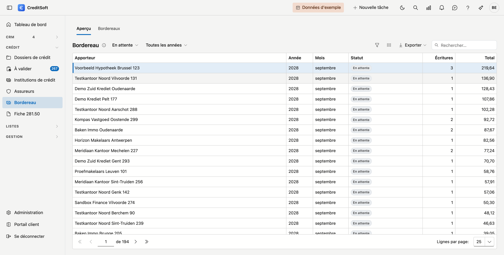
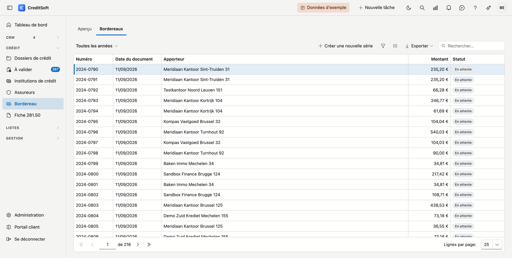
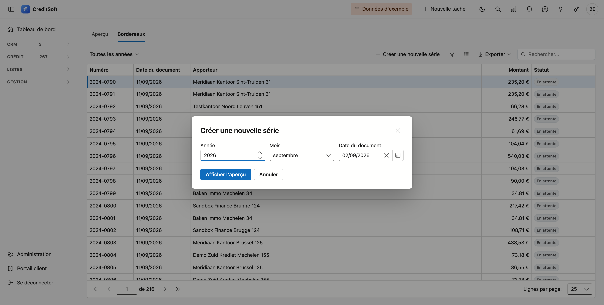

# Bordereau

Pour chaque dossier de crédit, CreditSoft calcule la commission qui revient à votre intermédiaire et la comptabilise par mois. Sur cet écran, vous passez à l'étape suivante : vous **décomptez**. Par apporteur, vous créez un bordereau, vous l'imprimez ou vous l'envoyez, et vous enregistrez la date de paiement.

## Ouvrir l'écran

Dans le menu de gauche, cliquez sur **Bordereau**, sous *Crédit*.

{ .volle-breedte }

En haut se trouvent deux onglets, et la différence entre les deux est importante :

| Onglet | Ce que vous voyez |
|---|---|
| **Aperçu** | Ce qui est **comptabilisé**, par apporteur et par période. Cela évolue : si vous modifiez un schéma de commission et le recalculez, cet aperçu change |
| **Bordereaux** | Ce qui est **décompté**. Un bordereau est un document — il reste tel qu'il était à ce moment-là |

## Onglet Aperçu : ce qui reste à payer

Chaque ligne correspond à un apporteur pour un mois, avec le nombre d'écritures et le total.

Le filtre **Statut** en tête est sur **En attente** : uniquement ce qui ne figure pas encore sur un bordereau. C'est presque toujours ce que vous voulez voir — le montant qu'il vous reste à payer.

- **Décompté** montre ce qui figure déjà sur un bordereau.
- **Tout** montre les deux ensemble. La colonne **Statut** mérite alors votre attention : si elle indique **Partiellement décompté**, une partie de ce mois est déjà payée et une autre non, avec le montant ouvert à côté. Cela se produit lorsqu'une commission s'ajoute sur une période que vous aviez déjà décomptée.

Le second filtre vous permet de choisir une **année**.

## Onglet Bordereaux : ce qui est décompté

Vous y trouvez chaque bordereau que vous avez créé : numéro, date du document, apporteur, montant et statut de paiement.

{ .volle-breedte }

!!! info "Le numéro"
    Les bordereaux que vous créez dans CreditSoft reçoivent un numéro par année — *2026-0001*, *2026-0002*, et ainsi de suite. Les bordereaux plus anciens portent un numéro précédé d'un dièse, comme *#6127* : c'est la référence qui permet de les retrouver dans vos données.

### Créer une série

Cliquez en haut sur **Créer une nouvelle série**. Vous choisissez trois éléments :

- l'**année** ;
- la **période** — un mois, ou un trimestre si votre bureau décompte par trimestre ;
- la **date du document**, celle qui figurera sur le bordereau. Aujourd'hui par défaut. Si vous décomptez le mois de décembre début janvier, vous pouvez librement l'adapter ici.

{ .volle-breedte }

Cliquez ensuite sur **Afficher l'aperçu**. Vous voyez par apporteur combien de lignes sont reprises et pour quel montant, avec le total en bas. **Rien n'est encore enregistré** — vous pouvez tout à fait choisir une autre période et regarder à nouveau.

Rien ne s'affiche ? CreditSoft vous le dit : *aucune commission non décomptée dans cette période*. Cela signifie le plus souvent que vous aviez déjà décompté cette période.

Ce n'est qu'en cliquant sur **Créer les bordereaux** que quelque chose se passe : chaque apporteur reçoit son bordereau, et les lignes de commission qui y figurent sont dès lors **protégées**.

!!! warning "Ce que « protégées » signifie"
    Une ligne portée sur un bordereau ne change plus. Si vous modifiez ensuite le schéma de commission de ce dossier et le recalculez, cette ligne reste telle qu'elle était. C'est voulu : vous avez décompté ce montant, et un décompte dont le montant change après coup n'est pas un décompte.

Une période ne peut être décomptée qu'une seule fois. Si vous essayez une deuxième fois, CreditSoft indique qu'une série existe déjà pour cette période.

## Ouvrir un bordereau

Double-cliquez une ligne dans la liste.

{ .volle-breedte }

En haut figurent les **données générales** : numéro, date du document, apporteur et montant, ainsi que la date d'**envoi** et d'**impression**. En dessous se trouvent les **lignes de commission**, avec les mêmes données que sur l'impression : date d'acte, dossier, client, bien, prêteur, montant du crédit et commission, triées par date d'acte. Si une ligne n'est rattachée à aucun dossier, la mention **libre** apparaît : il s'agit d'une commission libre, par exemple une indemnité mensuelle ou une correction, et sa description figure dans la colonne Client.

Quatre boutons figurent en bas.

### Imprimer

Ouvre l'**aperçu avant impression** : un pdf en format paysage, avec votre en-tête — logo, adresse, coordonnées et numéro FSMA issus de votre fiche d'entreprise — et à droite l'adresse de l'apporteur avec son numéro de TVA, de sorte que le document se lise comme un décompte qui lui est adressé.

Chaque ligne de commission indique la **date d'acte**, le **numéro de dossier**, le **client**, le **bien**, le **prêteur**, le **montant du crédit** et la **commission**. Les lignes sont triées par date d'acte. Une commission libre n'a pas de dossier : vous y lisez la description à la place. Le total figure en bas, et les en-têtes de colonnes se répètent sur chaque page avec un numéro de page.

Depuis cette fenêtre, vous pouvez **télécharger** le fichier ou le **transférer par e-mail** à qui vous voulez. C'est autre chose que le bouton *Envoyer* voisin : celui-ci adresse le bordereau à l'apporteur lui-même, accompagné de votre texte type.

CreditSoft retient la date d'impression — vous la relisez sous *Imprimé le*.

### Envoyer

Envoie ce même pdf à l'apporteur, avec le texte du modèle d'e-mail **Bordereau de commission**. Ce texte, vous l'adaptez vous-même dans les modèles d'e-mail.

Deux choses peuvent empêcher l'envoi, et dans les deux cas CreditSoft dit ce qui ne va pas plutôt que de ne rien faire en silence :

- l'apporteur n'a **pas d'adresse e-mail** — complétez d'abord sa fiche ;
- le **modèle d'e-mail n'existe pas encore** — créez-le sous Modèles d'e-mail.

Imprimer et envoyer restent possibles à tout moment, même sur un bordereau déjà payé. Un apporteur qui a égaré son décompte doit pouvoir le recevoir à nouveau.

### Marquer payé

Vous indiquez la **date de paiement** et vous confirmez. Le bordereau figure dès lors comme payé dans la liste, avec cette date. En cas d'erreur, **Annuler le paiement** le remet en attente.

### Retirer

Retire le bordereau dans son entièreté. Les lignes de commission redeviennent disponibles et réapparaissent sous *En attente* dans l'aperçu, ce qui vous permet de décompter cette période à nouveau.

C'est possible **tant que le bordereau n'est pas payé**. S'il l'est, le bouton disparaît : annulez d'abord le paiement.

!!! tip "À quoi sert le retrait"
    Le plus souvent à une période mal choisie, ou lorsque vous constatez qu'un schéma de commission manquait encore. Retirez, complétez, et recréez la série.

## Par mois ou par trimestre

Par défaut, une série reprend un mois. Si votre bureau décompte par trimestre, une série reprend trois mois à la fois et vous choisissez un trimestre plutôt qu'un mois lors de la création. Ce choix vaut pour tout votre bureau et se règle sous [Paramètres de commission](../beheer/commissie-instellingen.md), dans la Gestion de la plateforme.
