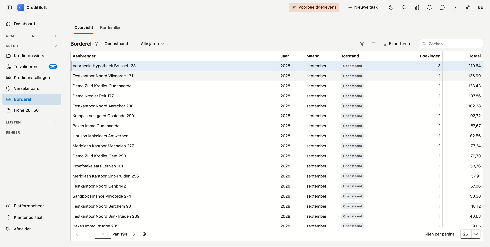
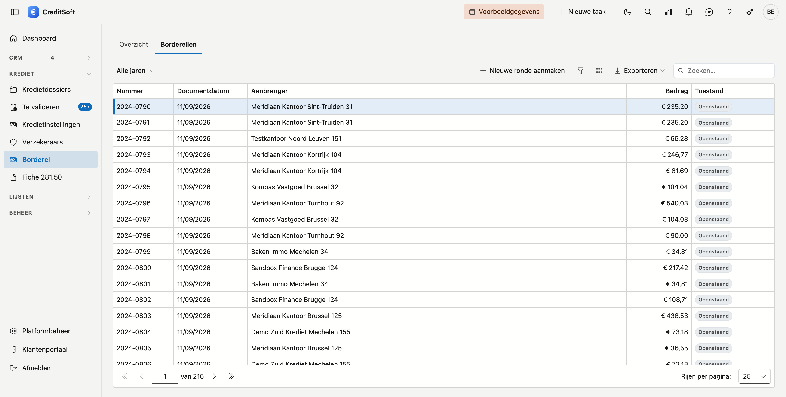
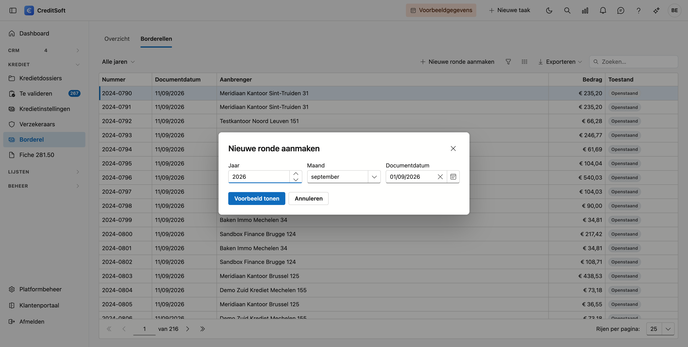
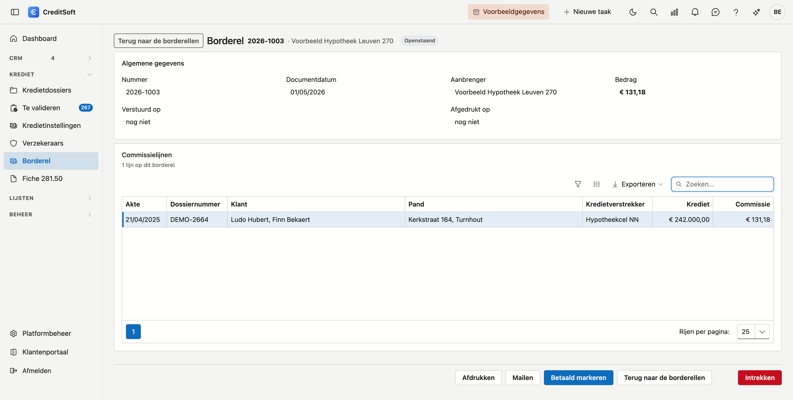

# Borderel

CreditSoft rekent bij elk kredietdossier uit welke commissie uw aanbrenger toekomt, en boekt die per maand. Op dit scherm zet u de volgende stap: u **rekent af**. Per aanbrenger maakt u een borderel, drukt het af of mailt het door, en legt vast wanneer het betaald werd.

## Het scherm openen

Klik in het menu links op **Borderel**, onder *Krediet*.

{ .volle-breedte }

Bovenaan staan twee tabbladen, en het verschil ertussen is belangrijk:

| Tabblad | Wat u ziet |
|---|---|
| **Overzicht** | Wat er **geboekt** staat, per aanbrenger en per periode. Dit beweegt mee: past u een commissieschema aan en herberekent u het, dan verandert dit overzicht |
| **Borderellen** | Wat er **afgerekend** is. Een borderel is een document — het blijft staan zoals het op dat moment was |

## Tabblad Overzicht: wat er nog uitbetaald moet worden

Elke regel is één aanbrenger in één maand, met het aantal boekingen en het totaal.

De filter **Toestand** vooraan staat op **Openstaand**: enkel wat nog niet op een borderel staat. Dat is bijna altijd wat u wil zien — het bedrag dat u nog moet uitbetalen.

- **Afgerekend** toont wat al op een borderel staat.
- **Alles** toont beide door elkaar. Dan verdient de kolom **Toestand** uw aandacht: staat er **Deels afgerekend**, dan is een stuk van die maand al uitbetaald en een stuk nog niet, met het openstaande bedrag ernaast. Dat gebeurt wanneer er commissie bijkomt op een periode die u al afgerekend had.

Met de tweede filter kiest u een **jaar**.

## Tabblad Borderellen: wat er afgerekend is

Hier staat elk borderel dat u ooit aanmaakte: nummer, documentdatum, aanbrenger, bedrag en of het betaald is.

{ .volle-breedte }

!!! info "Het nummer"
    Borderellen die u in CreditSoft aanmaakt, krijgen een nummer per jaar — *2026-0001*, *2026-0002*, en zo verder. Bij oudere borderellen staat er een nummer met een hekje ervoor, zoals *#6127*: dat is het kenmerk waarmee dat borderel in uw gegevens terug te vinden is.

### Een ronde aanmaken

Klik bovenaan op **Nieuwe ronde aanmaken**. U kiest drie dingen:

- het **jaar**;
- de **periode** — een maand, of een kwartaal wanneer uw kantoor per kwartaal afrekent;
- de **documentdatum**, de datum die op het borderel komt te staan. Standaard vandaag. Rekent u begin januari de maand december af, dan zet u die hier gerust op de datum die u wil.

{ .volle-breedte }

Klik daarna op **Voorbeeld tonen**. U krijgt per aanbrenger te zien hoeveel lijnen er meegaan en voor welk bedrag, met het totaal onderaan. **Er is dan nog niets vastgelegd** — u kan gerust een andere periode kiezen en opnieuw kijken.

Staat er niets? Dan zegt CreditSoft dat: *er staat geen enkele niet-afgerekende commissie in deze periode*. Meestal betekent dat dat u die periode al afgerekend had.

Pas wanneer u op **Borderellen aanmaken** klikt, gebeurt er iets: elke aanbrenger krijgt zijn borderel, en de commissielijnen die erop staan zijn vanaf dat moment **beschermd**.

!!! warning "Wat 'beschermd' betekent"
    Een lijn die op een borderel staat, verandert niet meer. Past u nadien het commissieschema van dat dossier aan en herberekent u het, dan blijft die lijn staan zoals ze was. Dat is de bedoeling: u hebt dat bedrag afgerekend, en een afrekening die achteraf van bedrag verandert is geen afrekening.

Een periode kan maar één keer afgerekend worden. Probeert u het een tweede keer, dan zegt CreditSoft dat er al een ronde bestaat voor die periode.

## Eén borderel openen

Dubbelklik een regel in de lijst.

{ .volle-breedte }

Bovenaan staan de **algemene gegevens**: nummer, documentdatum, aanbrenger en bedrag, en of het al **verstuurd** en **afgedrukt** werd. Daaronder staan de **commissielijnen**, met dezelfde gegevens als op de afdruk: aktedatum, uw kenmerk, klant, pand, kredietverstrekker, kredietbedrag en commissie, gesorteerd op aktedatum. Hangt een lijn niet aan een dossier, dan staat er **vrij**: dat is een vrije commissie, bijvoorbeeld een maandelijkse vergoeding of een correctie, en de omschrijving ervan leest u in de kolom Klant.

Onderaan staan vier knoppen.

### Afdrukken

Opent het **afdrukvoorbeeld**: een pdf op een liggend blad, met uw briefhoofd — logo, adres, contactgegevens en FSMA-nr. uit uw bedrijfsfiche — en rechts het adres van de aanbrenger met zijn btw-nummer, zodat het document leest als een afrekening die aan hém gericht is.

Per commissielijn staat er: de **aktedatum**, **uw kenmerk**, de **klant**, het **pand**, de **kredietverstrekker**, het **kredietbedrag** en de **commissie**. De lijnen staan op aktedatum gesorteerd. Een vrije commissie heeft geen dossier: daar leest u de omschrijving in de plaats. Onderaan het totaal, en de kolomkoppen staan op elke bladzijde opnieuw met een paginanummer.

Vanuit dat venster kan u het bestand **downloaden** of **doorsturen per mail** naar wie u wil. Dat laatste is iets anders dan de knop *Mailen* hiernaast: die stuurt het borderel naar de aanbrenger zelf, met uw vaste begeleidende tekst.

CreditSoft onthoudt wanneer u afdrukte — dat leest u terug bij *Afgedrukt op*.

### Mailen

Stuurt diezelfde pdf naar de aanbrenger, met de tekst uit het mailsjabloon **Commissieborderel**. Die tekst past u zelf aan bij de mailsjablonen.

Twee dingen kunnen het versturen tegenhouden, en CreditSoft zegt in beide gevallen wat er scheelt in plaats van stil niets te doen:

- de aanbrenger heeft **geen e-mailadres** — vul zijn fiche eerst aan;
- het **mailsjabloon bestaat nog niet** — maak het aan onder Mailsjablonen.

Afdrukken en mailen kan altijd, ook op een borderel dat al betaald is. Een aanbrenger die zijn afrekening kwijt is, moet ze opnieuw kunnen krijgen.

### Betaald markeren

U geeft de **betaaldatum** op en bevestigt. Het borderel staat vanaf dan als betaald in de lijst, met die datum erbij. Vergiste u zich, dan zet **Betaling terugdraaien** het weer open.

### Intrekken

Trekt het hele borderel terug. De commissielijnen komen weer vrij en verschijnen opnieuw onder *Openstaand* in het overzicht, zodat u die periode opnieuw kan afrekenen.

Dat kan **zolang het borderel niet betaald is**. Is het wel betaald, dan verdwijnt de knop: zet eerst de betaling terug.

!!! info "De kolom Uw kenmerk"
    Dat is het **kenmerk dat de aanbrenger zelf aan het dossier gaf** — geen nummer dat CreditSoft uitdeelt. Werkt een kantoor daar niet mee, dan blijft die kolom leeg voor al zijn dossiers. Dat is geen ontbrekende informatie.

!!! tip "Waarvoor intrekken dient"
    Meestal voor een verkeerd gekozen periode, of wanneer u merkt dat er nog een commissieschema ontbrak. Trek in, vul aan, en maak de ronde opnieuw aan.

## Per maand of per kwartaal

Standaard verzamelt een ronde één maand. Rekent uw kantoor per kwartaal af, dan verzamelt een ronde drie maanden tegelijk en kiest u bij het aanmaken een kwartaal in plaats van een maand. Die keuze geldt voor uw hele kantoor en stelt u in bij [Commissie-instellingen](../beheer/commissie-instellingen.md), onder Platformbeheer.
