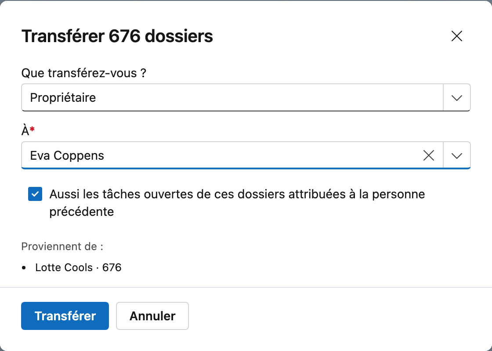
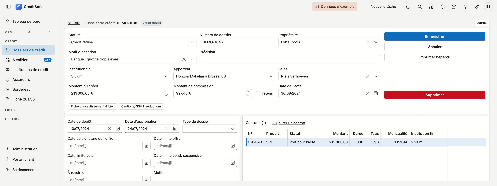
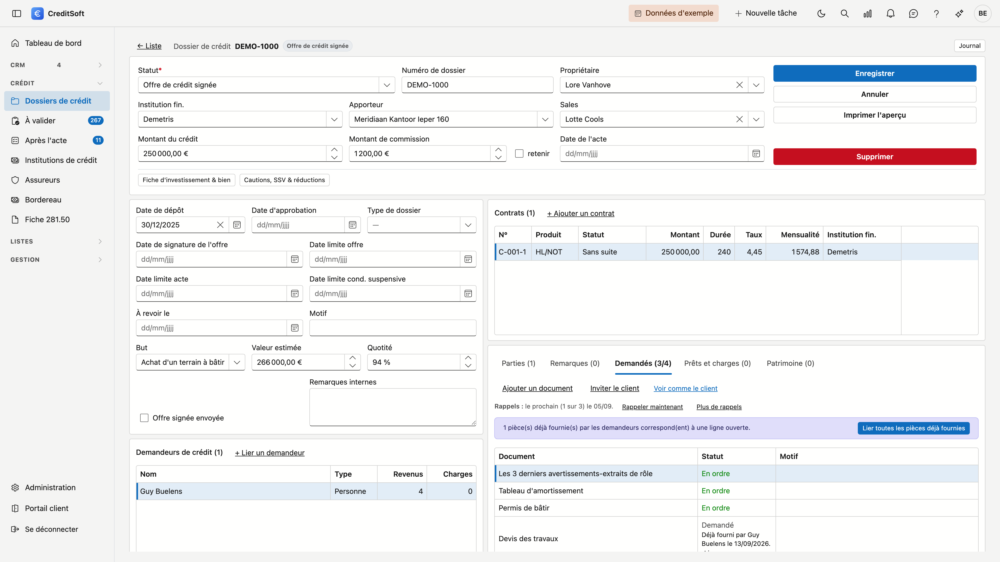
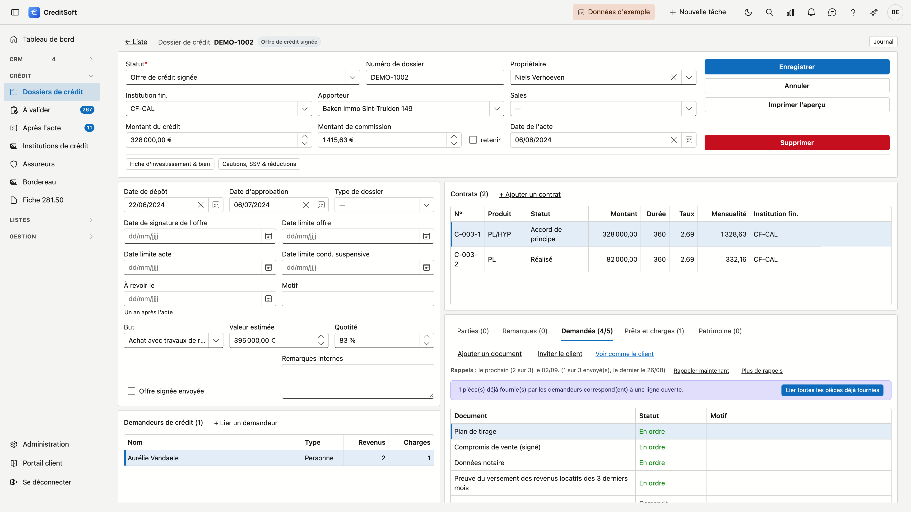

# Dossiers de crédit

Le dossier de crédit est le cœur de CreditSoft. Tout ce qui se rapporte à une demande de crédit — les demandeurs, le bien, les contrats, les parties concernées et les documents demandés — figure au même endroit, sur une seule page.

## Ouvrir l'écran

Dans la barre latérale, cliquez sur **Crédit**, puis sur **Dossiers de crédit**.

## La liste

{ .volle-breedte }

Par dossier, vous voyez qui en fait la demande, par qui il passe et où il en est :

| Colonne | Ce qu'elle affiche |
|---|---|
| **N° de dossier** | Le numéro interne du dossier |
| **Statut** | Où en est le dossier |
| **Montant du crédit** | Le montant effectivement accordé |
| **Demandeur** | Tous les demandeurs du dossier, à la suite |
| **Apporteur** | L'apporteur par lequel le dossier est arrivé |
| **Institution** | L'institution de crédit |
| **Propriétaire** | Le collaborateur qui suit le dossier |
| **Date de dépôt** | Quand le dossier a été introduit |
| **Date d'effet** | Quand le crédit prend effet |

Via le **sélecteur de colonnes**, vous en ajoutez six autres : *Sales*, *Crédit demandé*, *Investissement total*, *Fonds propres*, *Quotité* et *Bien*. Elles sont masquées par défaut, car tous les bureaux ne les remplissent pas, et parce que la liste ne tiendrait plus à côté du journal. Votre choix est mémorisé pour la fois suivante.

### Créer un dossier

Avec **Nouveau dossier** en haut de la liste, vous créez un dossier vide. Le statut de départ varie d'un bureau à l'autre : CreditSoft le demande donc une fois plutôt que de le deviner. La liste ne propose que les statuts **en usage** ; ceux que vous avez retirés n'y figurent pas.

!!! tip "Configurez-le une fois et la question disparaît"
    Si vous fixez le statut de départ sous **Administration → Phases du tableau de bord**, il n'est plus demandé et un nouveau dossier s'ouvre directement comme fiche.

!!! note "Configurez d'abord vos statuts"
    Si vous n'avez pas encore configuré de statuts de dossier, CreditSoft le signale et ne crée pas de dossier. Configurez-les d'abord dans **Listes de choix**.

### Rechercher et filtrer

- **Rechercher** — le champ de recherche porte sur toutes les colonnes **visibles**. Si vous activez une colonne via le sélecteur, la recherche s'y applique aussitôt.
- **Statut**, **Apporteur** et **Propriétaire** — les trois listes de choix du haut. Elles n'affichent que ce qui figure dans vos dossiers, donc aucun statut sans dossier. Sous *Propriétaire* figure aussi **Sans propriétaire**, s'il y a de tels dossiers.
- **Par date** — les colonnes **Date de dépôt** et **Date d'effet** se filtrent via l'entonnoir sur l'en-tête de colonne, ou via le constructeur de filtres pour une plage telle que « entre le 1er janvier et le 30 juin ». Voir [Filtrer et rechercher dans les listes](filteren-in-lijsten.md).
- **Depuis le tableau de bord** — si vous arrivez depuis une phase ou depuis les [Dossiers à l'arrêt](../getting-started/dashboard.md#dossiers-a-larret) du tableau de bord, la liste est déjà filtrée. Le filtre actif s'affiche en haut, avec un bouton **Effacer le filtre** à côté.
- **Exporter** — vers Excel ou CSV, avec les filtres actifs à ce moment-là. L'export suit la langue de votre écran.

**[Journal](../journaal/overzicht.md)** — cliquez à droite sur le rail **Journal** pour consulter les [tâches](../journaal/taken.md), [notes](../journaal/notities.md), les appels, [pièces jointes](../journaal/bijlagen.md), le [courrier](../journaal/mailverkeer.md), les schémas de commission et l'[historique](../journaal/logboek.md) du dossier sélectionné sans l'ouvrir.

**Double-cliquez** une ligne pour ouvrir le dossier.

### Transférer des dossiers

Un collègue s'en va, ou quelqu'un d'autre reprend ses clients : vous transférez ses dossiers en une fois.

1. Sous **Propriétaire** en haut, choisissez le collègue dont viennent les dossiers.
2. Cochez les dossiers. La case de l'en-tête coche **tous** les dossiers qui répondent à votre recherche et à vos filtres, sur toutes les pages ; en haut, vous voyez combien sont sélectionnés.
3. Cliquez sur **Transférer…** dans la bande au-dessus de la liste.
4. Choisissez **ce que** vous transférez — le *propriétaire* ou le *sales* — et **à qui**. Vous voyez aussitôt de qui viennent les dossiers ; ceux qui appartiennent déjà à ce collègue restent inchangés.
5. Laissez **Aussi les tâches ouvertes …** coché si les tâches ouvertes de ces dossiers doivent suivre. Seules les tâches attribuées à la personne précédente suivent.
6. Cliquez sur **Transférer**.

!!! note "Un collègue sans compte"
    Une tâche est liée à un compte. Si le collègue à qui vous transférez n'a pas de compte, les dossiers sont bien transférés mais les tâches restent où elles sont. CreditSoft l'indique dans la fenêtre.

Un transfert ne change rien à la date de la dernière activité : un [dossier à l'arrêt](../getting-started/dashboard.md#dossiers-a-larret) reste à l'arrêt jusqu'à ce que quelqu'un s'en occupe. Qui a transféré quoi, de qui à qui, figure dans l'[historique](../journaal/logboek.md) de chaque dossier et dans le journal des actions.

### Envoyer un e-mail groupé

Pour écrire en une fois aux demandeurs d'une série de dossiers — le bureau ferme, une nouvelle façon de travailler :

1. Cochez les dossiers. La case de l'en-tête coche tout ce qui répond à votre recherche et à vos filtres, sur toutes les pages.
2. Cliquez sur **E-mail groupé…** dans la bande au-dessus de la liste.
3. Vérifiez qui reçoit l'e-mail, choisissez un modèle ou tapez un texte libre, puis cliquez sur **Aperçu**.
4. Cliquez sur **Envoyer** et confirmez.

Chaque demandeur ayant une adresse e-mail reçoit son propre e-mail, qui figure ensuite dans le courrier du dossier.
Qui est ignoré et pourquoi, et comment fonctionne le lien de désinscription : voir
[Courrier](../journaal/mailverkeer.md#un-e-mail-groupe). Le bouton requiert le droit **Envoyer un e-mail groupé**.

## Le dossier

![Un dossier de crédit ouvert : en haut le bloc principal avec le statut, le numéro interne, le propriétaire et le responsable commercial sous forme de listes déroulantes — pour ce statut de clôture, aussi le motif d'abandon avec la précision —, l'institution financière, l'apporteur, le montant du crédit, le montant de commission avec la case Retenir à côté et la date d'acte, et à droite les boutons Enregistrer, Annuler, Imprimer l'aperçu et Supprimer. En dessous, à gauche les dates de dépôt et d'approbation avec le type de dossier, la signature de l'offre à côté de la date limite de l'offre, les dates limites de l'acte et des conditions suspensives, À revoir le avec le motif à côté, le but, la valeur estimée et la quotité avec la case Offre signée envoyée ainsi que le champ Remarques internes, et sous cette carte les demandeurs de crédit avec, pour chacun, le nombre de revenus et de charges ; à droite les contrats et en bas les onglets Parties, Remarques, Demandés, Prêts et charges et Patrimoine, chacun avec un compteur.](../images/kredietdossier-fiche-fr.png "Le dossier de crédit : tout sur une seule page"){ .volle-breedte }

Le dossier tient sur une seule page. En haut, le bloc principal reprend les données dont vous avez le plus souvent besoin ; en dessous, les dates et le bien à gauche, les contrats à droite. En bas à droite, **Parties**, **Remarques**, **Demandés** et **Prêts et charges** figurent côte à côte sous forme d'onglets — quatre listes qui partagent le même emplacement, pour que vous puissiez les atteindre toutes les quatre sans faire défiler la page.

### Données du dossier

Le bloc d'en-tête porte ce dont vous avez le plus souvent besoin : numéro interne, **propriétaire**, **sales**, **statut**, institution financière, apporteur, le montant du crédit avec la case *Retenir*, et la date de l'acte.

Dans la carte en dessous à gauche figurent en haut les dates de dépôt et d'approbation, avec le type de dossier. En dessous, la signature de l'offre se trouve à côté de la date limite de l'offre, suivie des dates limites de l'acte et des conditions suspensives. Ces trois dates limites apparaissent sur le [tableau de bord](../getting-started/dashboard.md) parmi les délais. En dessous figure **À revoir le** avec un **motif** : la date à laquelle vous voulez réexaminer le dossier, même longtemps après l'acte. Si la date de l'acte est remplie, le lien **Un an après l'acte** complète la date pour vous. Le dossier apparaît alors sur le [tableau de bord](../getting-started/dashboard.md#le-suivi-des-credits-en-cours) sous *À revoir*, avec le motif. Le bas de la carte reprend le but, la valeur estimée et la quotité.

!!! tip "Un montant vide reste vide"
    Si vous laissez un montant non renseigné, il reste vide — il ne devient pas 0 €. La distinction compte : pour un dossier sans montant de crédit, vous voyez qu'il n'est pas encore connu, et non qu'il serait nul.

**Propriétaire** et **Sales** sont des listes déroulantes de vos collaborateurs. Vous pouvez y taper pour rechercher, et la croix vide à nouveau le champ.

Deux cases méritent votre attention :

- **Retenir** — à côté du montant de commission : détermine si la commission de ce dossier est retenue.
- **Offre signée envoyée** — vous avez transmis l'offre signée.

En bas du bloc figure **Remarques internes** : un champ de texte libre pour vos propres notes sur ce dossier. C'est autre chose que l'onglet *Remarques*, où chaque ligne porte l'auteur et la date.

### Motif d'abandon

Si le **statut** clôture le dossier sans acte — par exemple *Crédit refusé* ou *Sans suite* —, deux champs figurent sous le statut : **Motif d'abandon** et **Précision**. Indiquez si la banque a refusé ou si le client a renoncé, et pourquoi. Dans la précision, vous écrivez ce que le choix ne dit pas.

{ .volle-breedte }

- Le champ apparaît dès que vous choisissez un tel statut. Les statuts qui clôturent un dossier se règlent dans les **Phases du tableau de bord** : un statut dans une phase finale qui ne compte pas comme *réussie*. Si votre bureau n'a pas encore réglé de phases, le champ figure sur chaque dossier.
- Un motif n'est pas obligatoire. L'onglet *Production* du [tableau de bord](../getting-started/dashboard.md#longlet-production) montre pourquoi vos dossiers sont abandonnés, et aussi pour combien un motif est rempli.
- Si vous rouvrez le dossier plus tard, le champ disparaît. Le motif reste enregistré, mais ne compte plus.
- Vous adaptez les motifs sous [Listes de choix](../beheer/keuzelijsten.md#le-motif-dabandon).
- Vos apporteurs voient le motif dans leur portail, mais ne peuvent pas le modifier.

### Bien

Sur la fiche elle-même figure la **valeur estimée**, avec la quotité à côté.

Le reste du bien se trouve derrière le bouton **Fiche d'investissement & bien…** : l'adresse du bien, le type de bien, la date de validité du PEB et la case **Libre choix de l'assurance incendie**. Dans cette même fenêtre, vous établissez le calcul d'investissement complet — achat, construction neuve, rénovation, frais de notaire, inscription hypothécaire et tous les autres postes, avec en bas l'**investissement total** et l'**apport propre**.

### Demandeurs de crédit

Qui demande le crédit. Liez une relation existante avec **+ Lier un demandeur**. La liste indique, pour chaque demandeur, combien de **revenus** et combien de **charges** ont été saisis.

Si la personne que vous liez porte encore un **type de contact**, comme *Prospect*, CreditSoft demande après
l'enregistrement s'il peut être effacé. Elle disparaît ainsi de votre liste de prospects : elle est désormais
cliente. **Conserver** garde le type ; la question ne revient pas lorsque vous enregistrez plus tard le même
demandeur. Pour une entreprise comme demandeur, CreditSoft ne pose pas la question.

Double-cliquez un demandeur pour ouvrir sa fenêtre. Elle compte trois onglets :

- **Général** — la relation. Le bouton **Enregistrer** en bas porte sur cet onglet.
- **Revenus** — chaque revenu est une ligne : le type, le montant et si ce montant vaut **par mois** ou **par an**, avec l'employeur, la fonction, le type de contrat et la période pendant laquelle il court.
- **Prêts et charges** — les crédits que le demandeur rembourse aujourd'hui, et ses charges fixes. Voir [Prêts et charges](#prets-et-charges) ci-dessous.

Une ligne s'enregistre dans sa propre fenêtre : elle figure immédiatement sur le dossier, indépendamment du bouton **Enregistrer** du demandeur. Un demandeur que vous venez de rattacher, vous l'enregistrez donc d'abord ; ensuite vous ajoutez ses revenus et ses charges.

!!! tip "Le type propose la période"
    Si vous choisissez *Pécule de vacances* ou *Prime de fin d'année*, la période passe à **Par an** ; pour les autres types, à **Par mois**. Vous pouvez toujours la modifier.

Vous gérez vous-même les types de revenu sous **Administration → [Listes de choix](../beheer/keuzelijsten.md)**, dans la liste *Type de revenu*. Chaque bureau démarre avec les mêmes onze : revenu mensuel net, revenu étranger, pécule de vacances, prime de fin d'année, chèques-repas, allocations familiales, quatre types de revenus locatifs (privés ou professionnels, actuels ou futurs) et autre revenu.

!!! note "Pas de totaux"
    CreditSoft n'additionne pas les revenus et ne calcule pas de taux d'endettement. Un salaire mensuel et une prime annuelle ne s'additionnent pas simplement, et une somme inexacte se lit malgré tout comme une réponse.

### Prêts et charges

Pour une nouvelle ligne, vous choisissez d'abord le **type**. Ce que la fenêtre demande ensuite en dépend.

Un **prêt** — crédit hypothécaire, prêt à tempérament, vente à tempérament, ouverture de crédit ou leasing — demande l'organisme de crédit, le numéro de contrat, la durée, le montant initial, le solde, le remboursement mensuel, le taux d'intérêt, les dates de début et de fin, la régularité du remboursement (régulier, régularisé ou fiché) et une éventuelle indemnité de remploi.

- **Organisme de crédit** propose vos institutions de crédit, mais vous pouvez aussi y taper un autre nom : un prêt en cours se trouve souvent auprès d'une banque avec laquelle vous ne travaillez pas.
- Cochez **Reprendre** lorsque le nouveau crédit reprend ce prêt.

Pour un **loyer**, une **pension alimentaire** ou une **autre charge**, la fenêtre ne demande que le montant par mois et la période, avec la case **Disparaît après le nouveau crédit** — par exemple le loyer qui s'arrête lorsque votre client emménage dans son nouveau logement.

Sur le dossier lui-même figure l'onglet **Prêts et charges**, à côté de *Parties*, *Remarques* et *Demandés* : les lignes de tous les demandeurs réunies, avec une colonne **Demandeur**. Vous voyez ainsi, à côté des contrats du nouveau crédit, ce que vos clients remboursent déjà aujourd'hui. La colonne **Après le crédit** indique quels prêts sont repris et quelles charges disparaissent. Vous pouvez aussi y ajouter directement une ligne ; vous choisissez alors d'abord le demandeur.

{ .volle-breedte }

!!! tip "Dans la fiche d'investissement"
    Sous **Solde reprise de crédits**, la fiche d'investissement affiche la somme des soldes des prêts que vous avez cochés *Reprendre*. C'est une aide à la saisie : le montant du champ lui-même, c'est vous qui le fixez.

### Patrimoine

L'onglet **Patrimoine** affiche les biens que votre client possède déjà — à côté du bien que ce crédit finance,
qui reste sous *Fiche d'investissement & bien*. Pour chaque bien, vous voyez l'adresse, le type, le propriétaire,
la valeur, le solde restant dû et le loyer mensuel. En bas figure une **ligne de total** avec la valeur totale,
le solde restant dû total et le loyer mensuel total. Une colonne dans laquelle aucun bien ne porte de montant
affiche un tiret et non 0,00 €.

{ .volle-breedte }

Cliquez sur **+ Ajouter un bien**, ou double-cliquez un bien pour le modifier :

| Champ | À quoi il sert |
|---|---|
| **Type** | La destination du bien — habitation familiale, appartement mis en location, commerce mis en location, … |
| **Propriétaire** | L'un des demandeurs, ou **Ensemble** |
| **Adresse** | Rue, numéro et boîte, avec le sélecteur de code postal et de commune comme pour les relations |
| **Valeur**, **Solde restant dû**, **Loyer mensuel** | Les montants que la ligne de total additionne |
| **Remarque** | Ce qui ne trouve pas sa place dans un champ, par exemple une vente prévue |

{ .volle-breedte }

Un bien a besoin au moins d'un type ou d'une adresse. Chaque bien s'enregistre séparément ; il n'est pas
nécessaire d'enregistrer le dossier pour cela.

!!! tip "Un prêt sur un bien"
    Le solde restant dû figure sur le bien. Si un prêt court sur ce bien, sa mensualité figure sous **Prêts et
    charges** — vous ne comptez ainsi pas la mensualité deux fois.

Le patrimoine figure aussi sur l'impression du dossier, avec la même ligne de total.

### Contrats

Les contrats de crédit rattachés à ce dossier. La liste affiche le numéro, le produit, le statut, le montant, la durée, le taux d'intérêt et l'institution ; la charge mensuelle et la date de début se trouvent sur le contrat lui-même.

La fenêtre du contrat s'adapte au **type de produit** : pour un crédit ordinaire elle demande le type de produit, le taux, la variabilité et la charge mensuelle ; pour une assurance solde restant dû s'y ajoutent la prime, le type et la périodicité, ainsi que la désignation des personnes assurées.

Pour un crédit hypothécaire, la **Première révision** figure à côté de la variabilité : la date à laquelle le
taux est révisé pour la première fois. Si vous choisissez une variabilité dont votre bureau connaît les années,
et que le champ est encore vide, CreditSoft propose une date : la date de début du contrat — ou à défaut la date
de l'acte — plus le nombre d'années. Vous pouvez adapter cette date. Si elle diffère de la proposition — par exemple parce que vous
avez ensuite choisi une autre variabilité — la proposition s'affiche en dessous, avec **Utiliser la proposition** à côté. À partir de la première révision, le
[tableau de bord](../getting-started/dashboard.md#le-suivi-des-credits-en-cours) calcule lui-même les révisions
suivantes. Pour vos contrats existants, la première révision est déjà remplie lorsque la variabilité connaît ses
années et que la date de début ou d'acte est connue.

{ .volle-breedte }

#### Un e-mail lors d'un nouveau statut

Si votre bureau a configuré des [e-mails par moment](../beheer/mail-momenten.md), l'enregistrement d'un contrat ou du dossier peut entraîner un e-mail au client — par exemple lorsqu'un contrat reçoit le statut *Introduit*.

- Si le moment est en mode **Proposer**, un e-mail déjà complété s'ouvre après *Enregistrer*, avec tous les demandeurs comme destinataires. Vous le relisez, l'adaptez si vous le souhaitez, et l'envoyez — ou vous fermez la fenêtre.
- S'il est en mode **Automatique**, l'e-mail part tout de suite ; un message vous le signale.

Un moment part au maximum une fois par contrat ou dossier. Vous retrouvez l'e-mail dans le **courrier** du dossier.

### Parties

Les professionnels concernés — agence immobilière, notaire, expert ou comptable. Pour chaque partie, vous suivez si elle est **désignée** et si le **rapport a été reçu**, avec les dates et coordonnées correspondantes.

### Garants, ASRD & réductions

Derrière le bouton **Garants, ASRD & réductions…**, trois listes sont réunies : les garants et prêteurs, les assurances solde restant dû (avec l'assureur, le pourcentage de capital assuré, le volet fiscal et fumeur) et les réductions accordées.

### Documents demandés

Le troisième onglet, à côté de *Parties* et *Remarques* : la liste des pièces que vous attendez de ce client.

Le titre porte **deux chiffres** — *Demandés (3/6)* signifie trois validés sur les six que vous demandez. Vous voyez ainsi l'état d'avancement du dossier sans ouvrir l'onglet. Le chiffre de gauche indique ce qui est **validé**, pas ce qui est arrivé : une pièce qu'il vous reste à contrôler ne compte pas comme en ordre.

La colonne **Statut** indique en un mot où en est chaque pièce : *Demandé* (rien reçu), *Reçu* (fourni, en attente de votre contrôle), *En ordre* (approuvé) ou *À renvoyer* (refusé, avec le motif à côté).

**Double-cliquez** une ligne pour l'évaluer. Vous voyez les fichiers envoyés par votre client, avec leur taille et l'heure ; la **loupe** ouvre un PDF sans devoir le télécharger. Ensuite, vous choisissez :

- **Approuver** — la pièce est en ordre et compte dans le compteur en haut.
- **Refuser** — vous indiquez un motif. Il est obligatoire : votre client le lit dans son portail et sait ainsi ce qui ne va pas. Par défaut, un e-mail part également avec un **nouveau lien vers le portail**, afin qu'il puisse fournir à nouveau immédiatement. Ce qu'il avait envoyé est conservé.

Si finalement vous ne demandez pas une pièce, **Supprimer** dans cette même fenêtre la retire de la liste. Elle part à la [corbeille](../administration/recycle-bin.md) et n'est donc pas définitivement effacée ; le compteur en haut en décompte une aussitôt.

#### Pièces déjà fournies par le client

Si un demandeur a déjà fourni une pièce sur sa [fiche relation](../crm/relations.md) — par exemple avant qu'il y ait un dossier —, il ne doit pas la renvoyer. Si une pièce du même type est encore ouverte dans ce dossier, la ligne affiche **Déjà fourni par Jan Peeters le 12/06/2026** avec un bouton **Lier**. Au-dessus de la liste figure **Lier toutes les pièces déjà fournies** s'il y en a plusieurs.

Après la liaison, la ligne passe à *Reçu*, avec *via Jan Peeters, fourni le 12/06/2026* en dessous. Quelques points à savoir :

- **Le fichier reste un seul fichier, chez le client.** Rien n'est déplacé ni copié : si un dossier suivant demande la même pièce, vous la liez à nouveau.
- **Vous l'évaluez à nouveau, pour ce dossier.** Même une pièce déjà approuvée sur la relation commence ici sans évaluation — une fiche de paie d'il y a huit mois peut être trop ancienne pour ce dossier. Regardez donc la date.
- **Délier** est possible dans la fenêtre d'évaluation tant que vous ne l'avez pas approuvée ; la ligne est alors de nouveau ouverte.
- Si le client envoie malgré tout un nouveau fichier via son portail, c'est ce nouveau fichier qui compte.
- Dans le portail client, votre client lit sur cette ligne qu'il a déjà fourni la pièce.

### Le journal de ce dossier

Le bouton **Journal** en haut à droite, sur la ligne du numéro de dossier, ouvre un panneau à sept onglets : **Tâches**, **Notes**, **Appels**, **Pièces jointes**, **Schémas de commission**, **Courrier** et l'**Historique** — le tout pour ce dossier. Le panneau s'ouvre sur **Tâches** : ce qu'il reste à faire sur ce dossier.

#### Schémas de commission

Cet onglet indique, par apporteur, ce qui a été convenu pour ce dossier : le montant, la forme — étalé, par échéances ou montant fixe — et l'état. Si un dossier porte de nombreux schémas, ils sont regroupés par apporteur avec le total à côté ; cliquez sur un nom pour déplier les schémas en dessous.

{ .volle-breedte }

Au-dessus de la liste se trouve le bouton **Ajouter**. Il crée un nouveau schéma pour ce dossier : vous choisissez l'apporteur, le montant total de la commission, la date de début et la forme de paiement. Si vous choisissez *Étalé*, vous complétez la part payée immédiatement et le nombre de mois sur lequel le reste est réparti. Si vous choisissez *Paiements planifiés*, vous fixez vous-même les échéances : par échéance, combien de mois après la date de début et quel pourcentage de la commission totale. Un schéma peut porter jusqu'à 24 échéances, et leur somme ne doit pas nécessairement atteindre 100 %. Remplissez toutefois **les deux** champs par échéance : une échéance qui ne porte qu'un pourcentage ou qu'un mois est refusée, avec l'indication de la ligne concernée. Une ligne que vous avez ajoutée mais laissée vide peut rester : elle est ignorée.

Un nouveau schéma est d'abord *pas encore actif* : rien n'est encore comptabilisé. Ce n'est qu'à l'activation que CreditSoft prépare les montants mensuels.

![La fiche d'un schéma de commission : en haut le numéro de dossier avec, à côté, l'état Actif ; en dessous la section Données générales avec l'apporteur, la commission totale et la date de début, et le choix du paiement entre étalé, paiements planifiés et montant fixe. Étalé est sélectionné, de sorte que figurent en dessous Immédiat (%) et Nombre de mois avec l'explication que la part qui n'est pas payée immédiatement est répartie également sur ce nombre de mois, ainsi qu'un champ pour une remarque.](../images/commissieschema-fiche-fr.png "Un schéma de commission avec un paiement étalé"){ .volle-breedte }

En haut de la fiche, à côté du nom du dossier ou de l'apporteur, figure l'état du schéma : **Actif**,
**Arrêté** (avec la date) ou **Pas encore activé**. Vous voyez ainsi immédiatement si ce schéma rapporte
encore aujourd'hui.

À côté d'**Ajouter** se trouvent un champ de recherche — pratique sur un dossier qui porte de nombreux schémas — et un menu pour **exporter** la liste vers Excel ou CSV.

Ce que vous pouvez faire ensuite dépend de l'état du schéma :

- **Pas encore actif** — vous pouvez le **modifier** ou l'**activer**. CreditSoft prépare alors tous les montants mensuels en une fois, jusqu'à la fin de la durée. Tant que rien n'est payé, vous pouvez aussi le **supprimer**.
- **Actif** — vous pouvez le **modifier**, le **recalculer** ou l'**arrêter**. Si vous modifiez un schéma actif, CreditSoft recalcule immédiatement les mois qui ne sont pas encore payés. Le recalcul montre d'abord ce qui changerait : par mois l'ancien et le nouveau montant, combien de mois déjà payés restent inchangés, et le total après. Cela ne se produit qu'après votre confirmation.
- **Arrêté** — seule la date reste affichée ; la modification n'est plus possible. À l'arrêt, vous indiquez vous-même à partir de quelle date le schéma s'arrête, et pourquoi. À partir de ce mois, les mois non encore payés disparaissent ; ce qui précède ce mois reste.

!!! tip "Un rappel lors de l'enregistrement"
    Si vous enregistrez un dossier dont l'apporteur n'a pas encore de schéma de commission, un message vous
    le rappelle. Le dossier est enregistré normalement — c'est un rappel, pas un blocage. Si vous ne voyez pas ce
    message et souhaitez l'avoir, demandez à votre administrateur de l'activer ; il est désactivé par défaut, car
    tous les bureaux ne travaillent pas avec des schémas de commission.

!!! note "Ce qui est payé reste"
    Un mois qui a figuré sur un bordereau n'est plus modifié par aucune de ces actions — pas même lors d'un recalcul. Le total après un recalcul peut donc différer du montant du schéma. Ce n'est pas une erreur : le passé a été payé et rapporté.

    Pour la même raison, un schéma ne peut plus être supprimé dès qu'un mois a été payé. Si vous voulez malgré tout l'arrêter, utilisez **Arrêter**.

Sous *Courrier*, vous retrouvez l'invitation envoyée à votre client ainsi que l'e-mail concernant les pièces refusées, chacun avec son statut de livraison. Vous pouvez aussi y rédiger un courriel : le destinataire est alors déjà rempli avec le premier demandeur du dossier.

Le panneau flotte au-dessus de la fiche et la masque temporairement. Sur un écran large, cliquez l'**épingle** en haut à droite du panneau : la fiche se décale et les deux s'affichent côte à côte. Ce choix est mémorisé.

### Inviter votre client

Le bouton **Inviter le client**, au-dessus de la liste, envoie à votre client un e-mail contenant un **lien personnel**. Il y voit les pièces que vous demandez et les téléverse — sans mot de passe, sans compte.

Vous choisissez le destinataire parmi les demandeurs du dossier ; leur nom et leur adresse sont indiqués, et vous pouvez aussi saisir une autre adresse. Le courriel provient de votre modèle *Invitation portail client* et est **conservé dans le courrier de ce dossier**, afin que vous puissiez retrouver quand et à qui vous l'avez envoyé.

Si votre client n'a pas d'adresse e-mail, utilisez **Créer uniquement le lien** : le lien s'affiche et vous le transmettez vous-même, par téléphone par exemple.

Dans la même fenêtre, **Liens émis** reprend toutes les invitations de ce dossier, avec la date d'envoi et **la dernière fois que le client a ouvert le lien** — ou *pas encore ouvert*. Vous voyez ainsi si votre client a déjà regardé. Cette date change chaque fois qu'il clique sur le lien ; s'il reste connecté et revient plus tard sans cliquer à nouveau, elle ne bouge pas.

Avec **Voir comme le client** à côté, vous ouvrez le portail dans un nouvel onglet, exactement tel que votre client le voit. Pratique pour vérifier ce que vous demandez avant d'envoyer l'invitation. Ce que vous y déposez arrive réellement sur le dossier — un bandeau jaune en haut vous le rappelle.

!!! warning "Le lien est nouveau à chaque fois"
    Une invitation n'est pas conservée et ne peut pas être récupérée — seule une empreinte l'est. Si vous en envoyez une deuxième, votre client reçoit un nouveau lien ; l'ancien continue de fonctionner jusqu'à son expiration.

### Rappels à votre client

S'il manque encore des pièces, votre client reçoit automatiquement un **rappel par e-mail** : la liste de ce qui manque — avec le motif pour une pièce refusée — et un nouveau lien vers son portail. Cela se fait si vous avez activé les rappels sous [Administration → Types de documents](../beheer/documenttypes.md#rappel-au-client), et uniquement pour un client qui a reçu une **invitation par e-mail** pour ce dossier. Avec *Créer uniquement le lien*, aucun rappel ne part.

Au-dessus de la liste, vous voyez où en est le dossier : quand part le prochain rappel, et combien ont déjà été envoyés. Un dossier en reçoit au maximum trois. Ils s'arrêtent d'eux-mêmes dès qu'il ne manque plus rien ou que le dossier est clôturé.

- **Rappeler maintenant** en envoie un tout de suite. Le prochain rappel automatique compte alors à partir d'aujourd'hui.
- **Plus de rappels** les arrête pour ce dossier. Avec **Reprendre**, vous les réactivez ; ce qui a déjà été envoyé continue de compter.

!!! note "Ce qui compte comme manquant"
    Une pièce au statut *Demandé* ou *À renvoyer*. Une pièce que votre client a déjà fournie et qui attend votre évaluation (*Reçu*) ne compte pas : c'est alors lui qui vous attend.

Les rappels partent chaque matin à 6 h. Le texte provient du modèle d'e-mail *Rappel pièces manquantes (portail client)*, et l'e-mail figure ensuite dans le courrier du dossier.

Le bouton **Fichiers** vous permet de gérer les pièces jointes vous-même — pratique lorsqu'un document arrive par courrier ou par e-mail plutôt que via le portail. Le bouton **Ajouter un document** ajoute une pièce demandée à la liste. Cette liste de choix est groupée par **catégorie** : une même pièce existe souvent pour plusieurs types de dossiers — *Données du notaire* séparément pour Achat, Succession, Refinancement et cinq autres — et l'en-tête indique chaque fois de laquelle il s'agit.

!!! tip "Tout sur une seule liste"
    Si vous ne voulez pas vérifier dossier par dossier ce qui est arrivé, utilisez [Documents à valider](document-validation.md) : les mêmes actions, mais tous dossiers confondus, avec un compteur dans le menu.

!!! tip "Les documents que vous pouvez demander, c'est vous qui les déterminez"
    La liste dans laquelle vous choisissez se gère sous [Administration → Types de documents](../beheer/documenttypes.md). Chaque bureau demande d'autres pièces : cette liste est la vôtre.

### Remarques

L'onglet à côté de *Parties*. Vous y notez tout ce qui a été dit ou convenu sur ce dossier — un appel avec le client, un rendez-vous à la banque, une pièce que vous attendez encore. Chaque ligne porte son auteur et sa date.

## Impression

Le bouton **Imprimer l'aperçu** génère un pdf de ce dossier, surmonté de votre propre en-tête. Il reprend, dans cet ordre : les données du dossier, les demandeurs de crédit, leurs revenus, leurs prêts et charges, le bien, la fiche d'investissement, les contrats, les parties et les remarques. Vous pouvez télécharger ce pdf ou l'envoyer directement par courriel.

- L'impression montre ce qui est **enregistré**. Si vous venez de modifier quelque chose, enregistrez-le d'abord.
- Pour le bien et la fiche d'investissement, seul ce qui est complété apparaît. La fiche d'investissement se termine par l'investissement total, l'apport propre et le crédit demandé.
- Les revenus et les charges ne sont pas additionnés, comme à l'écran.
- Un bloc sans contenu reste présent, avec une courte phrase. Vous voyez ainsi qu'il n'y a rien, et non qu'il manque quelque chose.
- Si un bloc s'étend sur plus d'une page, ses en-têtes de colonnes figurent aussi en haut de la page suivante.

Vous cherchez des chiffres portant sur **plusieurs** dossiers — par statut, par prêteur, par apporteur ou par responsable commercial ? Vous les trouverez sous [Rapports](reports.md).
