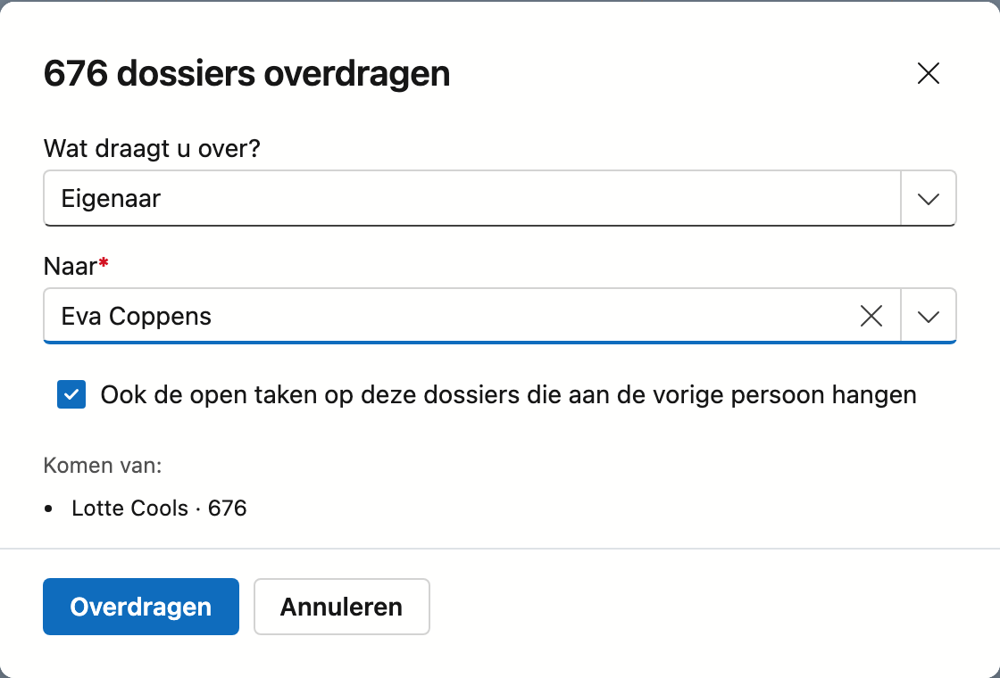
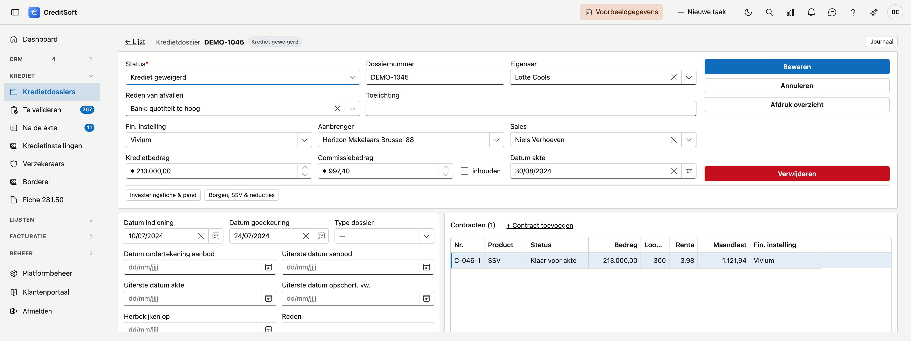
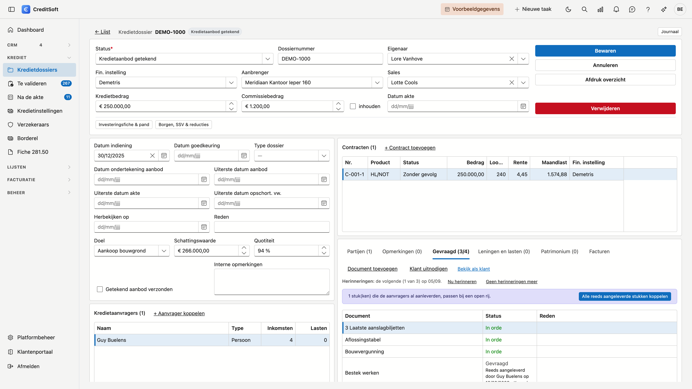
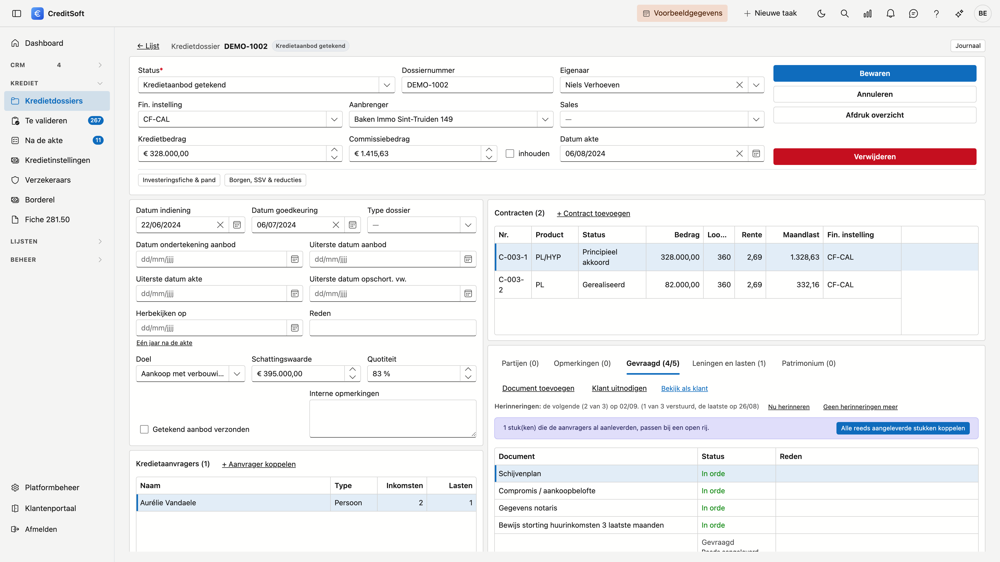

# Kredietdossiers

Het kredietdossier is het hart van CreditSoft. Alles wat bij één kredietaanvraag hoort — de aanvragers, het pand, de contracten, de betrokken partijen en de gevraagde documenten — staat op één pagina bij elkaar.

## Het scherm openen

Klik in de zijbalk op **Krediet** en dan op **Kredietdossiers**.

## De lijst

{ .volle-breedte }

Per dossier ziet u wie het aanvraagt, via wie het loopt en waar het staat:

| Kolom | Wat het toont |
|---|---|
| **Dossiernr** | Het interne nummer van het dossier |
| **Status** | Waar het dossier staat |
| **Kredietbedrag** | Het effectief toegekende bedrag |
| **Aanvrager** | Alle aanvragers van het dossier, na elkaar |
| **Aanbrenger** | De aanbrenger via wie het dossier binnenkwam |
| **Instelling** | De kredietinstelling |
| **Eigenaar** | De medewerker die het dossier opvolgt |
| **Datum indiening** | Wanneer het dossier is ingediend |
| **Ingangsdatum** | Wanneer het krediet ingaat |

Via **Kolommen kiezen** zet u er nog zes bij: *Sales*, *Gevraagd krediet*, *Totale investering*, *Eigen middelen*, *Quotiteit* en *Pand*. Ze staan standaard uit omdat lang niet elk kantoor ze invult, en omdat de lijst anders niet meer naast het journaal past. Uw keuze wordt onthouden voor de volgende keer.

### Een dossier aanmaken

Met **Nieuw dossier** bovenaan de lijst maakt u een leeg dossier aan. Welke status het begin is, verschilt per kantoor, dus vraagt CreditSoft dat één keer in plaats van te gokken. De lijst toont alleen statussen die **in gebruik** zijn: wat u hebt afgevoerd, komt er niet in.

!!! tip "Eén keer instellen en de vraag verdwijnt"
    Legt u de beginstatus vast bij **Platformbeheer → Dashboard-fases**, dan wordt ze niet meer gevraagd en opent een nieuw dossier meteen als fiche.

!!! note "Eerst uw statussen instellen"
    Hebt u nog geen dossierstatussen ingesteld, dan meldt CreditSoft dat en maakt hij geen dossier aan. Stel ze eerst in bij **Keuzelijsten**.

### Zoeken en filteren

- **Zoeken** — het zoekveld zoekt over alle **zichtbare** kolommen. Zet u een kolom aan via **Kolommen kiezen**, dan zoekt u er meteen ook in.
- **Status**, **Aanbrenger** en **Eigenaar** — de drie keuzelijsten bovenaan. Ze tonen alleen wat in uw dossiers voorkomt, dus geen statussen zonder dossier. Bij *Eigenaar* staat onderaan ook **Zonder eigenaar**, als er zulke dossiers zijn.
- **Op datum** — de kolommen **Datum indiening** en **Ingangsdatum** filtert u via het trechtertje op de kolomkop, of via de filterbouwer voor een bereik zoals "tussen 1 januari en 30 juni". Zie [Filteren en zoeken in lijsten](filteren-in-lijsten.md).
- **Vanaf het dashboard** — klikt u door vanaf een fase of vanaf [Stilgevallen dossiers](../getting-started/dashboard.md#stilgevallen-dossiers) op het dashboard, dan staat de lijst al gefilterd. Bovenaan ziet u welke filter actief is, met een knop **Filter wissen** ernaast.
- **Exporteren** — naar Excel of CSV, met de filters die op dat moment aan staan. De export volgt de taal van uw scherm.

**[Journaal](../journaal/overzicht.md)** — klik rechts op de rail **Journaal** om de [taken](../journaal/taken.md), [notities](../journaal/notities.md), gesprekken, [bijlagen](../journaal/bijlagen.md), het [mailverkeer](../journaal/mailverkeer.md), de commissieschema's en het [logboek](../journaal/logboek.md) van het geselecteerde dossier te zien zonder het te openen.

**Dubbelklik** een rij om het dossier te openen.

Wilt u het dossier in een **nieuw tabblad** van uw browser, houd dan **Ctrl** ingedrukt (**Cmd** op een Mac) terwijl u op de rij klikt, klik met het muiswiel, of klik op het **pijltje** vooraan de rij. De lijst blijft staan, zodat u meerdere dossiers naast elkaar open houdt. Met de rechtermuisknop op het pijltje opent u het dossier in een nieuw venster of kopieert u de koppeling. Zie [Meerdere fiches naast elkaar](../getting-started/navigatie.md#meerdere-fiches-naast-elkaar).

### Dossiers overdragen

Vertrekt een collega, of neemt iemand anders zijn klanten over, dan draagt u zijn dossiers in één keer over.

1. Kies bij **Eigenaar** bovenaan de collega van wie de dossiers komen.
2. Vink de dossiers aan. Het vakje in de kolomkop vinkt **alle** dossiers aan die aan uw zoekterm en filters voldoen, over alle pagina's heen; bovenaan ziet u hoeveel er geselecteerd zijn.
3. Klik op **Overdragen…** in de band boven de lijst.
4. Kies **wat** u overdraagt — de *eigenaar* of de *sales* — en **naar wie**. U ziet meteen van wie de dossiers komen; dossiers die al bij die collega horen, blijven ongewijzigd.
5. Laat **Ook de open taken …** aangevinkt als de open taken op die dossiers mee moeten. Enkel de taken die aan de vorige persoon hingen, gaan mee.
6. Klik op **Overdragen**.

!!! note "Een collega zonder account"
    Een taak hangt aan een account. Heeft de collega naar wie u overdraagt geen account, dan gaan de dossiers wel over maar blijven de taken waar ze zijn. CreditSoft zegt dat in het venster.

Een overdracht verandert niets aan de datum van de laatste activiteit: een [stilgevallen dossier](../getting-started/dashboard.md#stilgevallen-dossiers) blijft stilgevallen tot iemand er iets mee doet. Wie wat van wie naar wie overdroeg, staat in het [logboek](../journaal/logboek.md) van elk dossier en in het actielogboek.

### Een groepsmail sturen

Om de aanvragers van een reeks dossiers in één keer te schrijven — het kantoor sluit, een nieuwe werkwijze:

1. Vink de dossiers aan. Het vakje in de kolomkop vinkt alles aan wat aan uw zoekterm en filters voldoet, over alle pagina's heen.
2. Klik op **Groepsmail…** in de band boven de lijst.
3. Kijk na wie de mail krijgt, kies een sjabloon of typ een vrije tekst, en klik op **Voorbeeld**.
4. Klik op **Versturen** en bevestig.

Elke aanvrager met een mailadres krijgt zijn eigen mail, en die staat daarna in het mailverkeer van het dossier.
Wie wordt overgeslagen en waarom, en hoe de afmeldlink werkt, leest u bij
[Mailverkeer](../journaal/mailverkeer.md#een-groepsmail). De knop vraagt het recht **Groepsmail versturen**.

## Het dossier

![Een geopend kredietdossier: bovenaan de kopkaart met status, intern nummer, eigenaar en sales als keuzelijst — bij deze afgesloten status ook de reden van afvallen met de toelichting —, de financiële instelling, de aanbrenger, het kredietbedrag, het commissiebedrag met het vinkje inhouden ernaast en de datum akte, met rechts de knoppen Bewaren, Annuleren, Afdruk overzicht en Verwijderen. Daaronder links de datums van indiening en goedkeuring met het type dossier, de ondertekening van het aanbod naast de uiterste datum voor het aanbod, de uiterste datums voor de akte en de opschortende voorwaarden, Herbekijken op met de reden ernaast, het doel, de schattingswaarde en de quotiteit met het vinkje Getekend aanbod verzonden en het veld Interne opmerkingen, en onder die kaart de kredietaanvragers met per aanvrager het aantal inkomsten en lasten; rechts de contracten en onderaan de tabbladen Partijen, Opmerkingen, Gevraagd, Leningen en lasten en Patrimonium, elk met een teller.](../images/kredietdossier-fiche.png "Het kredietdossier: alles op één pagina"){ .volle-breedte }

Het dossier is één pagina. Bovenaan staat het kernblok met de gegevens die u het vaakst nodig hebt; daaronder staan links de datums en het pand, rechts de contracten. Onderaan rechts staan **Partijen**, **Opmerkingen**, **Gevraagd** en **Leningen en lasten** naast elkaar als tabbladen — vier lijsten die dezelfde plaats delen, zodat u niet hoeft te scrollen om ze alle vier te bereiken.

### Dossiergegevens

Het kopblok bovenaan draagt wat u het vaakst nodig hebt: intern nummer, **eigenaar**, **sales**, **status**, financiële instelling, aanbrenger, het kredietbedrag met het vinkje *Inhouden*, en de datum van de akte.

In de kaart eronder links staan bovenaan de datums van indiening en goedkeuring, met het type dossier. Daaronder staat de ondertekening van het aanbod naast de uiterste datum voor het aanbod, en dan de uiterste datums voor de akte en de opschortende voorwaarden. Die drie uiterste datums verschijnen op het [dashboard](../getting-started/dashboard.md) bij de termijnen. Daaronder staat **Herbekijken op** met een **reden**: de datum waarop u het dossier wil nalopen, ook lang nadat het krediet geakteerd is. Is de datum van de akte ingevuld, dan vult de link **Eén jaar na de akte** de datum voor u in. Het dossier verschijnt dan op het [dashboard](../getting-started/dashboard.md#opvolging-van-lopende-kredieten) bij *Herbekijken*, met de reden erbij. Onderaan de kaart volgen het doel, de schattingswaarde en de quotiteit.

!!! tip "Een leeg bedrag blijft leeg"
    Laat u een bedrag oningevuld, dan blijft het leeg — het wordt geen € 0. Dat onderscheid telt: bij een dossier zonder kredietbedrag ziet u dat het nog niet bekend is, niet dat het nul zou zijn.

**Eigenaar** en **Sales** zijn keuzelijsten van uw medewerkers. U kan erin typen om te zoeken, en met het kruisje maakt u het veld weer leeg.

Twee vinkjes verdienen aandacht:

- **Inhouden** — naast het commissiebedrag: bepaalt of de commissie van dit dossier ingehouden wordt.
- **Getekend aanbod verzonden** — u hebt het ondertekende aanbod doorgestuurd.

Onderaan het blok staat **Interne opmerkingen**: één vrij tekstveld voor uw eigen notities bij dit dossier. Dat is iets anders dan het tabblad *Opmerkingen*, waar elke regel de gebruiker en de datum draagt.

### Reden van afvallen

Sluit de **status** het dossier af zonder akte — bijvoorbeeld *Krediet geweigerd* of *Zonder gevolg* — dan staan er onder de status twee velden: **Reden van afvallen** en **Toelichting**. Kies of de bank weigerde of de klant afzag, en waarom. In de toelichting schrijft u wat de keuze niet zegt.

{ .volle-breedte }

- Het veld verschijnt zodra u zo'n status kiest. Welke statussen een dossier afsluiten, stelt u in bij de **Dashboard-fases**: een status in een afsluitende fase die niet als *geslaagd* telt. Heeft uw kantoor nog geen fases ingesteld, dan staat het veld op elk dossier.
- Een reden is niet verplicht. Het tabblad *Productie* op het [dashboard](../getting-started/dashboard.md#het-tabblad-productie) toont waarom uw dossiers afvallen, en ook bij hoeveel er een reden is ingevuld.
- Zet u het dossier later weer open, dan verdwijnt het veld. De reden blijft bewaard, maar telt niet meer mee.
- De redenen past u aan onder [Keuzelijsten](../beheer/keuzelijsten.md#de-reden-van-afvallen).
- Uw aanbrengers zien de reden in hun portaal, maar kunnen ze niet wijzigen.

### Pand

Op de fiche zelf staat de **schattingswaarde**, met de quotiteit ernaast.

De rest van het pand zit achter de knop **Investeringsfiche & pand…**: het pandadres, het pandtype, tot wanneer het EPC geldig is en het vinkje **Vrije keuze brandverzekering**. In datzelfde venster maakt u de volledige investeringsberekening — aankoop, nieuwbouw, renovatie, notariskosten, hypotheekinschrijving en alle overige posten, met onderaan de **totale investering** en de **eigen inbreng**.

### Kredietaanvragers

Wie het krediet aanvraagt. Koppel een bestaande relatie met **+ Aanvrager koppelen**. De lijst toont per aanvrager hoeveel **inkomsten** en hoeveel **lasten** er ingevuld zijn.

Draagt de persoon die u koppelt nog een **type contact**, zoals *Prospect*, dan vraagt CreditSoft na het bewaren
of dat type gewist mag worden. Zo verdwijnt die persoon uit uw lijst van prospecten: het is nu een klant. **Laten staan**
houdt het type; de vraag komt niet terug wanneer u dezelfde aanvrager later opnieuw bewaart. Bij een bedrijf als
aanvrager stelt CreditSoft de vraag niet.

Dubbelklik een aanvrager om zijn venster te openen. Het heeft drie tabbladen:

- **Algemeen** — de relatie. De knop **Bewaren** onderaan gaat over dit tabblad.
- **Inkomsten** — elk inkomen is een regel: het type, het bedrag en of dat bedrag **per maand** of **per jaar** geldt, met de werkgever, de functie, het soort contract en de periode waarin het loopt.
- **Leningen en lasten** — de kredieten die de aanvrager vandaag afbetaalt, en zijn vaste lasten. Zie [Leningen en lasten](#leningen-en-lasten) hieronder.

Een regel bewaart u in haar eigen venster: ze staat meteen op het dossier, los van de knop **Bewaren** van de aanvrager. Een aanvrager die u net koppelt, bewaart u daarom eerst; daarna voegt u zijn inkomsten en lasten toe.

!!! tip "Het type stelt de periode voor"
    Kiest u *Vakantiegeld* of *Eindejaarspremie*, dan springt de periode op **Per jaar**; bij de andere types op **Per maand**. U kan ze altijd aanpassen.

De inkomenstypes beheert u zelf onder **Platformbeheer → [Keuzelijsten](../beheer/keuzelijsten.md)**, in de lijst *Inkomenstype*. Elk kantoor begint met dezelfde elf: netto maandinkomen, buitenlands inkomen, vakantiegeld, eindejaarspremie, maaltijdcheques, kindergeld, vier soorten huurinkomsten (privé of beroeps, huidig of toekomstig) en ander inkomen.

!!! note "Geen totalen"
    CreditSoft telt de inkomsten niet op en berekent geen schuldgraad. Een maandloon en een jaarlijkse premie zijn niet zomaar op te tellen, en een som die niet klopt, leest toch als een antwoord.

### Leningen en lasten

Bij een nieuwe regel kiest u eerst de **soort**. Wat het venster daarna vraagt, hangt daarvan af.

Een **lening** — hypothecair krediet, lening op afbetaling, verkoop op afbetaling, kredietopening of leasing — vraagt de kredietmaatschappij, het contractnummer, de looptijd, het oorspronkelijke bedrag, het saldo, de aflossing per maand, de rentevoet, de begin- en einddatum, de regelmatigheid van de terugbetaling (regelmatig, geregulariseerd of geficheerd) en een eventuele wederbeleggingsvergoeding.

- **Kredietmaatschappij** stelt uw kredietinstellingen voor, maar u mag er ook een andere naam in typen: een lopende lening zit vaak bij een bank waarmee u niet samenwerkt.
- **Overnemen** vinkt u aan wanneer het nieuwe krediet deze lening overneemt.

Bij **huur**, **alimentatie** of een **andere last** vraagt het venster enkel het bedrag per maand en de periode, met het vinkje **Valt weg na het nieuwe krediet** — bijvoorbeeld de huur die stopt wanneer uw klant naar zijn nieuwe woning verhuist.

Op het dossier zelf staat het tabblad **Leningen en lasten**, naast *Partijen*, *Opmerkingen* en *Gevraagd*: de regels van alle aanvragers samen, met een kolom **Aanvrager**. Zo ziet u naast de contracten van het nieuwe krediet wat uw klanten vandaag al afbetalen. De kolom **Na het krediet** zegt welke leningen overgenomen worden en welke lasten wegvallen. U kan er ook rechtstreeks een regel toevoegen; dan kiest u eerst de aanvrager.

{ .volle-breedte }

!!! tip "In de investeringsfiche"
    Onder **Saldo overname kredieten** toont de investeringsfiche de som van de saldo's van de leningen die u op *Overnemen* zette. Het is een hulp bij het invullen: het bedrag in het veld zelf bepaalt u.

### Patrimonium

Het tabblad **Patrimonium** toont de panden die uw klant al bezit — naast het pand dat dit krediet financiert,
dat onder *Investeringsfiche & pand* blijft staan. Per pand ziet u het adres, het type, de eigenaar, de waarde,
het openstaand saldo en de huur per maand. Onderaan staat een **somregel** met de totale waarde, het totaal
openstaand saldo en de totale huur per maand. Een kolom waarin geen enkel pand een bedrag draagt, toont een
streepje en geen € 0,00.

{ .volle-breedte }

Klik op **+ Pand toevoegen**, of dubbelklik een pand om het te wijzigen:

| Veld | Waarvoor |
|---|---|
| **Type** | De bestemming van het pand — gezinswoning, verhuurd appartement, verhuurde handelszaak, … |
| **Eigenaar** | Een van de aanvragers, of **Samen** |
| **Adres** | Straat, nummer en bus, met de postcode- en gemeentekiezer zoals bij relaties |
| **Waarde**, **Openstaand saldo**, **Huur per maand** | De bedragen die de somregel optelt |
| **Opmerking** | Wat er niet in een veld past, bijvoorbeeld een geplande verkoop |

{ .volle-breedte }

Een pand heeft minstens een type of een adres nodig. Elk pand bewaart u apart; het dossier hoeft u daarvoor
niet te bewaren.

!!! tip "Een lening op een pand"
    Het openstaand saldo staat op het pand. Loopt er een lening op, dan hoort haar maandlast bij **Leningen en
    lasten** — zo telt u de maandlast niet twee keer.

Het patrimonium staat ook op de afdruk van het dossier, met dezelfde somregel.

### Facturen

Het tabblad **Facturen** toont het **charter** van dit dossier en de **facturen** die eraan hangen. U ziet het met het recht *Facturen bekijken*.

{ .volle-breedte }

- **Charter** — vink *Dit dossier heeft een charter* aan en vul het **charterbedrag** in. Klik op **Bewaren** in deze kaart: het charter bewaart u apart, niet met het dossier. Een dossier met een charter verschijnt op [Te factureren](../facturatie/te-factureren.md) tot zijn factuur definitief is.
- **Facturen** — de facturen en creditnota's van dit dossier. Dubbelklik er een om ze te openen.
- **Factuur maken** opent een nieuwe [factuur](../facturatie/facturen.md) met de eerste aanvrager als klant en dit dossier ingevuld; met een charter staat het charterbedrag er al als lijn.

### Contracten

De kredietcontracten onder dit dossier. De lijst toont nummer, product, status, bedrag, looptijd, rentevoet en instelling; maandlast en startdatum vindt u op het contract zelf.

Het contractvenster past zich aan de **productsoort** aan: bij een gewoon krediet vraagt het producttype, rentevoet, variabiliteit en maandlast, bij een schuldsaldoverzekering komen daar premie, type en periodiciteit bij, plus het aanvinken van wie verzekerd is.

Naast het contractnummer staat het **voorlopig dossiernummer**: het nummer dat de instelling geeft zolang er nog geen definitief contractnummer is. Bij een krediet vult u ook de **datum ingediend** en de **datum klaar voor akte** in, onder de startdatum.

Bij een hypothecair krediet staat naast de variabiliteit de **Eerste herziening**: de datum waarop de rente voor
het eerst herzien wordt. Kiest u een variabiliteit waarvan uw kantoor de jaren kent, en is het veld nog leeg,
dan stelt CreditSoft een datum voor: de startdatum van het contract — of anders de datum van de akte — plus het
aantal jaren. U mag die datum aanpassen. Wijkt ze af van het voorstel — bijvoorbeeld omdat u nadien een
andere variabiliteit koos — dan staat het voorstel eronder, met **Voorstel gebruiken** ernaast. Vanaf de eerste herziening telt het
[dashboard](../getting-started/dashboard.md#opvolging-van-lopende-kredieten) de volgende herzieningen zelf
verder. Bij uw bestaande contracten is de eerste herziening al ingevuld waar de variabiliteit haar jaren kent en
de start- of aktedatum bekend is.

{ .volle-breedte }

#### Een mail bij een nieuwe status

Heeft uw kantoor [mails per moment](../beheer/mail-momenten.md) ingesteld, dan kan het bewaren van een contract of van het dossier een mail aan de klant meebrengen — bijvoorbeeld wanneer een contract de status *Ingediend* krijgt.

- Staat het moment op **Voorstellen**, dan opent na *Bewaren* een mail die al ingevuld is, met alle aanvragers als ontvanger. U leest ze na, past ze aan als u wil, en verstuurt ze — of u sluit het venster.
- Staat het op **Automatisch**, dan vertrekt de mail meteen; een melding zegt het u.

Een moment vertrekt hoogstens één keer per contract of dossier. U vindt de mail terug bij het **mailverkeer** van het dossier.

### Partijen

De betrokken professionals — immokantoor, notaris, schatter of accountant. Per partij houdt u bij of ze **aangesteld** is en of het **verslag ontvangen** is, met de bijhorende datums en contactgegevens.

### Borgen, SSV & reducties

Achter de knop **Borgen, SSV & reducties…** vindt u drie lijsten bij elkaar: borgen en kredietgevers, de schuldsaldoverzekeringen (met verzekeraar, verzekerd percentage, fiscaal en roker) en de toegekende reducties.

### Gevraagde documenten

Het derde tabblad, naast *Partijen* en *Opmerkingen*: de lijst van stukken die u van deze klant verwacht.

In de titel staan **twee getallen** — *Gevraagd (3/6)* betekent drie gevalideerd van de zes die u vraagt. Zo ziet u hoe ver dit dossier staat zonder het tabblad te openen. Links staat wat **gevalideerd** is, niet wat binnen is: een stuk dat u nog moet nakijken telt niet mee als in orde.

De kolom **Status** zegt in één woord waar elk stuk staat: *Gevraagd* (nog niets binnen), *Ontvangen* (aangeleverd, wacht op u), *In orde* (goedgekeurd) of *Opnieuw sturen* (afgekeurd, met de reden ernaast).

**Dubbelklik** een regel om ze te beoordelen. U ziet welke bestanden uw klant stuurde, met hun grootte en het tijdstip; het **vergrootglas** opent een PDF zonder hem eerst te downloaden. Daarna kiest u:

- **Goedkeuren** — het stuk staat in orde en telt mee in de teller bovenaan.
- **Afkeuren** — u geeft een reden op. Die is verplicht: uw klant leest ze in zijn portaal en weet zo wat er scheelt. Standaard vertrekt er ook een e-mail met een **nieuwe portaallink**, zodat hij meteen opnieuw kan aanleveren. Wat hij eerder stuurde, blijft bewaard.

Vraagt u een stuk toch niet, dan haalt **Verwijderen** in datzelfde venster het van de lijst. Het verhuist naar de [prullenbak](../administration/recycle-bin.md) en is dus niet definitief weg; de teller bovenaan telt er meteen één minder.

#### Stukken die de klant al aanleverde

Leverde een aanvrager een stuk al aan bij zijn [relatiefiche](../crm/relations.md) — bijvoorbeeld vóór er een dossier was — dan hoeft hij het niet opnieuw te sturen. Staat in dit dossier een stuk van dezelfde soort nog open, dan ziet u op die regel **Reeds aangeleverd door Jan Peeters op 12/06/2026** met een knop **Koppelen**. Boven de lijst staat **Alle reeds aangeleverde stukken koppelen** als het er meer zijn.

Na het koppelen staat de regel op *Ontvangen*, met *via Jan Peeters, aangeleverd op 12/06/2026* eronder. Een paar dingen om te weten:

- **Het bestand blijft één bestand, bij de klant.** Er wordt niets verplaatst of gekopieerd: vraagt een volgend dossier hetzelfde stuk, dan koppelt u het daar opnieuw.
- **U beoordeelt het opnieuw, voor dit dossier.** Ook een stuk dat bij de relatie al goedgekeurd was, begint hier onbeoordeeld — een loonfiche van acht maanden geleden kan voor dit dossier te oud zijn. Kijk dus naar de datum.
- **Ontkoppelen** kan in het beoordeelvenster zolang u het niet goedgekeurd hebt; de regel staat dan weer open.
- Stuurt de klant via zijn portaal toch een nieuw bestand, dan geldt dat nieuwe bestand.
- In het klantenportaal leest uw klant bij die regel dat hij het stuk al aanleverde.

### Het journaal van dit dossier

De knop **Journaal** rechtsboven, op de regel met het dossiernummer, opent een paneel met zeven tabbladen: **Taken**, **Notities**, **Gesprekken**, **Bijlagen**, **Commissieschema's**, **Mailverkeer** en het **Logboek** — alles van dít dossier. Het paneel opent op **Taken**: wat er nog te doen is bij dit dossier.

#### Commissieschema's

Op dit tabblad staat per aanbrenger wat er voor dit dossier afgesproken is: het bedrag, de vorm — gespreid, in termijnen of een vast bedrag — en de toestand. Hangen er veel schema's aan één dossier, dan staan ze gegroepeerd per aanbrenger, met het totaal ernaast; klik op een naam om de schema's eronder open te vouwen.

{ .volle-breedte }

Boven de lijst staat de knop **Toevoegen**. Daarmee maakt u een nieuw schema voor dit dossier: u kiest de aanbrenger, het totale commissiebedrag, de startdatum en de uitbetalingsvorm. Kiest u *Gespreid*, dan vult u aan welk deel direct uitbetaald wordt en over hoeveel maanden de rest verdeeld wordt. Kiest u *Geplande betalingen*, dan zet u zelf de termijnen: per termijn hoeveel maanden na de startdatum, en welk percentage van de totale commissie. Een schema mag tot 24 termijnen dragen, en die hoeven samen geen 100 % te vormen. Vul per termijn wél **allebei** de velden in: een termijn met enkel een percentage of enkel een maand wordt geweigerd, met de melding welke rij het is. Een rij die u toevoegde maar leeg liet, mag blijven staan — die wordt genegeerd.

Een nieuw schema staat eerst op *nog niet actief*: er is nog niets geboekt. Pas wanneer u het activeert, zet CreditSoft de maandbedragen klaar.

{ .volle-breedte }

Bovenaan de fiche staat naast de naam van het dossier of de aanbrenger in welke toestand het schema is:
**Actief**, **Stopgezet** (met de datum) of **Nog niet geactiveerd**. Zo weet u meteen of dit schema
vandaag nog geld oplevert.

Naast **Toevoegen** staat een zoekveld — handig op een dossier met veel schema's — en een menu om de lijst te **exporteren** naar Excel of CSV.

Wat u verder met een schema kan doen, hangt af van zijn toestand:

- **Nog niet actief** — u kan het **wijzigen** of **activeren**. Dan zet CreditSoft alle maandbedragen ineens klaar, tot het einde van de looptijd. Zolang er niets uitbetaald is, kan u het ook nog **verwijderen**.
- **Actief** — u kan het **wijzigen**, **herberekenen** of **stopzetten**. Wijzigt u een actief schema, dan herberekent CreditSoft meteen de maanden die nog niet uitbetaald zijn. Herberekenen toont eerst wat er zou veranderen: per maand het oude en het nieuwe bedrag, hoeveel al uitbetaalde maanden ongewijzigd blijven, en het totaal daarna. Pas als u bevestigt, gebeurt het.
- **Stopgezet** — er staat enkel nog wanneer; wijzigen kan niet meer. Bij het stopzetten geeft u zelf de datum op vanaf wanneer het schema stopt, en waarom. Vanaf die maand vervallen de maanden die nog niet uitbetaald waren; wat er vóór die maand stond, blijft.

!!! tip "Een herinnering bij het bewaren"
    Bewaart u een dossier waarvoor de aanbrenger nog geen commissieschema heeft, dan verschijnt daar een
    melding over. Het dossier wordt gewoon bewaard — het is een herinnering, geen blokkade. Ziet u die melding
    niet en wilt u ze wel, vraag dan uw beheerder om ze aan te zetten; ze staat standaard uit omdat niet elk
    kantoor met commissieschema's werkt.

!!! note "Wat uitbetaald is, blijft"
    Een maand die op een borderel gestaan heeft, wordt door geen enkele van deze handelingen nog gewijzigd — ook niet bij een herberekening. Daardoor kan het totaal ná een herberekening afwijken van het schemabedrag. Dat is geen fout: het verleden is uitbetaald en gerapporteerd.

    Om dezelfde reden kan een schema niet meer verwijderd worden zodra er één maand uitbetaald is. Wilt u dan toch stoppen, gebruik **Stopzetten**.

Onder *Mailverkeer* vindt u de uitnodiging terug die u naar uw klant stuurde, en de mail over stukken die u afkeurde, elk met hun afleverstatus. U kan er ook zelf een mail opstellen; de ontvanger staat dan al ingevuld met de eerste aanvrager van het dossier.

Het paneel zweeft over de fiche en dekt ze tijdelijk af. Werkt u op een breed scherm, klik dan het **pinnetje** rechtsboven in het paneel: dan schuift de fiche opzij en staan beide naast elkaar. Die keuze wordt onthouden.

### Uw klant uitnodigen

De knop **Klant uitnodigen** boven de lijst stuurt uw klant een e-mail met een **persoonlijke link**. Daarmee ziet hij welke stukken u vraagt en laadt hij ze op — zonder wachtwoord, zonder account.

U kiest de ontvanger uit de aanvragers van het dossier; hun naam en adres staan erbij, en u kan ook een ander adres intikken. De mail vertrekt uit uw sjabloon *Uitnodiging klantenportaal* en wordt **bewaard bij het mailverkeer van dit dossier**, zodat u later kan terugvinden wanneer en naar wie u ze stuurde.

Heeft uw klant geen e-mailadres, gebruik dan **Enkel de link maken**: u krijgt de link te zien en bezorgt hem zelf, bijvoorbeeld telefonisch.

In hetzelfde venster staan onder **Uitgegeven links** alle uitnodigingen van dit dossier, met de datum waarop ze vertrokken en **wanneer de klant de link het laatst opende** — of *nog niet geopend*. Zo ziet u of uw klant al gekeken heeft. Die datum verschuift telkens hij op de link klikt; blijft hij aangemeld en komt hij later terug zonder opnieuw te klikken, dan blijft ze staan.

Met **Bekijk als klant** ernaast opent u het portaal in een nieuw tabblad, precies zoals uw klant het ziet. Handig om te controleren wat u vraagt vóór u de uitnodiging verstuurt. Wat u daar oplaadt, komt écht op het dossier terecht — een gele balk bovenaan herinnert u daaraan.

!!! warning "De link is elke keer nieuw"
    Een uitnodiging wordt niet bewaard en kan niet teruggehaald worden — enkel een afdruk ervan. Verstuurt u er een tweede, dan krijgt uw klant een nieuwe link; de oude blijft werken tot ze vervalt.

### Herinneringen aan uw klant

Ontbreken er nog stukken, dan krijgt uw klant vanzelf een **herinnering per mail**: de lijst van wat nog ontbreekt — bij een afgekeurd stuk met de reden erbij — en een nieuwe link naar zijn portaal. Dat gebeurt als u de herinneringen aanzette bij [Platformbeheer → Documenttypes](../beheer/documenttypes.md#herinnering-aan-de-klant), en enkel voor een klant die voor dit dossier een **uitnodiging per mail** kreeg. Met *Enkel de link maken* vertrekken er geen herinneringen.

Boven de lijst ziet u waar het dossier staat: wanneer de volgende herinnering vertrekt, en hoeveel er al verstuurd zijn. Een dossier krijgt er hoogstens drie. Ze stoppen vanzelf zodra er niets meer ontbreekt of het dossier afgesloten is.

- **Nu herinneren** stuurt er meteen een. De volgende automatische herinnering telt dan vanaf vandaag.
- **Geen herinneringen meer** stopt ze voor dit dossier. Met **Hervatten** zet u ze weer aan; wat al verstuurd is, blijft meetellen.

!!! note "Wat telt als ontbrekend"
    Een stuk met de status *Gevraagd* of *Opnieuw sturen*. Een stuk dat uw klant al aanleverde en dat op uw beoordeling wacht (*Ontvangen*), telt niet mee: dan wacht hij op u.

De herinneringen vertrekken elke ochtend om 6 uur. De tekst komt uit het mailsjabloon *Herinnering ontbrekende stukken (klantenportaal)*, en de mail staat daarna bij het mailverkeer van het dossier.

Met **Bestanden** beheert u de bijlagen zelf — handig wanneer een stuk per post of per mail binnenkomt in plaats van via het portaal. Met **Document toevoegen** zet u een extra gevraagd stuk op de lijst. Die keuzelijst is gegroepeerd per **categorie**: eenzelfde stuk bestaat vaak voor meerdere soorten dossiers — *Gegevens notaris* apart voor Aankoop, Erfenis, Herfinanciering en nog vijf andere — en de kop erboven zegt telkens over welke het gaat.

!!! tip "Alles op één lijst"
    Wilt u niet dossier per dossier kijken wat er binnenkwam, gebruik dan [Te valideren documenten](document-validation.md): dezelfde handelingen, maar over al uw dossiers heen, met een teller in het menu.

!!! tip "Welke documenten u kan opvragen, bepaalt u zelf"
    De lijst waaruit u kiest, beheert u onder [Platformbeheer → Documenttypes](../beheer/documenttypes.md). Elk kantoor vraagt andere stukken op, dus die lijst is van u.

### Opmerkingen

Het tabblad naast *Partijen*. Hier noteert u alles wat bij dit dossier gezegd of afgesproken is — een telefoon met de klant, een afspraak met de bank, een stuk dat u nog verwacht. Elke regel draagt wie ze schreef en wanneer.

## Afdrukken

De knop **Afdruk overzicht** maakt een pdf van dit dossier, met uw eigen briefhoofd erboven. Erop staan, in deze volgorde: de dossiergegevens, de kredietaanvragers, hun inkomsten, hun leningen en lasten, het pand, de investeringsfiche, de contracten, de partijen en de opmerkingen. U kan die pdf downloaden of meteen doorsturen per e-mail.

- De afdruk toont wat **bewaard** is. Hebt u net iets gewijzigd, bewaar het dan eerst.
- Bij het pand en de investeringsfiche staat enkel wat ingevuld is. De investeringsfiche eindigt met de totale investering, de eigen inbreng en het gevraagde krediet.
- Inkomsten en lasten worden niet opgeteld, net zoals op het scherm.
- Een blok zonder inhoud blijft staan, met een korte zin. Zo ziet u dat er niets is, en niet dat er iets ontbreekt.
- Loopt een blok over meer dan één pagina, dan staan zijn kolomkoppen ook bovenaan de volgende pagina.

Zoekt u cijfers over **meerdere** dossiers — per status, per kredietverstrekker, per aanbrenger of per sales verantwoordelijke — dan vindt u die onder [Rapporten](reports.md).
