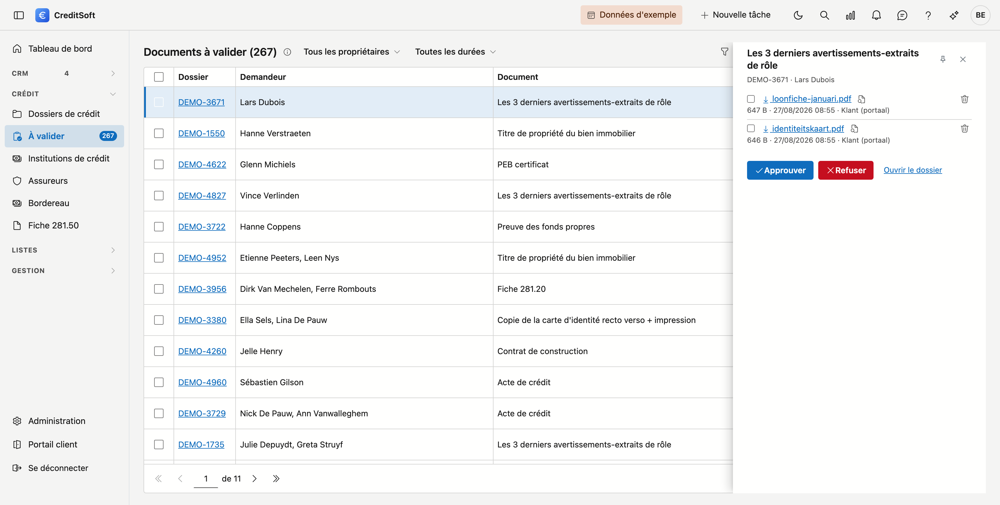

# Documents à valider

Ce que vos clients fournissent via le **portail client** se retrouve ici : une seule liste avec toutes les pièces qui doivent encore être évaluées, tous dossiers confondus. Vous ne devez donc pas ouvrir chaque dossier pour vérifier si quelque chose est arrivé.

## Ouvrir l'écran

Dans le menu de gauche, cliquez sur **Documents à valider**, sous *Crédit*. Le nombre à côté indique combien de pièces attendent ; s'il n'y a pas de nombre, il n'y a rien à faire.

{ .volle-breedte }

## Celui qui attend le plus longtemps figure en haut

La liste est triée sur le temps d'attente. Après la date, vous voyez depuis combien de jours une pièce attend ; à partir d'une semaine, ce nombre passe au rouge.

| Colonne | Signification |
|---|---|
| **Dossier** | Le numéro de dossier. Cliquez dessus pour ouvrir le dossier dans un nouvel onglet |
| **Demandeur** | Le ou les clients de ce dossier |
| **Document** | La pièce que vous aviez demandée. La mention *Nouvelle tentative* signifie qu'elle a déjà été refusée — survolez l'étiquette pour lire le motif précédent |
| **Fourni le** | Quand le client l'a envoyée |
| **Fichiers** | Combien de fichiers il a joints à cette seule pièce |
| **Propriétaire** | Le gestionnaire du dossier |

En haut, vous pouvez filtrer par **propriétaire** — pour ne garder que vos propres dossiers — et par **temps d'attente**, pour voir ce qui traîne. Le nombre à côté du titre de l'écran indique combien de pièces attendent à cet instant ; le même nombre figure à côté de l'élément de menu.

## Évaluer une pièce

Cliquez une ligne. Un panneau s'ouvre à droite — de lui-même, vous n'avez rien à déplier — avec ce que le client a envoyé : chaque fichier avec sa taille et l'heure. Cliquez le nom du fichier pour le télécharger, ou **Consulter** pour ouvrir un PDF sans l'enregistrer.

L'**épingle** en haut du panneau le fixe, afin qu'il reste ouvert pendant que vous parcourez la liste. Sur un écran plus étroit, mieux vaut le laisser flotter : il ne masque alors que ce que vous ne lisez pas à ce moment-là.

Le bouton **Ouvrir le dossier** vous mène du panneau au dossier complet.

Ensuite, vous choisissez :

- **Approuver** — la pièce est cochée sur la liste des documents du dossier. C'est fait.
- **Refuser** — vous indiquez un motif. Il est obligatoire : sans motif, votre client ne sait pas quoi faire différemment. La pièce réapparaît sur sa liste, accompagnée de votre motif, et il peut la fournir à nouveau.

Pour traiter plusieurs pièces à la fois — un client qui a envoyé six fichiers d'un coup — cochez les lignes. Une barre apparaît alors au-dessus de la liste avec **Approuver** et **Refuser** pour toute la sélection. Pour le refus, CreditSoft demande ici aussi un motif unique, valable pour toutes les pièces cochées.

!!! info "Ce que le client a envoyé est conservé"
    Même après un refus, les fichiers restent en place. Vous pouvez donc toujours vérifier ce qui a été fourni et pourquoi cela ne suffisait pas.

## Avertir le client

Lors du refus, l'option **Avertir le client par e-mail** est activée par défaut. Un courriel part alors avec les pièces refusées, votre motif et un **nouveau lien** vers son portail.

Ce lien est volontairement nouveau : la clé d'origine n'est conservée nulle part, elle ne peut donc pas être récupérée. Votre client dispose ainsi toujours d'un chemin de retour qui fonctionne.

Le texte de ce courriel provient du modèle d'e-mail **Documents non valides**. Vous pouvez l'adapter vous-même dans les modèles d'e-mail — les endroits où votre client lit son nom, le numéro de dossier, les pièces refusées et le lien vers le portail sont des champs de fusion remplis automatiquement.

Si vous refusez des pièces de **plusieurs dossiers** en même temps, l'avertissement ne peut pas être activé — la case est décochée et le reste. Ces pièces appartiennent à des clients différents, et un seul courriel pour plusieurs clients n'existe pas. Avertissez-les séparément depuis leur propre dossier.

!!! warning "Si le courriel ne part pas"
    Si l'envoi échoue — une panne du serveur de messagerie, par exemple — un bandeau apparaît en haut : *les pièces ont été refusées, mais le client n'a pas été averti*. Le refus lui-même a bien eu lieu. Vous ne devez pas le recommencer ; seul l'avertissement reste à faire.

## Une pièce sans fichier

Il arrive qu'une pièce figure dans la liste sans fichier joint. Cela signifie généralement qu'elle est arrivée en dehors du portail — par courrier ou par e-mail — et que quelqu'un l'a cochée sur le dossier lui-même. Vous pouvez l'approuver sans souci ; il n'y a simplement rien à ouvrir.
