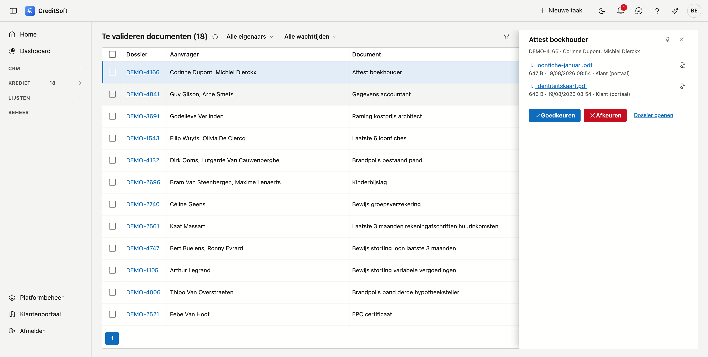

# Te valideren documenten

Wat uw klanten via het **klantenportaal** aanleveren, komt hier samen: één lijst met alle stukken die nog beoordeeld moeten worden, over al uw dossiers heen. U hoeft dus niet dossier per dossier te gaan kijken of er iets binnengekomen is.

## Het scherm openen

Klik in het menu links op **Te valideren documenten**, onder *Krediet*. Het getal ernaast zegt hoeveel stukken er wachten; staat er geen getal, dan is er niets te doen.

{ .volle-breedte }

## Wie het langst wacht, staat bovenaan

De lijst is gesorteerd op wachttijd. Achter de datum ziet u hoeveel dagen een stuk al ligt; vanaf een week kleurt dat rood.

| Kolom | Wat het betekent |
|---|---|
| **Dossier** | Het dossiernummer. Klik erop om het dossier in een nieuw tabblad te openen |
| **Aanvrager** | De klant(en) van dat dossier |
| **Document** | Welk stuk u gevraagd had. Staat er *Herkansing* naast, dan werd het eerder al afgekeurd — beweeg over het label voor de vorige reden |
| **Aangeleverd** | Wanneer de klant het opstuurde |
| **Bestanden** | Hoeveel bestanden hij onder dat ene stuk plaatste |
| **Eigenaar** | De beheerder van het dossier |

Bovenaan kan u filteren op **eigenaar** — zo houdt u enkel uw eigen dossiers over — en op **wachttijd**, om te zien wat te lang blijft liggen.

## Een stuk beoordelen

Klik een rij aan. Onder de lijst verschijnt wat de klant stuurde: elk bestand met zijn grootte en het tijdstip. Klik de bestandsnaam om te downloaden, of **Bekijken** om een PDF te openen zonder hem op te slaan.

Daarna kiest u:

- **Goedkeuren** — het stuk staat afgevinkt op de documentchecklist van het dossier. Klaar.
- **Afkeuren** — u geeft een reden op. Die is verplicht, want zonder reden weet uw klant niet wat hij anders moet doen. Het stuk komt terug op zijn lijstje te staan, met uw reden erbij, en hij kan opnieuw aanleveren.

Wilt u meerdere stukken tegelijk afhandelen — een klant die zes bestanden in één keer opstuurde — vink dan de rijen aan. Boven de lijst verschijnt dan een balk met **Goedkeuren** en **Afkeuren** voor de hele selectie.

!!! info "Wat de klant stuurde, blijft bewaard"
    Ook na een afkeuring blijven de bestanden staan. Zo kan u achteraf nog nagaan wat er precies aangeleverd werd en waarom het niet volstond.

## De klant verwittigen

Bij het afkeuren staat **De klant hiervan per e-mail verwittigen** standaard aan. Er vertrekt dan een mail met de afgekeurde stukken, uw reden, en een **nieuwe link** naar zijn portaal.

Die link is bewust nieuw: de oorspronkelijke sleutel wordt nergens bewaard, dus terughalen kan niet. Uw klant heeft dus altijd een werkende weg terug.

De tekst van die mail komt uit het mailsjabloon **Ongeldige documenten**. U kan die zelf aanpassen bij de mailsjablonen — de plaatsen waar uw klant zijn naam, het dossiernummer, de afgekeurde stukken en de portaallink leest, zijn samenvoegvelden die automatisch ingevuld worden.

Keurt u stukken van **meerdere klanten** tegelijk af, dan wordt het verwittigen uitgezet: één mail voor verschillende klanten bestaat niet.

## Een stuk zonder bestand

Soms staat er een stuk in de lijst waar geen bestand aan hangt. Dat betekent meestal dat het buiten het portaal om binnenkwam — per post of per mail — en dat iemand het op het dossier zelf heeft afgevinkt. Goedkeuren mag gerust; er valt enkel niets te openen.
