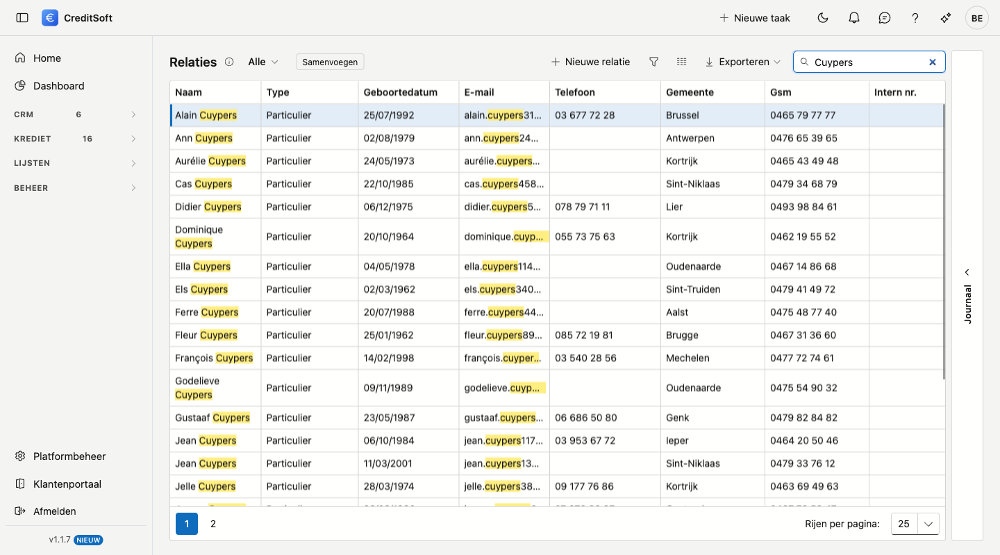

# Filteren en zoeken in lijsten

<!-- AFBEELDING: dezelfde lijst met een kolomfilter actief, zodat onderaan de balk met de actieve filter zichtbaar is (zie punt 4). Het trechtertje verschijnt pas bij muisbeweging over de kolomkop, dus dit beeld moet met de hand genomen worden. -->

Elke lijst in CreditSoft werkt op dezelfde manier. Wat u hier leest, geldt dus even goed voor de kredietdossiers als voor de verzekeringen, de contracten, de relaties of de aanbrengers.

Er zijn vier manieren om een lijst te versmallen, van snel naar krachtig. Ze werken samen: wat u met de ene wegfiltert, blijft weg wanneer u de andere gebruikt.

## 1. Het zoekveld

Rechtsboven staat een zoekveld. Wat u daar typt, wordt gezocht in **alles wat u ziet** — alle zichtbare kolommen tegelijk. Dit is de snelste weg naar één klant of één dossiernummer.

## 2. De keuzelijsten bovenaan

De meeste lijsten hebben bovenaan een rij keuzelijsten: status, instelling, verantwoordelijke, product. Die zijn per scherm anders en staan beschreven op de pagina van dat scherm. Ze tonen alleen waarden die in uw gegevens voorkomen, dus u krijgt geen keuzes die niets opleveren.

## 3. Het trechtertje op een kolomkop

Beweeg met de muis over een kolomkop en er verschijnt een klein **trechtertje**. Klik erop en u krijgt de waarden die in die kolom voorkomen, met een vinkje per waarde. Handig om snel op één of enkele waarden te filteren.

## 4. De filterbouwer — voor bereiken en combinaties

Zodra er ergens gefilterd is, verschijnt onderaan de lijst een **balk met de actieve filter**, bijvoorbeeld:

> ☑ `[Bedrag] >= '200.000'`

Die balk doet drie dingen:

- ze **toont** wat er gefilterd staat, zodat u nooit naar een ingekorte lijst kijkt zonder te weten waarom;
- met het **vinkje** links zet u de filter tijdelijk uit zonder hem kwijt te raken;
- met het **prullenbakje** rechts wist u hem.

**Klik op de tekst van de filter** en de **filterbouwer** opent. Daar stelt u zelf voorwaarden samen:

- kies een **veld** (bijvoorbeeld *Bedrag*),
- kies een **operator** (*is gelijk aan*, *is groter dan of gelijk aan*, *bevat*, …),
- vul een **waarde** in.

Met **Voorwaarde toevoegen** zet u er een tweede bij, en met de keuze **En / Of** bovenaan bepaalt u of alle voorwaarden moeten kloppen of één ervan. Met **Groep toevoegen** nest u voorwaarden, bijvoorbeeld *(bedrag boven 200.000) én (instelling A óf instelling B)*.

!!! tip "Zo zoekt u op een bereik"
    Een vork zoals "tussen 200.000 en 250.000" maakt u met **twee voorwaarden in één En-groep**: *Bedrag is groter dan of gelijk aan 200.000* én *Bedrag is kleiner dan of gelijk aan 250.000*. Datzelfde werkt op looptijd, interest en op datums — bijvoorbeeld alle aktes van dit jaar.

## Wat er bewaard blijft

Uw filters, uw kolomvolgorde, uw kolombreedtes en welke kolommen u aan of uit zette, blijven per lijst bewaard in uw browser. Komt u morgen terug op hetzelfde scherm, dan staat het zoals u het achterliet — en de filterbalk onderaan toont u meteen wat er nog actief is.

## Exporteren en afdrukken volgen uw filters

Wat u exporteert naar Excel of CSV, en wat op een afdruk komt, is **wat u op dat moment ziet**. Filtert u eerst en exporteert u daarna, dan zit alleen die selectie in het bestand.
