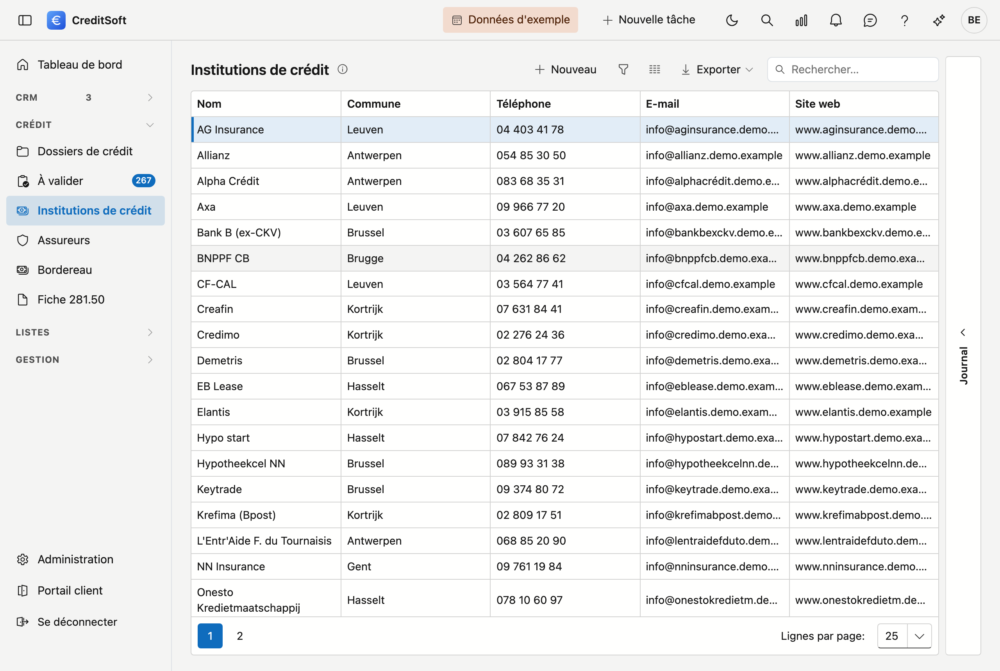

# Institutions de crédit

Les institutions de crédit sont les **banques et prêteurs** avec lesquels votre bureau collabore — les organismes de crédit auprès desquels vous introduisez vos dossiers. Cet écran permet de gérer leurs données et le **régime de commission par défaut** de chaque institution.

## Ouvrir l'écran

Dans la barre latérale, cliquez sur **Institutions de crédit**.

## La liste

Le tableau affiche par institution : **nom**, **commune**, **téléphone**, **e-mail** et **site web**.

- **Rechercher** — utilisez le champ de recherche pour chercher dans toutes les colonnes à la fois.
- **Choisir les colonnes** — affichez ou masquez des colonnes ; votre choix est mémorisé.
- **Exporter** — exportez la liste via Excel ou CSV.
- **Nouveau / modifier** — cliquez sur **Nouveau**, ou **double-cliquez** une ligne pour ouvrir la fiche.
- **Supprimer** — une institution est **archivée** (suppression douce), pas définitivement effacée ; elle disparaît de la liste mais reste conservée.

### Journal

À droite de l'écran se trouve le tiroir **Journal**. Sélectionnez une institution et ouvrez-le : vous y trouvez ce
qui se passe autour de cette fiche — [tâches](../journaal/taken.md), [notes](../journaal/notities.md),
[pièces jointes](../journaal/bijlagen.md), [courrier](../journaal/mailverkeer.md) et l'[historique](../journaal/logboek.md)
des modifications.

Lorsque vous ouvrez la fiche, les mêmes parties figurent en haut sous forme d'**onglets** — vous ne devez
donc pas revenir à la liste pour les consulter. Le tiroir et les onglets affichent la même chose et
fonctionnent de manière identique sur chaque écran ; [Le journal](../journaal/overzicht.md) explique comment.

## La fiche d'une institution

**Nouveau** et un double-clic ouvrent tous deux la **fiche sur une page entière**. En haut figure un bouton de
retour vers la liste, suivi du nom de l'institution.

{ .volle-breedte }

La fiche se compose de trois blocs, avec en bas une barre de boutons qui reste visible.

### Informations générales

- **Nom** (obligatoire)
- **Adresse** — rue, numéro, boîte, code postal, commune, pays.
- **Contact** — téléphone, e-mail, site web
- **Langue des documents** (obligatoire) — la langue dans laquelle vous correspondez avec cette institution (néerlandais ou français). Elle détermine la langue des modèles d'e-mail et des documents établis pour cette institution.
- **Logo** — chargez une image ; elle apparaît notamment sur les impressions.

!!! tip "Code postal et commune"
    Tapez dans le champ **Code postal** : la liste affiche à la fois le code postal et la commune, vous
    pouvez donc chercher sur les deux — également sur *Gent* ou *Liège*. Lorsque vous choisissez un code
    postal, la **commune est toujours complétée**, même si un nom s'y trouvait déjà. Si vous videz la
    commune — avec la croix ou avec **Retour arrière** sur le texte sélectionné — le code postal est vidé
    lui aussi. Les deux champs restent ainsi toujours cohérents.

### Commissionnement par défaut

Vous y définissez le **régime de commission par défaut** applicable à ce prêteur. Vous choisissez **au maximum un** des deux types (ils sont mutuellement exclusifs) :

- **Pourcentage direct** — le pourcentage versé immédiatement.
- **Paiement échelonné** — la commission est répartie sur un **nombre de mois**.
- **Paiements planifiés** — vous indiquez une liste (jusqu'à 24 lignes) avec, par ligne, un **mois** et un **pourcentage** de la commission totale.

Les pourcentages se saisissent de **0 à 100** avec deux décimales ; ils sont affichés avec un signe % (p. ex. *1,50 %*).

Sous la liste des paiements planifiés, un **total courant** s'affiche : *Total : 75 % sur 100 %*. Dès que vous atteignez 100 %, il passe au vert.

!!! warning "Ce que CreditSoft contrôle à l'enregistrement"
    - **Un seul type à la fois** — il n'est possible de choisir que **0 ou 1** type de commissionnement. Si vous choisissez à la fois *Paiement échelonné* et *Paiements planifiés*, l'enregistrement est refusé.
    - **Nombre de mois** — si vous cochez *Paiement échelonné*, le **nombre de mois** doit être renseigné.
    - **Total de 100 %** — pour les *Paiements planifiés*, le **pourcentage direct** et tous les pourcentages planifiés doivent totaliser **exactement 100 %**. Le message affiche le total actuel, pour que vous voyiez ce qu'il manque.

### Remarques

En bas se trouve un large champ **Remarques**, sur toute la largeur de la fiche, pour vos notes libres sur cette
institution.

## Enregistrer

La barre de boutons du bas reste visible pendant que vous faites défiler la fiche :

- **Enregistrer** — sauvegarde l'institution.
- **Annuler** — retourne à la liste sans sauvegarder.
- **Supprimer** — archive l'institution (à droite dans la barre).

À l'enregistrement, les **champs obligatoires manquants** (nom, langue des documents), une **adresse e-mail
invalide** et un choix de commission invalide sont signalés. L'adresse e-mail est contrôlée dès qu'il y a
quelque chose dans le champ, même si vous ne l'avez pas modifiée vous-même.
