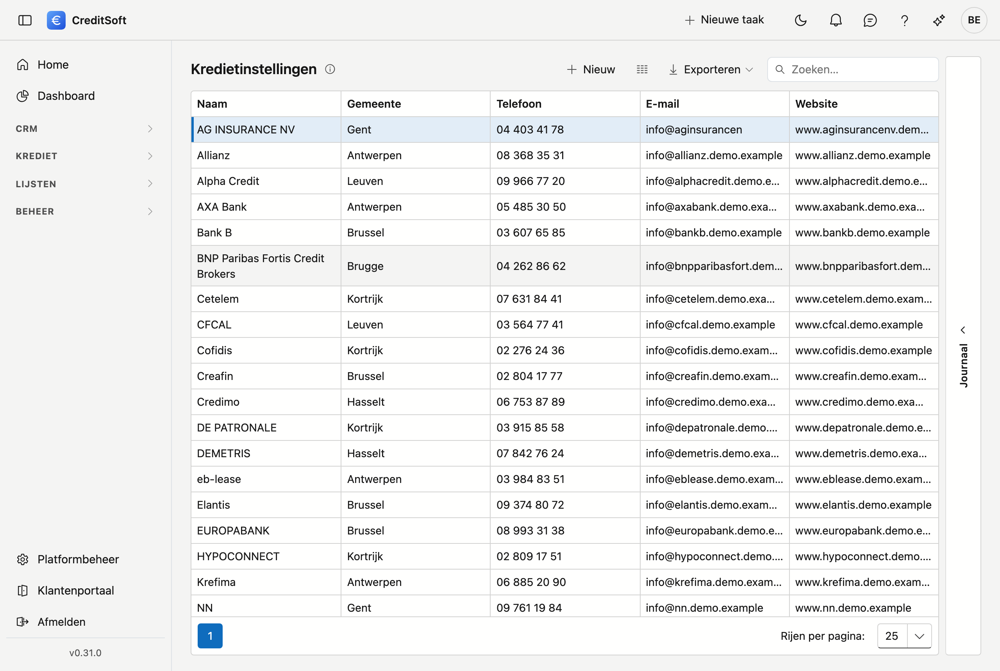

# Kredietinstellingen

De kredietinstellingen zijn de **banken en kredietverstrekkers** waarmee uw kantoor samenwerkt — de geldschieters waar u kredietdossiers bij plaatst. Op dit scherm beheert u hun gegevens en de **standaard commissieregeling** per instelling.

## Het scherm openen

Klik in de zijbalk op **Kredietinstellingen**.

## De lijst

De tabel toont per instelling: **naam**, **gemeente**, **telefoon**, **e-mail** en **website**.

- **Zoeken** — gebruik het zoekveld om in alle kolommen tegelijk te zoeken.
- **Kolommen kiezen** — toon of verberg kolommen; uw keuze wordt onthouden.
- **Exporteren** — exporteer de lijst naar Excel of CSV.
- **Nieuw / bewerken** — klik op **Nieuw**, of **dubbelklik** een rij om de fiche te openen.
- **Verwijderen** — een instelling wordt **gearchiveerd** (soft-delete), niet definitief gewist; ze verdwijnt uit de lijst maar blijft bewaard.

### Journaal

Rechts op het scherm zit de lade **Journaal**. Selecteer een instelling en klap ze open: daar houdt u per
instelling uw **taken, notities, bijlagen en mailverkeer** bij, plus het **logboek** van de wijzigingen. De lade
onthoudt of u ze open of dicht liet staan.

## De fiche van een instelling

**Nieuw** en een dubbelklik openen allebei de **fiche als een volledige pagina**. Bovenaan staat een
terugkeerlink naar de lijst, met daarnaast de naam van de instelling.

{ .volle-breedte }

De fiche bestaat uit drie blokken, met onderaan een knoppenbalk die in beeld blijft.

### Algemene informatie

- **Naam** (verplicht)
- **Adres** — straat, huisnummer, bus, postcode, gemeente, land.
- **Contact** — telefoon, fax, e-mail, website
- **Documenttaal** (verplicht) — de taal waarin u met deze instelling correspondeert (Nederlands of Frans). Ze bepaalt in welke taal de mailsjablonen en documenten voor deze instelling worden opgemaakt.
- **Logo** — laad een afbeelding op; ze verschijnt onder meer op afdrukken.

!!! tip "Postcode en gemeente"
    Typ in het veld **Postcode**: de keuzelijst toont zowel de postcode als de gemeente, dus u kunt op
    beide zoeken — ook op *Gent* of *Liège*. Kiest u een postcode, dan wordt de **gemeente altijd mee
    ingevuld**, ook als er al iets stond. Maakt u de gemeente leeg — met het kruisje, of met **Backspace**
    op de geselecteerde tekst — dan wordt de postcode mee leeggemaakt. Zo blijven de twee velden altijd
    bij elkaar horen.

### Standaard commissionering

Hier legt u de **standaard commissieregeling** vast die voor deze kredietverstrekker geldt. U kiest **maximaal één** van beide types (ze sluiten elkaar uit):

- **Percentage direct** — het percentage dat direct wordt uitgekeerd.
- **Gespreide betaling** — de commissie wordt gespreid over een **aantal maanden**.
- **Geplande betalingen** — u geeft een lijst op (tot 24 regels) met per regel een **maand** en een **percentage** van de totale commissie.

Percentages voert u in van **0 tot 100** met twee decimalen; ze worden getoond met een %-teken (bv. *1,50 %*).

Onder de lijst met geplande betalingen ziet u een **lopend totaal**: *Totaal: 75 % van 100 %*. Zodra u op 100 % staat, kleurt het groen.

!!! warning "Wat CreditSoft controleert bij het opslaan"
    - **Eén type tegelijk** — er kan slechts **0 of 1** type van commissionering gekozen worden. Kiest u zowel *Gespreide betaling* als *Geplande betalingen*, dan wordt het opslaan geweigerd.
    - **Aantal maanden** — vinkt u *Gespreide betaling* aan, dan moet het **aantal maanden** ingevuld zijn.
    - **Samen 100 %** — bij *Geplande betalingen* moeten het **percentage direct** en alle geplande percentages **samen exact 100 %** vormen. De melding toont het huidige totaal, zodat u ziet hoeveel er ontbreekt.

### Opmerkingen

Onderaan staat een breed veld **Opmerkingen** over de volle breedte van de fiche, voor vrije notities over deze
instelling.

## Opslaan

De knoppenbalk onderaan blijft in beeld terwijl u door de fiche scrolt:

- **Opslaan** — bewaart de instelling.
- **Annuleren** — keert terug naar de lijst zonder te bewaren.
- **Verwijderen** — archiveert de instelling (rechts in de balk).

Bij het opslaan worden **ontbrekende verplichte velden** (naam, documenttaal), een **ongeldig e-mailadres** en
een ongeldige commissiekeuze gemeld. Het e-mailadres wordt gecontroleerd zolang er iets in het veld staat, ook
als u het niet zelf hebt gewijzigd.
