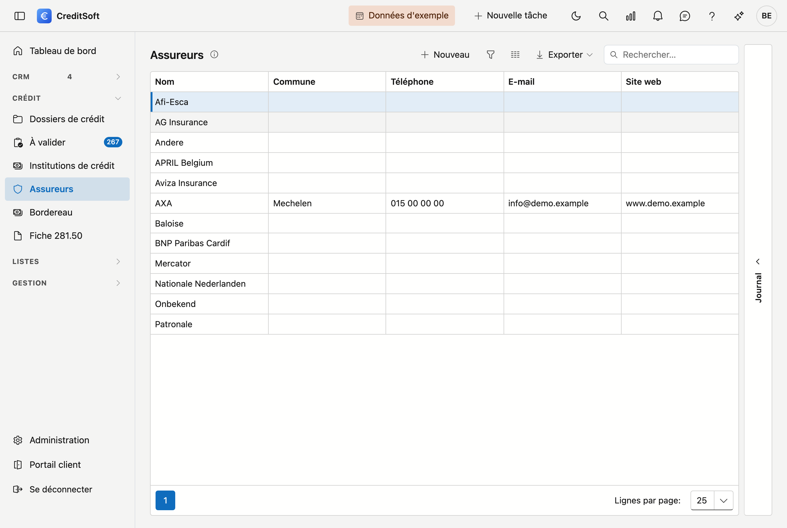

# Assureurs

Les assureurs sont les compagnies pour l'**assurance solde restant dû (ASRD)** liée à un dossier de crédit. CreditSoft en conserve ici les données de base sous forme de **liste de choix** ; vous sélectionnez un assureur sur le dossier.

## Ouvrir l'écran

Dans la barre latérale, cliquez sur **Assureurs**.

## La liste

Le tableau affiche par assureur : **nom**, **commune**, **téléphone**, **e-mail** et **site web**.

- **Rechercher** — utilisez le champ de recherche pour chercher dans toutes les colonnes à la fois.
- **Choisir les colonnes** — affichez ou masquez des colonnes ; votre choix est mémorisé.
- **Exporter** — exportez la liste via Excel ou CSV.
- **Nouveau / modifier** — cliquez sur **Nouveau**, ou **double-cliquez** une ligne pour ouvrir la fiche.
- **Supprimer** — un assureur est **archivé** (suppression douce), pas définitivement effacé ; il disparaît de la liste mais reste conservé.

### Journal

À droite de l'écran se trouve le tiroir **Journal**. Sélectionnez un assureur et ouvrez-le : vous y tenez, par
compagnie, vos **tâches, notes, pièces jointes et courriers**, ainsi que le **journal** des modifications. Le
tiroir retient si vous l'avez laissé ouvert ou fermé.

## La fiche d'un assureur

**Nouveau** et un double-clic ouvrent tous deux la **fiche sur une page entière**. En haut figure un lien de
retour vers la liste, suivi du nom de la compagnie.

{ .volle-breedte }

La fiche se compose de deux blocs, avec en bas une barre de boutons qui reste visible.

### Informations générales

- **Nom** (obligatoire)
- **Adresse** — rue, numéro, boîte, code postal, commune, pays.
- **Contact** — téléphone, e-mail, site web
- **Numéro d'institution** — le numéro sous lequel la compagnie est connue chez vous.
- **Langue des documents** (obligatoire) — la langue dans laquelle vous correspondez avec cette compagnie (néerlandais ou français). Elle détermine la langue des modèles d'e-mail et des documents établis pour cet assureur.
- **Logo** — chargez une image ; elle apparaît notamment sur les impressions.

!!! tip "Code postal et commune"
    Tapez dans le champ **Code postal** : la liste affiche à la fois le code postal et la commune, vous
    pouvez donc chercher sur les deux — également sur *Gent* ou *Liège*. Lorsque vous choisissez un code
    postal, la **commune est toujours complétée**, même si un nom s'y trouvait déjà. Si vous videz la
    commune — avec la croix ou avec **Retour arrière** sur le texte sélectionné — le code postal est vidé
    lui aussi. Les deux champs restent ainsi toujours cohérents.

### Remarques

En bas se trouve un large champ **Remarques**, sur toute la largeur de la fiche, pour vos notes libres sur
cette compagnie.

## Enregistrer

La barre de boutons du bas reste visible pendant que vous faites défiler la fiche :

- **Enregistrer** — sauvegarde l'assureur.
- **Annuler** — retourne à la liste sans sauvegarder.
- **Supprimer** — archive l'assureur (à droite dans la barre).

À l'enregistrement, les **champs obligatoires manquants** (nom, langue des documents) et une **adresse
e-mail invalide** sont signalés. L'adresse e-mail est contrôlée dès qu'il y a quelque chose dans le champ,
même si vous ne l'avez pas modifiée vous-même.
