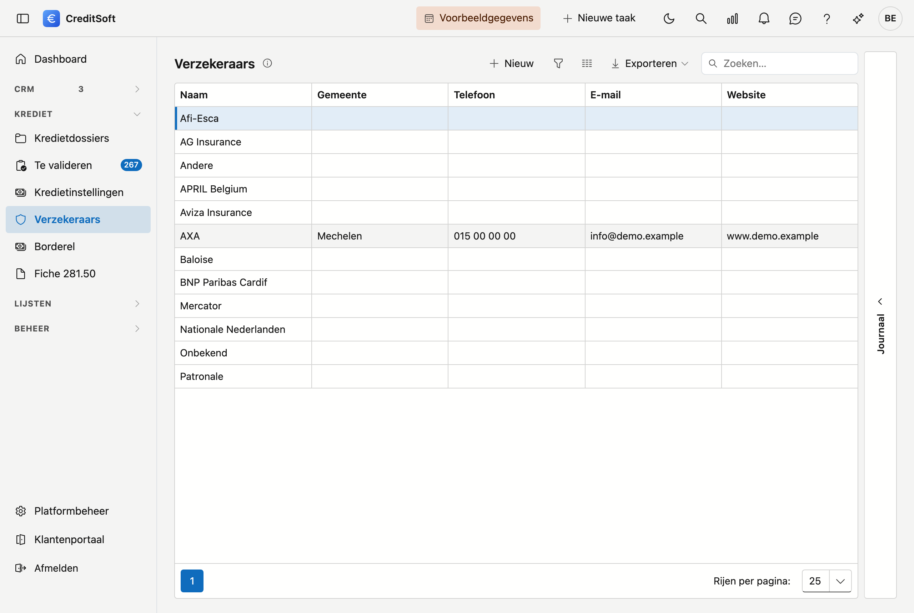

# Verzekeraars

De verzekeraars zijn de maatschappijen voor de **schuldsaldoverzekering (SSV)** bij een kredietdossier. CreditSoft houdt hier hun basisgegevens bij als **keuzelijst**; u kiest een verzekeraar op het dossier.

## Het scherm openen

Klik in de zijbalk op **Verzekeraars**.

## De lijst

De tabel toont per verzekeraar: **naam**, **gemeente**, **telefoon**, **e-mail** en **website**.

- **Zoeken** — gebruik het zoekveld om in alle kolommen tegelijk te zoeken.
- **Kolommen kiezen** — toon of verberg kolommen; uw keuze wordt onthouden.
- **Exporteren** — exporteer de lijst naar Excel of CSV.
- **Nieuw / bewerken** — klik op **Nieuw**, of **dubbelklik** een rij om de fiche te openen.
- **Verwijderen** — een verzekeraar wordt **gearchiveerd** (soft-delete), niet definitief gewist; ze verdwijnt uit de lijst maar blijft bewaard.

### Journaal

Rechts op het scherm zit de lade **Journaal**. Selecteer een verzekeraar en klap ze open: daar houdt u per
maatschappij uw **taken, notities, bijlagen en mailverkeer** bij, plus het **logboek** van de wijzigingen. De
lade onthoudt of u ze open of dicht liet staan.

## De fiche van een verzekeraar

**Nieuw** en een dubbelklik openen allebei de **fiche als een volledige pagina**. Bovenaan staat een
terugkeerlink naar de lijst, met daarnaast de naam van de maatschappij.

{ .volle-breedte }

De fiche bestaat uit twee blokken, met onderaan een knoppenbalk die in beeld blijft.

### Algemene informatie

- **Naam** (verplicht)
- **Adres** — straat, huisnummer, bus, postcode, gemeente, land.
- **Contact** — telefoon, e-mail, website
- **Instellingsnummer** — het nummer waaronder de maatschappij bij u bekendstaat.
- **Documenttaal** (verplicht) — de taal waarin u met deze maatschappij correspondeert (Nederlands of Frans). Ze bepaalt in welke taal de mailsjablonen en documenten voor deze verzekeraar worden opgemaakt.
- **Logo** — laad een afbeelding op; ze verschijnt onder meer op afdrukken.

!!! tip "Postcode en gemeente"
    Typ in het veld **Postcode**: de keuzelijst toont zowel de postcode als de gemeente, dus u kunt op
    beide zoeken — ook op *Gent* of *Liège*. Kiest u een postcode, dan wordt de **gemeente altijd mee
    ingevuld**, ook als er al iets stond. Maakt u de gemeente leeg — met het kruisje, of met **Backspace**
    op de geselecteerde tekst — dan wordt de postcode mee leeggemaakt. Zo blijven de twee velden altijd
    bij elkaar horen.

### Opmerkingen

Onderaan staat een breed veld **Opmerkingen** over de volle breedte van de fiche, voor vrije notities over
deze maatschappij.

## Opslaan

De knoppenbalk onderaan blijft in beeld terwijl u door de fiche scrolt:

- **Opslaan** — bewaart de verzekeraar.
- **Annuleren** — keert terug naar de lijst zonder te bewaren.
- **Verwijderen** — archiveert de verzekeraar (rechts in de balk).

Bij het opslaan worden **ontbrekende verplichte velden** (naam, documenttaal) en een **ongeldig
e-mailadres** gemeld. Het e-mailadres wordt gecontroleerd zolang er iets in het veld staat, ook als u het
niet zelf hebt gewijzigd.
