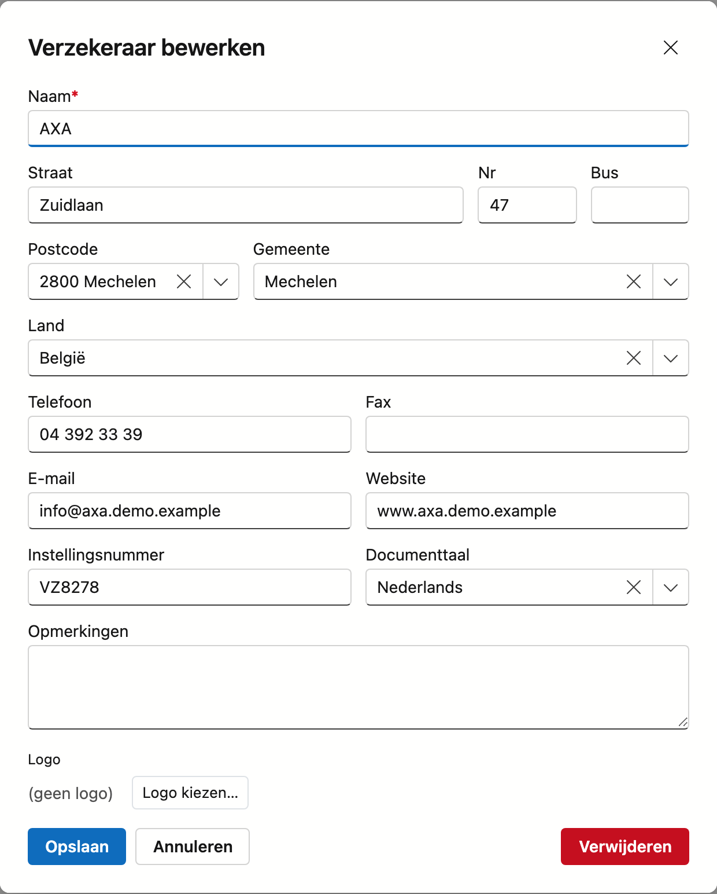

# Verzekeraars

De verzekeraars zijn de maatschappijen voor de **schuldsaldoverzekering (SSV)** bij een kredietdossier. CreditSoft houdt hier hun basisgegevens bij als **keuzelijst**; u kiest een verzekeraar op het dossier.

## Het scherm openen

Klik in de zijbalk op **Verzekeraars**.

## De lijst

De tabel toont per verzekeraar: **naam**, **gemeente**, **telefoon**, **e-mail** en **website**.

- **Zoeken** — gebruik het zoekveld om in alle kolommen tegelijk te zoeken.
- **Kolommen kiezen** — toon of verberg kolommen; uw keuze wordt onthouden.
- **Exporteren** — exporteer de lijst naar Excel of CSV.
- **Nieuw / bewerken** — klik op **Nieuw**, of **dubbelklik** een rij om het bewerkscherm te openen.
- **Verwijderen** — verwijderen doet u in het bewerkscherm; een verzekeraar wordt **gearchiveerd** (soft-delete), niet definitief gewist.

### Journaal

Rechts op het scherm zit de lade **Journaal**. Selecteer een verzekeraar en klap ze open: daar houdt u per
maatschappij uw **taken, notities, bijlagen en mailverkeer** bij, plus het **logboek** van de wijzigingen.

## Een verzekeraar toevoegen of bewerken

Het formulier bevat de kerngegevens:

- **Naam** (verplicht)
- **Adres** — straat, huisnummer, bus, postcode, gemeente, land. Tik een **postcode** in het zoekveld en de **gemeente** wordt automatisch ingevuld; land kiest u uit de lijst.
- **Contact** — telefoon, fax, e-mail, website
- **Instellingsnummer**
- **Documenttaal** — de taal waarin u met deze maatschappij correspondeert (Nederlands of Frans). Ze bepaalt in welke taal de mailsjablonen en documenten voor deze verzekeraar worden opgemaakt.
- **Opmerkingen**
- **Logo** — laad een afbeelding op; ze verschijnt onder meer op afdrukken

Klik op **Opslaan** om te bewaren. Een ingevuld **e-mailadres** wordt bij het opslaan op geldigheid gecontroleerd.
