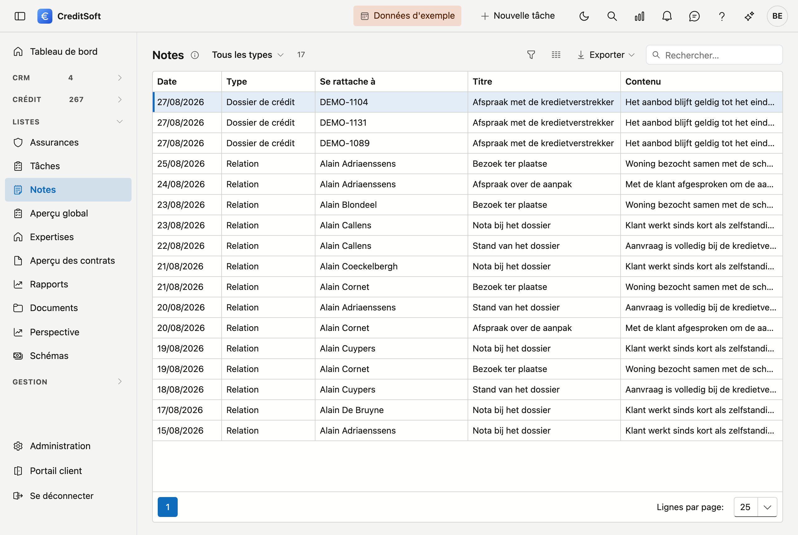

# Notes

Cet écran rassemble **toutes les notes** de votre bureau : sur une relation, un dossier de crédit, un apporteur, une institution — et les notes générales qui ne se rattachent à rien. C'est l'endroit pour retrouver quelque chose dont vous ne savez plus chez quel client c'était noté.

{ .volle-breedte }

## Ouvrir l'écran

Dans la barre latérale, cliquez sur **Listes**, puis sur **Notes**. Vous voyez l'écran si vous pouvez consulter les notes.

## Rechercher

Tapez dans la barre de recherche un mot du **titre ou du contenu** — un nom de banque, un montant, un nom. Le contenu est réduit à une ligne ; survolez-le pour le texte complet. Le filtre **Type** limite la liste aux notes d'un seul type de fiche, par exemple uniquement les dossiers de crédit. Voir aussi [Filtrer et rechercher dans les listes](filteren-in-lijsten.md).

Pour une recherche rapide depuis un autre écran, utilisez la [loupe en haut](../getting-started/zoeken.md) (Ctrl + K) : elle cherche aussi dans les notes, les tâches et les remarques d'un dossier.

## Les colonnes

| Colonne | Ce qu'elle affiche |
|---|---|
| **Date** | Quand la note a été prise |
| **Type** | Sur quel type de fiche elle figure — ou *Général* si elle ne se rattache à rien |
| **Se rattache à** | Le nom du client, le numéro de dossier, l'apporteur ou l'institution |
| **Titre** et **Contenu** | La note elle-même |

## Ouvrir une note

Double-cliquez une ligne pour ouvrir la fiche qui porte la note. C'est là, dans l'onglet [Notes](../journaal/notities.md) du journal, que vous les créez, modifiez et supprimez. Cet aperçu les affiche uniquement.
