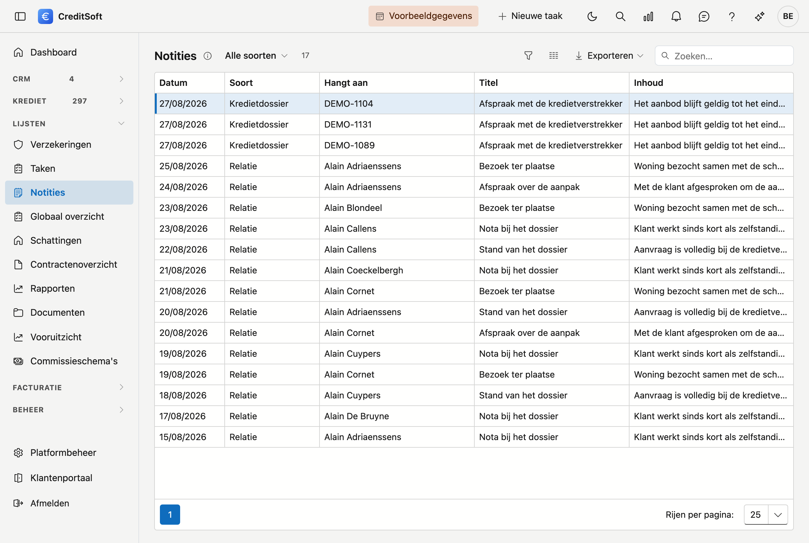

# Notities

Op dit scherm staan **alle notities** van uw kantoor samen: op een relatie, een kredietdossier, een aanbrenger, een instelling — en de algemene notities die aan niets hangen. Het is de plek om iets terug te vinden waarvan u niet meer weet bij welke klant het stond.

{ .volle-breedte }

## Het scherm openen

Klik in de zijbalk op **Lijsten** en dan op **Notities**. U ziet het scherm als u notities mag bekijken.

## Zoeken

Typ in de zoekbalk een woord uit de **titel of de inhoud** — een banknaam, een bedrag, een naam. De inhoud staat ingekort op één regel; wijs ze aan voor de volledige tekst. Met de filter **Soort** beperkt u de lijst tot de notities op één soort fiche, bijvoorbeeld enkel op kredietdossiers. Zie ook [Filteren en zoeken in lijsten](filteren-in-lijsten.md).

Zoekt u snel vanaf een ander scherm, gebruik dan het [vergrootglas bovenaan](../getting-started/zoeken.md) (Ctrl + K): dat zoekt ook in notities, in taken en in de opmerkingen op een dossier.

## De kolommen

| Kolom | Wat het toont |
|---|---|
| **Datum** | Wanneer de notitie genoteerd werd |
| **Soort** | Op welke soort fiche ze staat — of *Algemeen* als ze aan niets hangt |
| **Hangt aan** | De naam van de klant, het dossiernummer, de aanbrenger of de instelling |
| **Titel** en **Inhoud** | De notitie zelf |

## Een notitie openen

Dubbelklik een regel om de fiche te openen waar de notitie op staat. Daar, onder **Journaal › [Notities](../journaal/notities.md)**, maakt, wijzigt en verwijdert u ze. Dit overzicht toont ze enkel.
