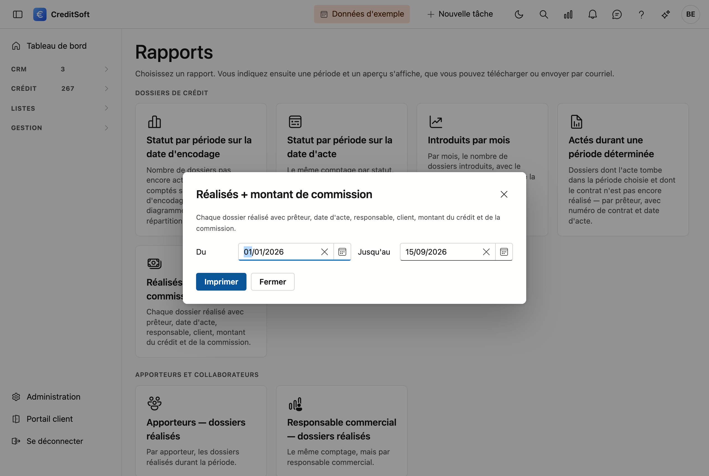

# Rapports

Neuf rapports fixes sur vos dossiers de crédit : combien de dossiers par statut, ce qui a été réalisé, par prêteur, par apporteur ou par responsable commercial. Vous choisissez un rapport, indiquez une période, et obtenez un pdf que vous pouvez **télécharger** ou **envoyer directement par courriel**.

## Ouvrir l'écran

Dans la barre latérale, cliquez sur **Listes**, puis sur **Rapports**.

{ .volle-breedte }

Chaque rapport est une tuile. Les tuiles sont réparties en trois groupes — **Dossiers de crédit**, **Apporteurs et collaborateurs** et **Prêteurs** — pour que vous lisiez ce qui existe au lieu de devoir le chercher.

## Créer un rapport

Cliquez sur la tuile du rapport souhaité. Une fenêtre s'ouvre avec deux champs : **Du** et **Jusqu'au**.

{ .volle-breedte }

La période va par défaut du **1er janvier de cette année à aujourd'hui**. Les deux dates comptent : si vous choisissez le 31 décembre comme date de fin, les dossiers du 31 décembre en font partie. Tapez la date sans barres obliques — `15082026` suffit, le champ avance tout seul.

Cliquez sur **Imprimer**. Le rapport s'affiche dans une fenêtre d'aperçu avec deux possibilités :

- **Envoyer par courriel** — une fenêtre de courriel s'ouvre avec le pdf déjà en pièce jointe. Vous complétez vous-même les destinataires.
- **Télécharger** — vous enregistrez le pdf sur votre ordinateur. Le fichier porte le nom du rapport dans votre propre langue.

{ .volle-breedte }

En haut de chaque rapport figurent le nom et les coordonnées de votre **fiche d'entreprise**, avec votre logo si vous en avez téléversé un. En bas de chaque page figurent la date de création et la pagination. Vous pouvez donc transmettre un rapport tel quel à un prêteur ou à un collègue.

## Les neuf rapports

### Dossiers de crédit

| Rapport | Ce que vous obtenez |
|---|---|
| **Statut par période sur la date d'encodage** | Par statut, le nombre de dossiers **encodés** durant la période et **sans acte** à ce jour, avec leur montant de crédit et de commission. Votre travail en cours, avec un diagramme circulaire de la répartition. |
| **Statut par période sur la date d'acte** | Le même comptage par statut, mais sur les dossiers dont l'**acte** tombe dans la période. |
| **Introduits par mois** | Par mois, le nombre de dossiers introduits, avec le montant total du crédit et de la commission. |
| **Actés durant une période déterminée** | Votre liste de travail après l'acte : les dossiers dont l'acte tombe dans la période et dont le contrat n'est **pas encore réalisé**, groupés par prêteur, avec numéro de contrat et date d'acte. |
| **Réalisés + montant de commission** | Chaque dossier réalisé sur une ligne : prêteur, date d'acte, responsable commercial, client, montant du crédit et de la commission. |

### Apporteurs et collaborateurs

| Rapport | Ce que vous obtenez |
|---|---|
| **Apporteurs — dossiers réalisés** | Par apporteur, les dossiers réalisés durant la période, avec un sous-total par apporteur. |
| **Responsable commercial — dossiers réalisés** | La même liste, mais groupée par responsable commercial. |

### Prêteurs

| Rapport | Ce que vous obtenez |
|---|---|
| **Prêteur — dossiers réalisés** | Par prêteur, les dossiers réalisés, avec un sous-total par prêteur. |
| **Prêteur — quotité moyenne** | La quotité moyenne par prêteur, avec le **nombre de dossiers** sur lequel porte cette moyenne. En bas, la moyenne pondérée sur l'ensemble. |

## Ce qu'il faut savoir sur les chiffres

!!! info "Tout tourne autour de la date d'acte"
    À deux rapports près, tous les rapports regardent la **date d'acte** du dossier pour déterminer s'il tombe dans votre période. *Introduits par mois* utilise la date d'introduction, et *Statut par période sur la date d'encodage* la date d'encodage.

!!! warning "Cinq rapports dépendent de vos réglages de statut"
    Les rapports sur les dossiers **réalisés** et **actés** doivent savoir quel statut de contrat signifie « réalisé » ou « introduit » dans votre bureau. Vous établissez ce lien sous **Administration → Phases du tableau de bord**, en bas, sous *Tuiles KPI*. Tant que ce n'est pas configuré, l'écran vous le dit avant d'imprimer — vous n'obtenez pas une page blanche sans explication.

!!! tip "Un dossier peut donner plusieurs lignes"
    Si un dossier porte plus d'un contrat, il figure plusieurs fois dans les rapports détaillés : chaque ligne est un contrat, avec son propre montant. Le **montant de commission** appartient au dossier et ne figure donc qu'une seule fois, sur sa première ligne. Les totaux en bas comptent chaque dossier une seule fois.

## Ouvrir un rapport directement

Chaque rapport a sa propre adresse. Si vous placez dans vos favoris un rapport que vous utilisez souvent, la fenêtre s'ouvre directement sur ce rapport — sans passer par la bibliothèque.
