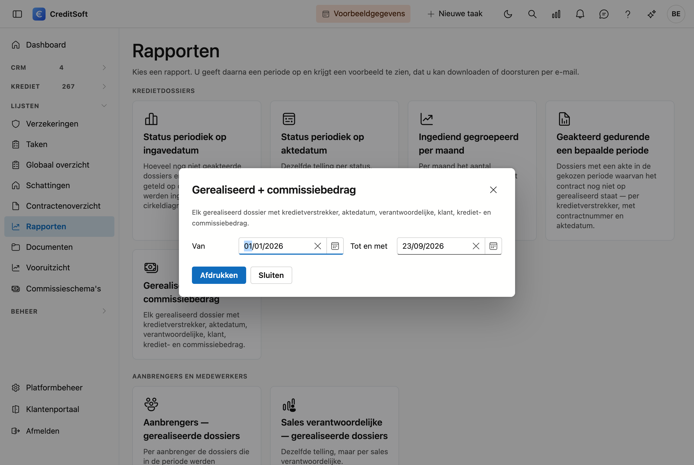

# Rapporten

Negen vaste rapporten over uw kredietdossiers: hoeveel er per status staan, wat er gerealiseerd werd, per kredietverstrekker, per aanbrenger of per sales verantwoordelijke. U kiest een rapport, geeft een periode op, en krijgt een pdf die u kan **downloaden** of meteen **doorsturen per e-mail**.

## Het scherm openen

Klik in de zijbalk op **Lijsten** en dan op **Rapporten**.

{ .volle-breedte }

Elk rapport is een tegel. De tegels staan in drie groepen — **Kredietdossiers**, **Aanbrengers en medewerkers** en **Kredietverstrekkers** — zodat u leest wat er bestaat in plaats van het te moeten zoeken.

## Een rapport maken

Klik op de tegel van het rapport dat u wil. Er opent een venster met twee velden: **Van** en **Tot en met**.

{ .volle-breedte }

De periode staat standaard op **1 januari van dit jaar tot vandaag**. Beide datums tellen mee: kiest u 31 december als einddatum, dan zitten de dossiers van 31 december erin. Typ de datum zonder schuine strepen — `15082026` volstaat, het veld springt zelf door.

Klik op **Afdrukken**. Het rapport verschijnt in een voorbeeldvenster met twee mogelijkheden:

- **Doorsturen per mail** — er opent een mailvenster met de pdf al als bijlage. U vult zelf de ontvangers aan.
- **Downloaden** — u bewaart de pdf op uw computer. Het bestand krijgt de naam van het rapport in uw eigen taal.

{ .volle-breedte }

Bovenaan elk rapport staan de naam en de gegevens uit uw **bedrijfsfiche**, met uw logo als u er een opgeladen hebt. Onderaan elke bladzijde staan de aanmaakdatum en de paginanummering. Zo kan u een rapport zonder meer doorsturen naar een kredietverstrekker of een kantoorgenoot.

## De negen rapporten

### Kredietdossiers

| Rapport | Wat u krijgt |
|---|---|
| **Status periodiek op ingavedatum** | Per status hoeveel dossiers er in de periode werden **ingegeven** en **nog geen akte** hebben, met hun krediet- en commissiebedrag. Uw openstaande werk, met een cirkeldiagram van de verdeling. |
| **Status periodiek op aktedatum** | Dezelfde telling per status, maar over de dossiers waarvan de **akte** in de periode viel. |
| **Ingediend gegroepeerd per maand** | Per maand het aantal ingediende dossiers, met het totale krediet- en commissiebedrag. |
| **Geakteerd gedurende een bepaalde periode** | Uw werklijst na de akte: dossiers met een akte in de periode waarvan het contract **nog niet op gerealiseerd** staat, gegroepeerd per kredietverstrekker, met contractnummer en aktedatum. |
| **Gerealiseerd + commissiebedrag** | Elk gerealiseerd dossier op één regel: kredietverstrekker, aktedatum, sales verantwoordelijke, klant, kredietbedrag en commissiebedrag. |

### Aanbrengers en medewerkers

| Rapport | Wat u krijgt |
|---|---|
| **Aanbrengers — gerealiseerde dossiers** | Per aanbrenger de dossiers die in de periode werden gerealiseerd, met een subtotaal per aanbrenger. |
| **Sales verantwoordelijke — gerealiseerde dossiers** | Dezelfde lijst, maar gegroepeerd per sales verantwoordelijke. |

### Kredietverstrekkers

| Rapport | Wat u krijgt |
|---|---|
| **Kredietverstrekker — gerealiseerde dossiers** | Per kredietverstrekker de gerealiseerde dossiers, met een subtotaal per verstrekker. |
| **Kredietverstrekker — gemiddelde quotiteit** | De gemiddelde quotiteit per kredietverstrekker, met erbij over **hoeveel dossiers** dat gemiddelde loopt. Onderaan het gewogen gemiddelde over alles samen. |

## Wat u moet weten over de cijfers

!!! info "Alles draait rond de aktedatum"
    Op twee rapporten na kijken alle rapporten naar de **aktedatum** van het dossier om te bepalen of het in uw periode valt. *Ingediend gegroepeerd per maand* gebruikt de indieningsdatum, en *Status periodiek op ingavedatum* de datum van ingave.

!!! warning "Vijf rapporten hangen af van uw statusinstellingen"
    De rapporten over **gerealiseerde** en **geakteerde** dossiers moeten weten welke contractstatus bij uw kantoor "gerealiseerd" of "ingediend" betekent. Die koppeling legt u onder **Platformbeheer → Dashboard-fases**, onderaan bij *KPI-tegels*. Zolang dat niet ingevuld is, zegt het scherm dat vóór het afdrukt — u krijgt geen leeg blad zonder uitleg.

!!! tip "Eén dossier kan meerdere regels geven"
    Draagt een dossier meer dan één contract, dan staat het in de detailrapporten meer dan één keer: elke regel is een contract, met zijn eigen bedrag. Het **commissiebedrag** hoort bij het dossier en staat daarom maar één keer, op de eerste regel ervan. De totalen onderaan tellen elk dossier één keer.

## Een rapport rechtstreeks openen

Elk rapport heeft een eigen adres. Zet u een rapport dat u vaak gebruikt bij uw favorieten, dan opent het venster meteen op dat rapport — u hoeft niet eerst langs de bibliotheek.
