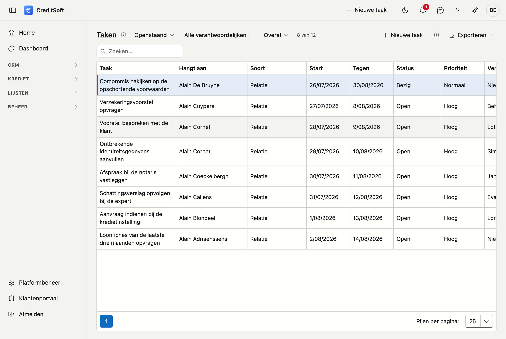

# Taken

Op dit scherm staan al uw taken samen, **over alle modules heen**: taken op een kredietdossier, op een relatiefiche, bij een aanbrenger of bij een instelling — én de losse taken die aan niets hangen.

## Het scherm openen

Klik in de zijbalk op **Lijsten** en dan op **Taken**.

## Een taak aanmaken

Er zijn twee wegen, en het verschil zit hem in waar de taak nadien te vinden is.

- **Los, zonder fiche** — klik rechtsboven in de balk op **Nieuwe taak**, of op dezelfde knop op dit scherm.
  Handig wanneer u aan de telefoon zit en iets niet wil vergeten. Zo'n taak hangt aan niets en staat
  **alleen hier**.
- **Bij een dossier of een klant** — open het [journaal](../journaal/taken.md) van een kredietdossier, een
  relatie, een aanbrenger of een instelling en voeg de taak daar toe. Ze staat dan bij die fiche **én** in dit
  overzicht.

Twijfelt u? Kies de tweede. Een taak die bij een dossier hoort maar er niet aan hangt, vindt uw collega niet
terug wanneer hij dat dossier opent.

## Wat u standaard ziet

De lijst opent op de **openstaande** taken. Dat is bewust: dat is wat er nog moet gebeuren. Zet de eerste keuzelijst op *Afgehandeld* om de afgewerkte en geannuleerde te zien, of op *Alle statussen* voor het geheel.

Daarnaast filtert u op **verantwoordelijke** en op **soort** — enkel de taken op dossiers bijvoorbeeld.

## De kolommen

| Kolom | Wat het toont |
|---|---|
| **Taak** | De titel. Staat er *(zonder titel)*, dan draagt de taak geen naam |
| **Hangt aan** | Het dossier, de relatie of de aanbrenger waar de taak bij hoort |
| **Soort** | Welk type dat is — of *Losse taak* wanneer er geen master is |
| **Start** en **Tegen** | Wanneer de taak begint en wanneer ze klaar moet zijn |
| **Status** en **Prioriteit** | Openstaand, bezig, afgewerkt of geannuleerd |
| **Verantwoordelijke** | Wie ze moet doen |

## Uw achterstand: het belletje

Het **belletje** rechtsboven telt de taken die **aan u** zijn toegewezen en waarvan de vervaldatum voorbij is.
Enkel die van u — het is een teller van uw eigen achterstand, niet van die van het kantoor. Klik erop om te
zien welke het zijn.

Een taak verdwijnt uit die teller door ze **af te werken of te verzetten**. Zie
[Navigeren in CreditSoft](../getting-started/navigatie.md#het-belletje-uw-achterstallige-taken).

## Werken met de lijst

- **Openen waar de taak aan hangt** — dubbelklik op de rij. Bij een losse taak gebeurt er niets, want er is geen scherm om naartoe te gaan.
- **Zoeken** — het zoekveld rechtsboven zoekt in alles wat u ziet.
- **Exporteren** — naar Excel of CSV, met de filters die op dat moment aan staan.

!!! note "Losse taken"
    Een taak hoeft niet aan een dossier of een klant te hangen. Zo'n **losse taak** is een gewoon pense-bête, en dit scherm is de enige plaats waar u ze terugvindt — op een fiche staat ze immers nergens.
