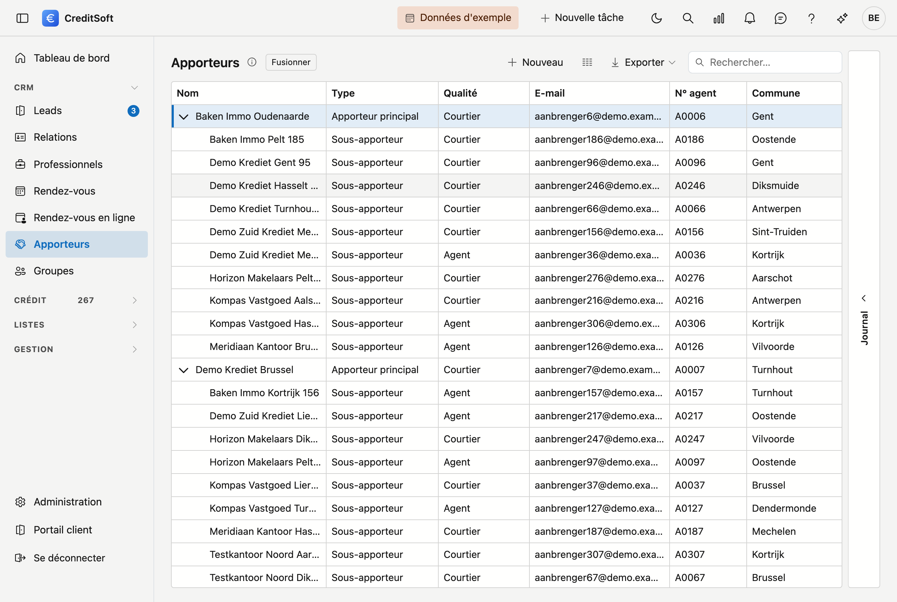
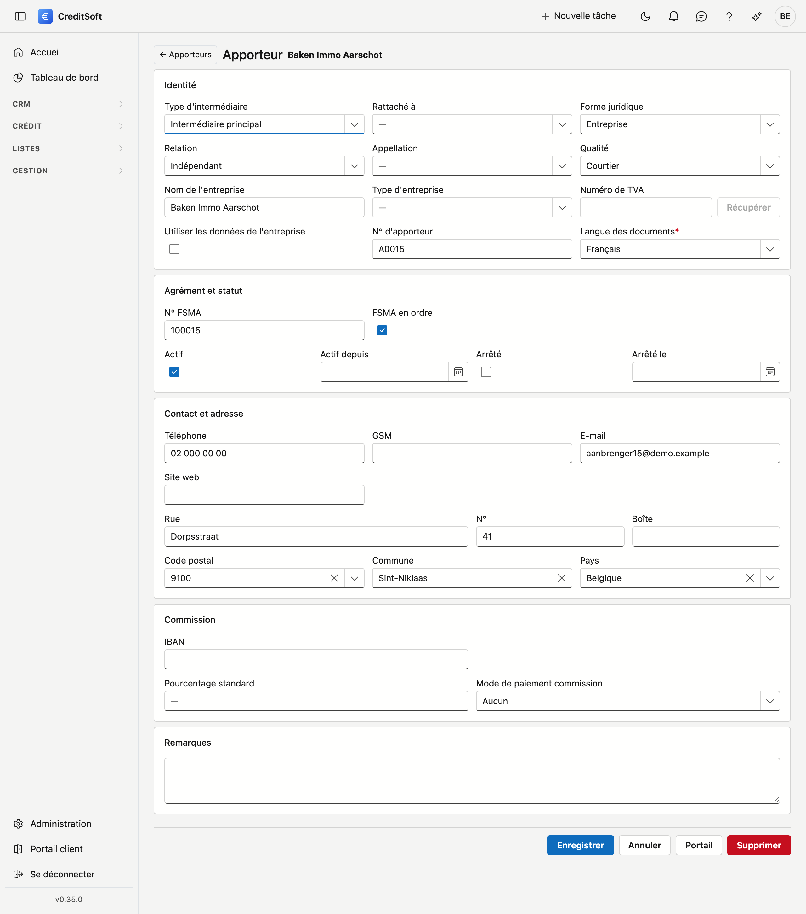

# Apporteurs

Vos intermédiaires figurent dans une **arborescence** : un apporteur principal, en dessous ses bureaux, et en dessous les collaborateurs individuels. Vous voyez ainsi immédiatement qui relève de qui.

## Ouvrir l'écran

Dans la barre latérale, cliquez sur **CRM**, puis sur **Apporteurs**.

## La liste

Le tableau affiche par apporteur : **nom**, **type**, **qualité**, **e-mail**, **numéro d'agent**, **commune**, **GSM** et **actif**.

- **Déplier et replier** — cliquez sur le triangle devant une ligne pour afficher ou masquer un niveau.
- **Rechercher** — le champ de recherche cherche dans toutes les colonnes à la fois.
- **Choisir les colonnes** — affichez ou masquez des colonnes ; les largeurs que vous réglez sont également conservées pour la prochaine fois.
- **Exporter** — vers Excel ou CSV.
- **Fusionner** — si deux fiches existent pour le même intermédiaire, vous les fusionnez ; voir ci-dessous.
- **Nouveau / modifier** — cliquez sur **Nouveau**, ou **double-cliquez** une ligne pour ouvrir la fiche.

### Journal

À droite de l'écran se trouve le tiroir **Journal** : par apporteur, vos **tâches, notes, pièces jointes et courriers**, ainsi que le **journal** des modifications.

## La fiche d'un apporteur

**Nouveau** et un double-clic ouvrent tous deux la **fiche sur une page entière**, avec quatre blocs et, en bas, une barre de boutons qui reste visible.

{ .volle-breedte }

### Identité

Qui est cet intermédiaire et quel rôle il joue : **type d'intermédiaire** (principal, bureau ou sous-agent), **rattaché à** — l'apporteur sous lequel il se trouve dans l'arborescence —, **forme juridique**, **relation**, **formule d'appel**, **qualité**, le nom ou la **raison sociale** avec le **type d'entreprise**, le **numéro de TVA**, le **numéro d'agent** et la **langue des documents** (obligatoire).

!!! tip "Récupérer automatiquement les données d'entreprise"
    Saisissez le **numéro de TVA** et cliquez sur **Récupérer** : CreditSoft reprend le nom, la forme juridique
    et l'adresse directement depuis la Banque-Carrefour des Entreprises.

### Agrément et statut

Cet intermédiaire peut-il exercer, et la collaboration est-elle toujours en cours ? Le **numéro FSMA** avec une case indiquant si l'inscription est en ordre, et s'il est **actif** — avec la date depuis laquelle — ou **arrêté**, avec la date correspondante.

### Contact et adresse

Téléphone, GSM, e-mail, site web et l'adresse.

!!! tip "Code postal et commune"
    Dans le champ **Code postal**, tapez un code postal ou un nom de commune ; la commune se complète. Si vous
    videz la commune — avec la croix ou avec **Retour arrière** — le code postal est vidé lui aussi.

### Commission

L'**IBAN** sur lequel sa commission est versée, le **pourcentage standard** et le **mode de paiement**.

## Fusionner deux fiches

Si le même intermédiaire figure deux fois dans la liste, fusionnez les fiches avec le bouton **Fusionner** en
haut. Sélectionnez d'abord la fiche que vous voulez **conserver**, cliquez sur le bouton, puis choisissez dans
la fenêtre celle qui doit y être absorbée.

Avant que vous confirmiez, CreditSoft montre **ce que porte la fiche appelée à disparaître** : ses dossiers,
commissions, tâches, notes, pièces jointes et courriers. Tout cela est repris par la fiche conservée. Les
bureaux et collaborateurs situés en dessous dans l'arborescence, les comptes bancaires, les paiements
planifiés et les documents demandés suivent également.

!!! warning "La fiche conservée garde ses propres champs"
    Nom, adresse, e-mail, accord de commission : ils restent tels quels sur la fiche **conservée**. Si vous
    voulez garder quelque chose de l'autre fiche — une adresse plus récente, par exemple — reprenez-la
    **d'abord**. Après la fusion, elle est perdue.

    Une fusion ne peut pas être annulée.

Ensuite, la fenêtre indique précisément ce qui a été déplacé, par catégorie. Si cette liste est vide, c'est
que rien n'était rattaché à la fiche disparue.

## Donner accès au portail

Avec le bouton **Portail** en bas à droite, vous donnez à un apporteur son propre accès. Il y voit :

- **Mes dossiers** — les dossiers qu'il a apportés, avec leur statut.
- **Mes commissions** — ce qui est comptabilisé pour lui.

Vous déterminez par apporteur s'il voit l'onglet des commissions et celui des documents. Vous pouvez ainsi ouvrir le portail sans montrer d'emblée tous les chiffres.

!!! warning "Ce que CreditSoft contrôle avant d'accorder l'accès"
    L'**adresse e-mail est le nom d'utilisateur** du portail. Par conséquent :

    - sans adresse e-mail sur la fiche, vous ne pouvez pas accorder l'accès ;
    - l'adresse doit avoir une forme valide ;
    - **deux apporteurs ne peuvent pas porter la même adresse** — si un autre apporteur la porte déjà,
      CreditSoft indique lequel et refuse d'accorder l'accès.

!!! warning "Un apporteur ne voit que ses propres données"
    Le portail est cloisonné par apporteur. Un bureau voit les dossiers de ses propres collaborateurs, mais jamais ceux d'un autre bureau.

## Enregistrer

La barre de boutons du bas reste visible. Les boutons se trouvent à droite : **Enregistrer**, **Annuler**, **Portail** et **Supprimer**.

À l'enregistrement, les **champs obligatoires manquants** (nom, langue des documents) et une **adresse e-mail invalide** sont signalés. Les **numéros de téléphone sont mis en forme** dans la notation officielle : si vous tapez `09/3724829`, vous lirez `09 372 48 29` après l'enregistrement.
