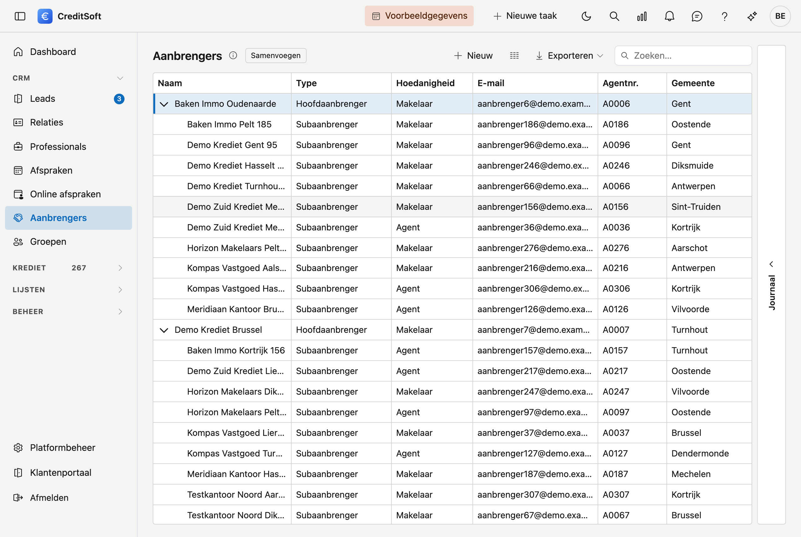
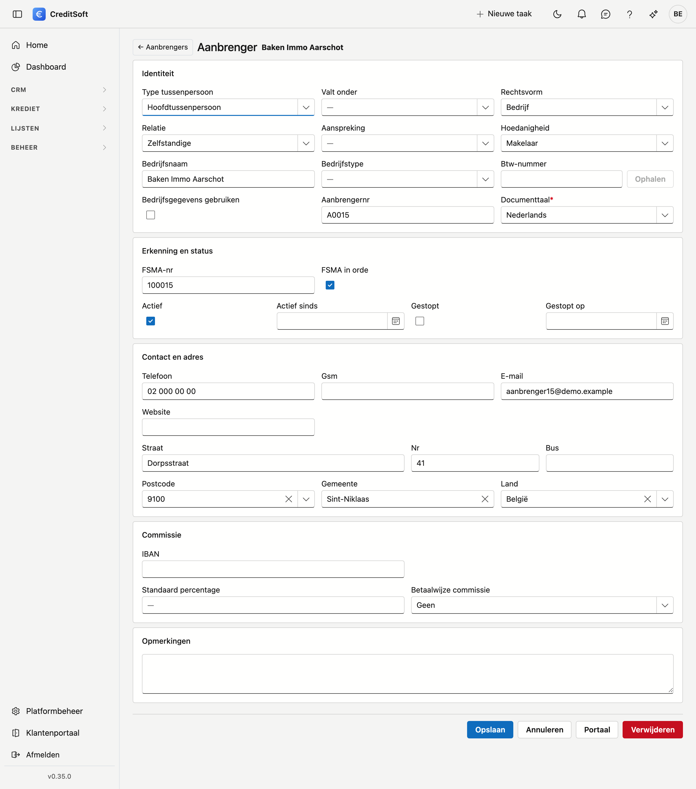

# Aanbrengers

Uw tussenpersonen staan in een **boom**: een hoofdaanbrenger, daaronder zijn kantoren, en daaronder de individuele medewerkers. Zo ziet u meteen wie bij wie hoort.

## Het scherm openen

Klik in de zijbalk op **CRM** en dan op **Aanbrengers**.

## De lijst

De tabel toont per aanbrenger: **naam**, **type**, **hoedanigheid**, **e-mail**, **agentnummer**, **gemeente**, **gsm** en **actief**.

- **Open- en dichtklappen** — klik op het driehoekje voor een rij om een niveau te tonen of te verbergen.
- **Zoeken** — het zoekveld zoekt in alle kolommen tegelijk.
- **Kolommen kiezen** — toon of verberg kolommen; ook de breedtes die u instelt, blijven bewaard voor de volgende keer.
- **Exporteren** — naar Excel of CSV.
- **Samenvoegen** — staan er twee fiches voor dezelfde tussenpersoon, dan voegt u ze samen: de gekozen rij blijft, de andere gaat erin op.
- **Nieuw / bewerken** — klik op **Nieuw**, of **dubbelklik** een rij om de fiche te openen.

### Journaal

Rechts op het scherm zit de lade **Journaal**: per aanbrenger uw **taken, notities, bijlagen en mailverkeer**, plus het **logboek** van de wijzigingen.

## De fiche van een aanbrenger

**Nieuw** en een dubbelklik openen allebei de **fiche als een volledige pagina**, met vier blokken en onderaan een knoppenbalk die in beeld blijft.

{ .volle-breedte }

### Identiteit

Wie deze tussenpersoon is en welke rol hij speelt: **type tussenpersoon** (hoofd, kantoor of sub), **valt onder** — de aanbrenger waaronder hij hangt in de boom —, **rechtsvorm**, **relatie**, **aanspreking**, **hoedanigheid**, de naam of **bedrijfsnaam** met het **bedrijfstype**, het **btw-nummer**, het **aanbrengernummer** en de **documenttaal** (verplicht).

!!! tip "Bedrijfsgegevens automatisch ophalen"
    Vul het **btw-nummer** in en klik op **Ophalen**: CreditSoft haalt naam, rechtsvorm en adres rechtstreeks
    uit de Kruispuntbank van Ondernemingen.

### Erkenning en status

Mag deze tussenpersoon bemiddelen, en loopt de samenwerking nog? Het **FSMA-nummer** met een vinkje of de inschrijving in orde is, en of hij **actief** is — met de datum vanaf wanneer, of **gestopt** met de datum sinds wanneer.

### Contact en adres

Telefoon, gsm, e-mail, website en het adres.

!!! tip "Postcode en gemeente"
    Typ in het veld **Postcode** een postcode of een gemeentenaam; de gemeente wordt mee ingevuld. Maakt u de
    gemeente leeg — met het kruisje of met **Backspace** — dan wordt de postcode mee leeggemaakt.

### Commissie

De **IBAN** waarop zijn commissie betaald wordt, het **standaard percentage** en de **betaalwijze**.

## Twee fiches samenvoegen

Staat dezelfde tussenpersoon twee keer in de lijst, dan voegt u de fiches samen met de knop **Samenvoegen**
bovenaan. Selecteer eerst de fiche die u wil **behouden**, klik dan op de knop en kies in het venster welke
fiche daarin moet opgaan.

Voor u bevestigt, toont CreditSoft **wat de verdwijnende fiche draagt**: haar dossiers, commissies, taken,
notities, bijlagen en mailverkeer. Alles daarvan verhuist mee naar de fiche die u behoudt. Ook de
onderliggende kantoren en medewerkers uit de boom, de bankrekeningen, de geplande betalingen en de gevraagde
documenten gaan mee.

!!! warning "De behouden fiche houdt haar eigen velden"
    Naam, adres, e-mail, commissie-afspraak: die blijven zoals ze op de **behouden** fiche staan. Wil u iets
    van de andere fiche bewaren — bijvoorbeeld een recenter adres — neem dat dan **eerst** over. Na het
    samenvoegen is het weg.

    Samenvoegen kan niet ongedaan gemaakt worden.

Na afloop toont het venster hoeveel er precies verhuisd is, per soort. Staat er niets in die lijst, dan hing
er aan de verdwenen fiche ook niets vast.

## Toegang tot het portaal geven

Met de knop **Portaal** rechtsonder geeft u een aanbrenger een eigen login. Hij ziet daarmee:

- **Mijn dossiers** — de dossiers die hij heeft aangebracht, met hun status.
- **Mijn commissies** — wat er voor hem geboekt staat.

Per aanbrenger bepaalt u of hij het commissie-tabblad en het documenten-tabblad te zien krijgt. Zo kunt u het portaal openstellen zonder meteen alle cijfers te tonen.

!!! warning "Wat CreditSoft controleert vóór het verlenen"
    Het **e-mailadres is de gebruikersnaam** van het portaal. Daarom:

    - zonder e-mailadres op de fiche kunt u geen toegang verlenen;
    - het adres moet een geldige vorm hebben;
    - **twee aanbrengers kunnen niet hetzelfde adres dragen** — draagt een andere aanbrenger het al, dan
      toont CreditSoft welke en weigert het verlenen.

!!! warning "Een aanbrenger ziet enkel zijn eigen gegevens"
    Het portaal is afgeschermd per aanbrenger. Een kantoor ziet de dossiers van zijn eigen medewerkers, maar nooit die van een ander kantoor.

## Opslaan

De knoppenbalk onderaan blijft in beeld. De knoppen staan rechts: **Opslaan**, **Annuleren**, **Portaal** en **Verwijderen**.

Bij het opslaan worden **ontbrekende verplichte velden** (naam, documenttaal) en een **ongeldig e-mailadres** gemeld. **Telefoonnummers worden opgemaakt** in de officiële notatie: typt u `09/3724829`, dan staat er na het bewaren `09 372 48 29`.
