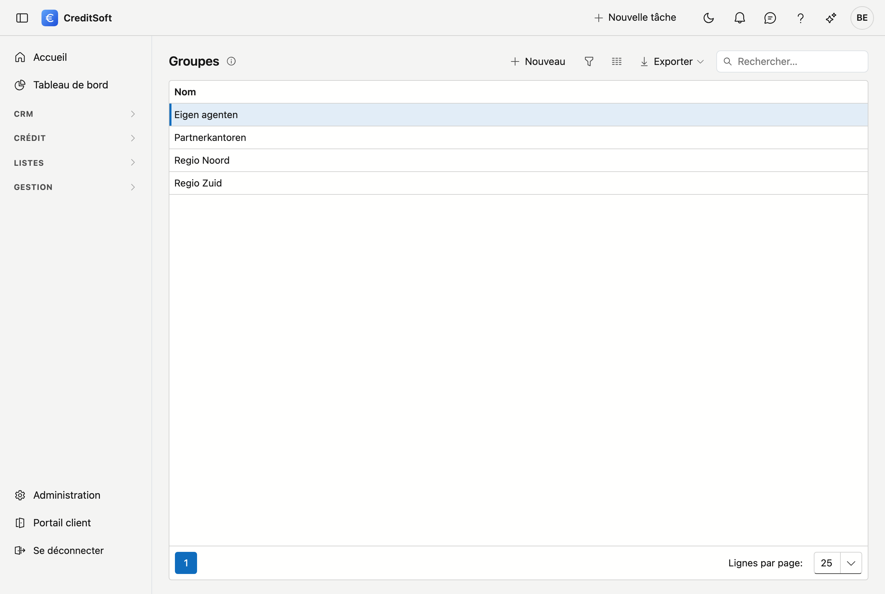

# Groupes

Les groupes sont un **classement libre de vos apporteurs** — par région, par type de collaboration, par bureau : c'est vous qui déterminez quels groupes existent et comment ils s'appellent. Cet écran sert à entretenir cette liste. L'affectation elle-même se fait sur la fiche de l'apporteur.

## Ouvrir l'écran

Dans la barre latérale, cliquez sur **CRM**, puis sur **Groupes**.

{ .volle-breedte }

## La liste

Le tableau affiche le **nom** de chaque groupe. Il n'y a rien de plus : un groupe est une étiquette, pas une fiche.

- **Rechercher** — le champ de recherche porte sur le nom.
- **Exporter** — vers Excel ou CSV.
- **Nouveau / modifier** — cliquez sur **Nouveau**, ou **double-cliquez** une ligne pour la renommer.
- **Supprimer** — un groupe est **archivé**, pas définitivement effacé. Les apporteurs qui le portaient subsistent.

## Ajouter ou modifier un groupe

Un groupe n'a qu'un **nom**. Saisissez-le et cliquez sur **Enregistrer**. La suppression se fait dans la même fenêtre.

## Placer un apporteur dans un groupe

Cela ne se fait pas ici, mais sur la fiche de l'apporteur : **CRM → Apporteurs**, ouvrez l'apporteur et choisissez une valeur au champ **Groupement**, sous l'onglet *Général*, dans le bloc **Identité**.

{ .volle-breedte }

!!! info "Un seul groupe par apporteur"
    Un apporteur appartient à un seul groupe au maximum. Si vous souhaitez classer quelqu'un de plusieurs manières, il faut choisir entre ces classements — ou donner aux groupes un nom qui exprime la combinaison.

!!! tip "La liste est vide au départ"
    Il n'existe pas de groupes prédéfinis : vous démarrez avec une liste vide et créez ce dont vous avez besoin. Tant que vous ne créez aucun groupe, le champ *Groupement* de la fiche de l'apporteur reste simplement vide.
